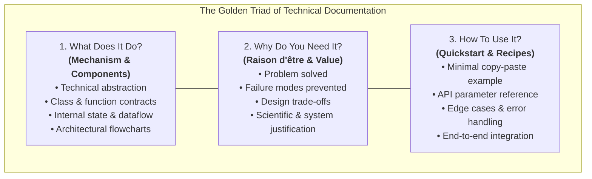
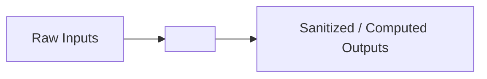

# 📝 Technical Source Code Documentation Skill

This skill provides an exhaustive, standardized engineering methodology for writing world-class, publication-grade documentation for source code files, software packages, data pipelines, and machine learning architectures. It enforces the **"Golden Triad"** framework: **What It Does**, **Why You Need It**, and **How To Use It**.

---

## 🎯 When to Use This Skill

Activate this skill when:
- Documenting new or refactored source code files, packages, or architectural layers.
- Writing technical manuals, system architecture guides, or developer READMEs under `docs/`.
- Explaining complex algorithms, data engineering pipelines, or optimization procedures to peers, advisors, or reviewers.
- Onboarding developers or researchers to a repository to ensure zero-friction reproducibility.
- Clarifying non-obvious engineering decisions, mathematical formulations, or domain constraints (e.g., avoiding data leakage, numerical stability tricks, hardware boundaries).

---

## 🏛️ The "Golden Triad" Documentation Framework

Every technical code document must answer three fundamental questions with depth and clarity:



---

## 📋 Standard Documentation Schema

When authoring documentation for a module or subsystem (e.g., in `docs/<module_name>.md`), adhere to the following Markdown template:

````markdown
# 📦 Module Documentation: `<module_path>`

[Short 1-2 sentence executive summary of the module's core purpose and scope.]

---

## 🗺️ Architectural Context & Dataflow

[Provide a visual Mermaid diagram showing where this module sits in the broader system and how data/tensors flow through it.]



---

## 1. What Does It Do?

[Detailed breakdown of all exported classes, functions, and data structures.]

### 1.1 Key Components
* **`ClassName` / `function_name`**:
  * **Role:** [Specific responsibility]
  * **Input Contract:** [Types, shapes, expected constraints]
  * **Output Contract:** [Return types, side-effects, exceptions raised]
  * **Internal Mechanics:** [Algorithms, mathematical formulas, state mutations]

### 1.2 Algorithmic & Mathematical Formulations
[Provide exact formulas for any optimization, scaling, or transformation performed.]
$$\text{Formula} = ...$$

---

## 2. Why Do You Need It?

[The technical and architectural rationale. Answer: *Why can't we just write naive code? What happens if we delete this module?*]

### 2.1 Problems Solved & Failure Modes Prevented
| Problem / Risk in Naive Implementation | Concrete Failure Mode | How This Module Solves It |
| :--- | :--- | :--- |
| **[e.g. Data Leakage]** | [e.g. Fitting scaler on combined dataset inflates test accuracy] | [e.g. Enforces strict train-only fit, applies transform on test] |
| **[e.g. Numerical Instability]** | [e.g. Division by zero yields NaNs in loss backward pass] | [e.g. Cleans infinities and replaces with training median] |

### 2.2 Architectural Trade-Offs & Design Decisions
* **Decision 1:** [e.g., Why RobustScaler instead of StandardScaler? (Resistance to heavy-tailed attack bursts).]
* **Decision 2:** [e.g., Why exclude BatchNorm in Non-IID FL? (Prevents running statistics drift across heterogeneous clients).]

---

## 3. How To Use It?

### 3.1 Minimal Quickstart (Copy-Paste Ready)
```python
# Fully self-contained runnable example
from module import MyClass

obj = MyClass(...)
result = obj.process(...)
print(result)
```

### 3.2 Common Recipes & Configuration Scenarios
[Show 2-3 standard recipes covering typical use cases, parameter variations, or integration with upstream/downstream packages.]

### 3.3 Edge Cases & Troubleshooting
* **Pitfall 1:** [Common mistake users make and how to fix it.]
* **Pitfall 2:** [Invalid parameter combination or hardware resource constraint.]
````

---

## 🔍 Deep-Dive: Executing Each Pillar

### Pillar 1: Writing "What It Does" with Precision
* ❌ **Poor:** *"This file cleans the data and trains the model."* (Vague, useless to engineers).
* ✅ **High-Grade:** *"Implements `TabularDataPreprocessor`, an anomaly-tolerant transformation pipeline that: (1) replaces infinities with median values learned exclusively on `df_train`, (2) clips negative time values caused by NIC clock drift at zero, (3) compresses dynamic range using $\log(1 + x)$, and (4) normalizes features using Interquartile Range scaling (`RobustScaler`)."*

### Pillar 2: Writing "Why You Need It" with Technical Depth
Explain the **negative consequence of absence**:
* What breaks if an engineer skips this file?
* What silent failure mode occurs? (e.g., loss turning into `NaN`, model predicting only the majority class, data leakage violating double-blind peer review).
* Why were alternative approaches rejected? (e.g., *"We rejected SMOTE because synthetic interpolation in high-dimensional flow manifolds creates physically impossible network flag combinations"*).

### Pillar 3: Writing "How To Use It" with Executable Clarity
* **Self-Contained Imports:** Ensure all imports in code blocks are explicit (no `from .utils import *`).
* **Realistic Dummy Data:** If demonstrating a data loader, provide a 3-line mock dictionary/tensor so the reader can copy-paste into an interactive terminal and see immediate output.
* **Annotate Parameters:** Call out non-obvious default arguments (e.g., `alpha=0.5`, `mu=0.01`, `max_grad_norm=5.0`).

---

## 🛠️ Documentation Quality & Sanity Checklist

Before publishing or committing any technical documentation, verify against this 10-point checklist:

- [ ] **Completeness:** Are all 3 pillars (**What**, **Why**, **How**) clearly articulated with dedicated sections?
- [ ] **Traceability:** Does the document link directly to the source file(s) using valid file paths (e.g. `[src/data/preprocess.py](file:///path/to/file)`)?
- [ ] **Mathematical Rigor:** Are formulas written in LaTeX format ($...$ and $$...$$)?
- [ ] **Visual Clarity:** Is there at least one Mermaid diagram visualizing architecture, sequence, or dataflow?
- [ ] **Code Verifiability:** Are code examples syntactically valid and runnable?
- [ ] **Why vs. What Decoupling:** Does the "Why" section explain problems, trade-offs, and failure modes rather than merely repeating what the code does?
- [ ] **Edge Cases Covered:** Are common pitfalls, runtime errors, or invalid inputs documented?
- [ ] **Style & Formatting:** Are GitHub-style callouts (`> [!NOTE]`, `> [!WARNING]`) used strategically for critical warnings?
- [ ] **Naming Precision:** Are class, function, and parameter names wrapped in backticks (e.g., `` `TabularIoTMLP` ``)?
- [ ] **Future Proof:** Does the document avoid hardcoding ephemeral paths or user-specific directories?
