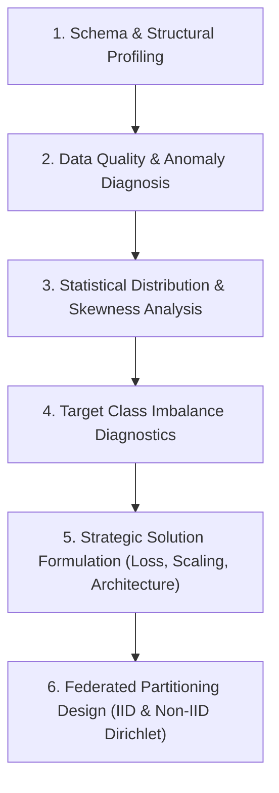
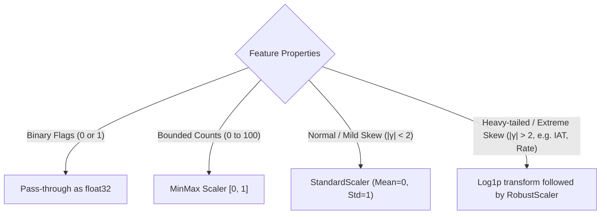
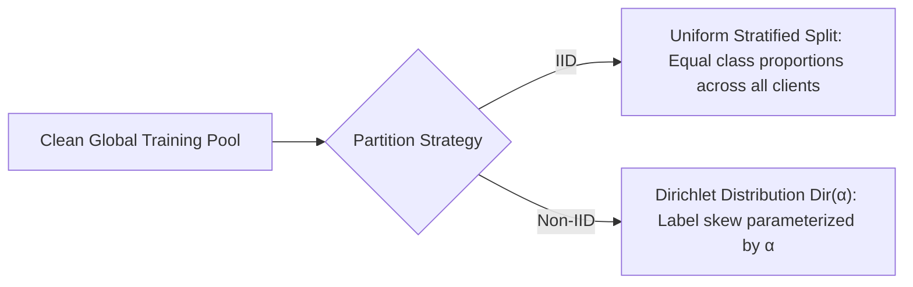

# 📊 Dataset Analysis & Strategy Formulation Skill

This skill outlines a systematic, data-centric methodology to audit, profile, clean, and partition complex datasets (especially tabular, cyber-security, network-flow, and IoT traffic). It directly connects statistical diagnoses to actionable modeling and training solutions.

---

## 🎯 When to Use This Skill

Activate this skill when:
- Exploring a new dataset before model prototyping or writing a baseline.
- Investigating data quality issues: missing entries, infinities, abnormal ranges, negative values in physical quantities, or high skewness.
- Dealing with severe class imbalance (e.g., rare cyber attacks, fraud, rare diseases).
- Designing partitioning algorithms for distributed or Federated Learning (IID vs. Non-IID Dirichlet splits).
- Determining appropriate normalization/scaling techniques to prevent gradient explosion or model divergence.

---

## 🔬 End-to-End Data Diagnostics & Strategy Pipeline



---

### Step 1: Structural & Schema Profiling

Run automated profiling to categorize features into functional roles:

1. **Feature Types:**
   - **Continuous Flow Metrics:** Packet sizes, bitrates, inter-arrival times (`IAT`, `Rate`, `AVG`, `Std`, `Tot sum`).
   - **Discrete Counts & Accumulators:** Sequence numbers, flag counters (`syn_count`, `ack_count`, `rst_count`).
   - **Binary / Categorical Encodings:** Protocol types, presence flags (`HTTP`, `HTTPS`, `DNS`, `TCP`, `UDP`, `fin_flag_number`).
   - **Target / Label:** Single multi-class categorical string or integer id.
2. **Identifier & Leakage Check:**
   - Detect high-cardinality quasi-identifiers (unique flow IDs, specific source IPs, MAC addresses) that have zero generalization value or leak the label.

---

### Step 2: Data Quality & Anomaly Diagnosis

Examine anomalous values that cause silent numerical failure in neural network training:

| Anomaly Pattern | Common Cause | Impact on Training | Prescribed Solution |
| :--- | :--- | :--- | :--- |
| **Missing Values (NaN/Null)** | Incomplete flow capture, timeout before flow completion | Causes `NaN` loss propagation | Impute with median or zero depending on physical meaning; drop if $<0.01\%$ of data. |
| **Infinite Values ($\pm\infty$)** | Division by zero during rate calculations (e.g., `Rate = bytes / duration` when duration $= 0$) | Immediate gradient NaN/crash | Cap at maximum observable non-infinite value ($99.9\text{th}$ percentile) or impute. |
| **Negative Values in Physical Metrics** | Clock synchronization drift between client/server packet captures (`IAT < 0`) | Violates physical reality; breaks logarithmic transforms | Clip to zero: `df['IAT'] = df['IAT'].clip(lower=0.0)`. |
| **Zero-Variance / Constant Columns** | Feature never changes across all classes | Adds dead weights, increases communication cost | Drop automatically: `df.drop(columns=zero_var_cols)`. |
| **Extreme Outliers (>10,000 std)** | DDoS floods, amplification traffic spikes | Dominates batch gradients, causes gradient explosion | Apply `RobustScaler` (median & IQR) or logarithmic clipping `log1p(x)`. |

---

### Step 3: Statistical Skewness & Normalization Strategy

Neural networks (like MLPs) fail when features have heavy-tailed distributions with extreme skewness ($> 10$).

#### Diagnostic Metrics:
* **Fisher-Pearson Skewness:**
  $$\gamma_1 = \frac{\mathbb{E}[(X - \mu)^3]}{\sigma^3}$$
  If $|\gamma_1| > 2$, the feature is highly skewed.
* **Selection Rule for Preprocessing:**



#### Leak-Free Preprocessing Code:
```python
import numpy as np
import pandas as pd
from sklearn.preprocessing import RobustScaler, LabelEncoder

def build_tabular_preprocessor(df_train, df_test, numeric_cols, categorical_cols):
    """
    Fits transforms strictly on train set and applies to test set.
    """
    train_clean = df_train.copy()
    test_clean = df_test.copy()
    
    # 1. Clean numerical anomalies strictly using train boundaries
    for col in numeric_cols:
        # Replace inf with nan then impute with train median
        train_clean[col] = train_clean[col].replace([np.inf, -np.inf], np.nan)
        test_clean[col] = test_clean[col].replace([np.inf, -np.inf], np.nan)
        
        median_val = train_clean[col].median()
        train_clean[col] = train_clean[col].fillna(median_val)
        test_clean[col] = test_clean[col].fillna(median_val)
        
        # Non-negative clip for physical times
        if "iat" in col.lower() or "time" in col.lower() or "rate" in col.lower():
            train_clean[col] = train_clean[col].clip(lower=0.0)
            test_clean[col] = test_clean[col].clip(lower=0.0)
            
            # Apply log1p for heavy tails
            train_clean[col] = np.log1p(train_clean[col])
            test_clean[col] = np.log1p(test_clean[col])

    # 2. Fit Scaler strictly on train
    scaler = RobustScaler()
    train_clean[numeric_cols] = scaler.fit_transform(train_clean[numeric_cols])
    test_clean[numeric_cols] = scaler.transform(test_clean[numeric_cols])
    
    return train_clean, test_clean, scaler
```

---

### Step 4: Target Class Imbalance Diagnostics & Strategy

When evaluating class distributions, calculate the **Imbalance Ratio (IR)**:
$$\text{IR}_c = \frac{\max_{j} N_j}{N_c}$$

#### In CICIoT2023 Analysis:
* `DDoS`: 1,922,002 samples (37.57%) $\implies \text{IR} = 1.0$
* `Benign`: 1,098,191 samples (21.46%) $\implies \text{IR} = 1.75$
* `Web-based`: 24,829 samples (0.49%) $\implies \text{IR} = 77.4$
* `Brute-force`: 13,064 samples (0.26%) $\implies \text{IR} = 147.1$

#### ⚠️ Strategic Interventions for Heavy Imbalance ($\text{IR} > 50$):

1. **Loss Function Strategy — Inverse Frequency Weighting:**
   Compute balanced class weights on the training split:
   $$w_c = \frac{N}{C \times N_c}$$
   Where $N$ is total samples, $C$ is number of classes, $N_c$ is count of class $c$.
   ```python
   import torch
   from sklearn.utils.class_weight import compute_class_weight
   
   class_weights = compute_class_weight(
       class_weight='balanced',
       classes=np.unique(y_train),
       y=y_train
   )
   weight_tensor = torch.tensor(class_weights, dtype=torch.float32).to(device)
   criterion = torch.nn.CrossEntropyLoss(weight=weight_tensor)
   ```

2. **Focal Loss Alternative:**
   For extreme cases where easy majority classes overwhelm gradient updates:
   $$\text{FL}(p_t) = -\alpha_t (1 - p_t)^\gamma \log(p_t) \quad (\gamma = 2.0)$$

3. **Evaluation Imperative:**
   Never report raw accuracy alone. Always require **Macro-F1** and per-class **Minority Recall**.

---

### Step 5: Distributed & Federated Partitioning Design

Federated Learning requires distributing training data across $K$ simulated clients while controlling statistical heterogeneity.



#### Non-IID Dirichlet Partition Algorithm:
For each class $c \in \{1, \dots, C\}$:
1. Draw a proportion vector $\mathbf{p}_c = (p_{c,1}, p_{c,2}, \dots, p_{c,K}) \sim \text{Dir}(\alpha \cdot \mathbf{1}_K)$.
2. Allocate proportion $p_{c,k}$ of samples of class $c$ to client $k$.
3. Enforce a minimum threshold $n_{min}$ to guarantee all clients have viable datasets.

```python
import numpy as np

def dirichlet_partition(labels, num_clients, alpha=0.5, min_samples_per_client=100, seed=42):
    """
    Partitions dataset indices among clients using Dirichlet distribution Dir(alpha).
    
    alpha -> inf: Uniform IID
    alpha = 1.0: Mild Non-IID
    alpha = 0.5: Moderate Non-IID
    alpha = 0.1: Extreme Non-IID (Heavy label skew)
    """
    rng = np.random.default_rng(seed)
    num_classes = len(np.unique(labels))
    client_indices = {i: [] for i in range(num_clients)}
    
    for c in range(num_classes):
        class_indices = np.where(labels == c)[0]
        rng.shuffle(class_indices)
        
        # Sample proportions from Dirichlet distribution
        proportions = rng.dirichlet(np.repeat(alpha, num_clients))
        
        # Split class indices according to proportions
        splits = (proportions * len(class_indices)).astype(int)
        splits[-1] = len(class_indices) - splits[:-1].sum() # Avoid rounding loss
        
        current_idx = 0
        for client_id, split_size in enumerate(splits):
            client_indices[client_id].extend(class_indices[current_idx : current_idx + split_size])
            current_idx += split_size
            
    # Validate client sizes
    for client_id, indices in client_indices.items():
        assert len(indices) >= min_samples_per_client, (
            f"Client {client_id} received only {len(indices)} samples, "
            f"less than required {min_samples_per_client}. Adjust alpha or dataset size."
        )
        rng.shuffle(client_indices[client_id])
        
    return client_indices
```

---

## 📋 Comprehensive Dataset Strategy Decision Matrix

| Dataset Diagnostic Finding | Potential Failure Mode | Actionable Solution Strategy |
| :--- | :--- | :--- |
| **5M+ tabular rows on single machine** | RAM exhaustion during multi-client Flower simulation | Use Stratified Sampling (300k–500k rows) during prototyping; use `np.memmap` or batch iterators for full scale. |
| **Extreme label skew ($\text{IR} > 100$)** | Model collapses to predicting majority class; minority intrusions missed | Apply `weight=class_weights` in CrossEntropyLoss; evaluate using Macro-F1 and Minority Recall. |
| **Heavy-tailed latency/bytes ($|\gamma| > 15$)** | Large values dominate gradients, producing NaN losses | Apply `log1p(x)` transform followed by `RobustScaler`. |
| **Extreme Non-IID Dirichlet ($\alpha=0.1$)** | Local client models diverge rapidly (Client Drift); global model oscillates | Deploy **FedProx** with proximal parameter $\mu \in [0.01, 0.1]$; reduce local epochs $E$. |
| **Sparse attack occurrence across clients** | Some clients have zero samples for rare attacks; catastrophic forgetting | Enforce holdout global test set evaluated at the server to accurately measure generalization. |
