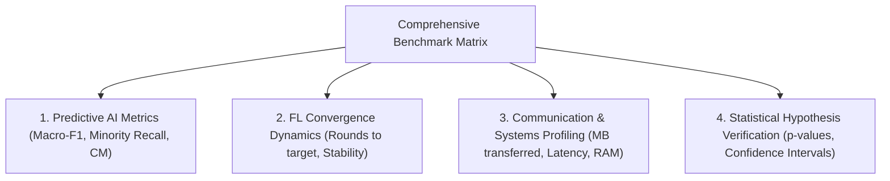

# 📈 Evaluation & Benchmarking Rigor Skill

This skill provides an exhaustive, publication-grade evaluation framework for machine learning, intrusion detection systems (IDS), and distributed/federated architectures. It establishes strict multi-metric standards, system efficiency profiling, and statistical significance verification.

---

## 🎯 When to Use This Skill

Activate this skill when:
- Evaluating classification performance on imbalanced multi-class datasets.
- Benchmarking Federated Learning algorithms (FedAvg vs. FedProx vs. Centralized).
- Measuring convergence speed, client drift, and loss trajectory stability.
- Quantifying communication overhead (network upload/download bytes) and edge hardware footprint.
- Generating publication-ready benchmark tables, confusion matrices, and convergence plots.
- Conducting statistical hypothesis tests (t-tests, Wilcoxon tests) to validate empirical claims.

---

## 🔬 Multi-Dimensional Evaluation Matrix



---

### Dimension 1: Predictive Classification Metrics (Imbalanced & Multi-Class)

In real-world network traffic, benign traffic and DDoS floods dominate the distribution, while stealthy attacks (Web attacks, Brute-force) comprise $<1\%$ of samples. Standard accuracy is fatally deceptive.

#### Mandatory Metric Suite:

1. **Overall Accuracy (OA):**
   $$\text{Accuracy} = \frac{\sum_{c=1}^C \text{TP}_c}{N}$$
   *(Reported only as reference; never used to claim system superiority).*

2. **Macro-Averaged Precision, Recall, and F1-Score:**
   Calculates metrics independently for each class and takes an unweighted average. This ensures minority classes have equal weight in the final score:
   $$\text{Macro-Recall} = \frac{1}{C}\sum_{c=1}^C \frac{\text{TP}_c}{\text{TP}_c + \text{FN}_c}, \quad \text{Macro-Precision} = \frac{1}{C}\sum_{c=1}^C \frac{\text{TP}_c}{\text{TP}_c + \text{FP}_c}$$
   $$\text{Macro-F1} = \frac{1}{C}\sum_{c=1}^C \frac{2 \cdot \text{Precision}_c \cdot \text{Recall}_c}{\text{Precision}_c + \text{Recall}_c}$$

3. **Minority Recall ($\text{Recall}_{min}$):**
   Explicitly tracks sensitivity on classes with prevalence $<1\%$:
   $$\text{Minority-Recall} = \frac{1}{|C_{minority}|} \sum_{c \in C_{minority}} \text{Recall}_c$$

4. **Normalized Confusion Matrix:**
   Reveals whether the model is confusing functionally distinct attacks (e.g., DoS vs. DDoS, or Brute-force misclassified as Benign).

#### Evaluation Script Implementation:
```python
import numpy as np
import torch
from sklearn.metrics import accuracy_score, precision_recall_fscore_support, confusion_matrix

def evaluate_model_comprehensive(model, test_loader, class_names, minority_classes=None, device="cpu"):
    """
    Computes publication-grade classification metrics on holdout test set.
    """
    model.eval()
    all_preds = []
    all_targets = []
    
    with torch.no_grad():
        for X_batch, y_batch in test_loader:
            X_batch = X_batch.to(device)
            outputs = model(X_batch)
            preds = outputs.argmax(dim=1).cpu().numpy()
            all_preds.extend(preds)
            all_targets.extend(y_batch.numpy())
            
    all_preds = np.array(all_preds)
    all_targets = np.array(all_targets)
    
    # 1. Overall & Macro Metrics
    acc = accuracy_score(all_targets, all_preds)
    p_macro, r_macro, f1_macro, _ = precision_recall_fscore_support(
        all_targets, all_preds, average='macro', zero_division=0
    )
    p_weighted, r_weighted, f1_weighted, _ = precision_recall_fscore_support(
        all_targets, all_preds, average='weighted', zero_division=0
    )
    
    # 2. Per-Class Metrics
    p_class, r_class, f1_class, support = precision_recall_fscore_support(
        all_targets, all_preds, average=None, zero_division=0
    )
    
    # 3. Minority Class Sensitivity
    minority_recall_dict = {}
    if minority_classes:
        for cls_name in minority_classes:
            if cls_name in class_names:
                cls_idx = class_names.index(cls_name)
                minority_recall_dict[cls_name] = r_class[cls_idx]
                
    # 4. Confusion Matrix
    cm = confusion_matrix(all_targets, all_preds, normalize='true')
    
    return {
        "accuracy": acc,
        "macro_f1": f1_macro,
        "macro_precision": p_macro,
        "macro_recall": r_macro,
        "weighted_f1": f1_weighted,
        "per_class_f1": dict(zip(class_names, f1_class)),
        "minority_recall": minority_recall_dict,
        "confusion_matrix": cm
    }
```

---

### Dimension 2: Federated Convergence Dynamics

Quantify how fast and stably the global model learns:

1. **Rounds to Target Performance ($R_{target}$):**
   Number of communication rounds required for the global model to reach a pre-defined performance threshold (e.g., $\text{Macro-F1} \ge 0.85$). Faster convergence translates directly to saved battery and wireless bandwidth.
2. **Convergence Stability & Variance ($\sigma_{loss}$):**
   Standard deviation of global validation loss across the final 10 rounds:
   $$\sigma_{loss} = \sqrt{\frac{1}{10}\sum_{t=T-9}^T (\mathcal{L}_t - \bar{\mathcal{L}})^2}$$
   *Under extreme Non-IID ($\alpha=0.1$), FedAvg often oscillates with high $\sigma_{loss}$, while FedProx stabilizes the trajectory.*

---

### Dimension 3: Communication & System Resource Overhead

In IoT and mobile edge systems, communication bandwidth is typically $10\times$ to $100\times$ more expensive than local CPU computation.

#### 1. Communication Payload Formulation:
In each round $t$, the central server broadcasts global model weights to $m_t$ participating clients, and each client uploads updated local weights:
$$\text{Cost}_{upload}(t) = m_t \times |w|, \quad \text{Cost}_{download}(t) = m_t \times |w|$$
$$\text{Total Communication Payload (MB)} = \frac{2 \times |w|_{bytes} \times \sum_{t=1}^T m_t}{1024^2}$$
* Where $|w|_{bytes} = N_{params} \times 4 \text{ bytes}$ for standard float32 precision.

#### 2. Wall-Clock Latency Breakdown:
$$T_{total} = T_{local\_computation} + T_{aggregation} + T_{eval}$$

#### 3. Edge Footprint:
- Peak RAM usage (GB) during simulation.
- Inference latency per 1,000 flows (milliseconds).

---

### Dimension 4: Statistical Hypothesis Testing

To prove that FedProx outperforms FedAvg (or that an architectural change is genuinely effective):
1. **Multi-Seed Protocol:**
   Always run each experimental scenario across at least 3 distinct random seeds (e.g., seeds 42, 101, 2024).
   Report all final scores as:
   $$\text{Score} = \text{Mean} \pm \text{Std}$$
2. **Paired Statistical Tests:**
   For round-by-round convergence or multi-fold results:
   - **Paired t-test** (if metrics are normally distributed via Shapiro-Wilk test).
   - **Wilcoxon Signed-Rank Test** (non-parametric alternative):
     ```python
     from scipy.stats import wilcoxon
     stat, p_value = wilcoxon(fedprox_scores, fedavg_scores)
     # If p_value < 0.05, the performance difference is statistically significant.
     ```

---

## 📊 Publication-Grade Benchmark Presentation Templates

### 1. Master Comparative Benchmark Table (Markdown)

```markdown
| Method | Partition Setting | Clients ($K$) | Overall Accuracy (%) | Macro-F1 (%) | Minority Recall (Web) | Minority Recall (BruteForce) | Rounds to F1 ≥ 80% | Total Comm (MB) |
| :--- | :--- | :--- | :--- | :--- | :--- | :--- | :--- | :--- |
| **Centralized Baseline** | Centralized | 1 | 99.12 ± 0.04 | 91.45 ± 0.32 | 87.20 ± 0.51 | 94.10 ± 0.40 | N/A | 0.0 |
| **FedAvg** | IID | 5 | 98.75 ± 0.08 | 88.90 ± 0.45 | 82.10 ± 0.80 | 89.30 ± 0.75 | 12 | 16.68 |
| **FedProx (μ=0.01)** | IID | 5 | 98.80 ± 0.06 | 89.15 ± 0.40 | 82.50 ± 0.70 | 89.60 ± 0.65 | 11 | 16.68 |
| **FedAvg** | Non-IID (α=1.0) | 5 | 97.40 ± 0.15 | 83.20 ± 0.85 | 71.40 ± 1.50 | 79.20 ± 1.20 | 18 | 25.02 |
| **FedProx (μ=0.05)** | Non-IID (α=1.0) | 5 | 97.85 ± 0.11 | 85.10 ± 0.62 | 75.80 ± 1.10 | 82.40 ± 0.90 | 15 | 20.85 |
| **FedAvg** | Non-IID (α=0.1) | 5 | 93.10 ± 0.42 | 70.80 ± 1.80 | 45.20 ± 3.40 | 58.10 ± 2.90 | Did not reach | 41.70 |
| **FedProx (μ=0.10)** | Non-IID (α=0.1) | 5 | 95.65 ± 0.28 | 78.90 ± 1.15 | 62.70 ± 2.10 | 71.50 ± 1.80 | 24 | 33.36 |
```

---

## 🛠️ Benchmark Verification Checklist

- [ ] Is Macro-F1 computed with `zero_division=0` to prevent division-by-zero crashes on empty classes?
- [ ] Is Minority Recall explicitly isolated and displayed for classes with $<1\%$ prevalence?
- [ ] Does every table report both mean and standard deviation over $\ge 3$ random seeds?
- [ ] Are communication payloads calculated from exact model weight byte sizes?
- [ ] Are confusion matrices normalized by true class prevalence (`normalize='true'`)?
- [ ] Are conclusions supported by formal p-values or confidence intervals?
