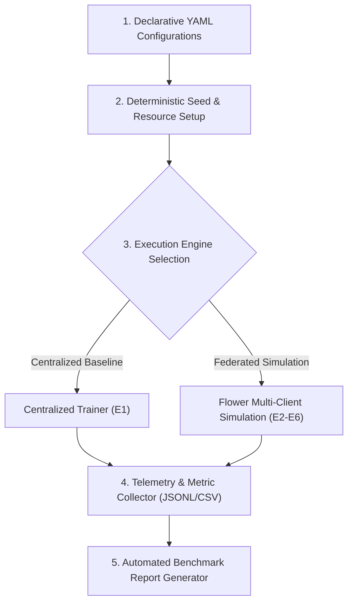

# 🚀 Experiment Design & Orchestration Skill

This skill provides an automated, configuration-driven methodology for designing, orchestrating, and logging complex multi-scenario experiments. It covers centralized baselines, distributed simulations, parameter sweeps, and system resource profiling across machine learning and Federated Learning tasks.

---

## 🎯 When to Use This Skill

Activate this skill when:
- Setting up multi-scenario experimental campaigns (e.g., comparing algorithms across IID vs. Non-IID Dirichlet tiers).
- Managing multi-factor configurations (number of clients, local epochs, learning rates, proximal penalty $\mu$).
- Automating large-scale simulations using frameworks like Flower (`flwr[simulation]`).
- Guaranteeing deterministic reproducibility across random seeds.
- Monitoring wall-clock runtime, network communication payloads, and memory footprints.

---

## ⚙️ Orchestration Architecture



---

### Step 1: The Experimental Matrix Formulation

Structure experimental campaigns systematically using a 2D factorial design matrix:

| Scenario ID | Task Name | Framework | Aggregator | Partition Scheme | Clients ($K$) | Local Epochs ($E$) | Proximal Penalty ($\mu$) | Primary Research Question |
| :--- | :--- | :--- | :--- | :--- | :--- | :--- | :--- | :--- |
| **E1** | Centralized Baseline | PyTorch | N/A | Full Train/Val/Test | 1 | 20 | 0.0 | Empirical performance upper bound |
| **E2** | IID FL Baseline | Flower | FedAvg & FedProx | Uniform Stratified | 5 | 3 | 0.0 vs 0.01 | FL penalty under ideal data distribution |
| **E3** | Mild Non-IID | Flower | FedAvg & FedProx | Dirichlet $\alpha = 1.0$ | 5 | 3 | 0.0 vs 0.01 | Impact of mild label skew |
| **E4** | Moderate Non-IID | Flower | FedAvg & FedProx | Dirichlet $\alpha = 0.5$ | 5 | 3 | 0.0 vs 0.05 | Client drift emergence and FedProx tolerance |
| **E5** | Severe Non-IID | Flower | FedAvg & FedProx | Dirichlet $\alpha = 0.1$ | 5 | 3 | 0.0 vs 0.1 | Extreme heterogeneity resilience |
| **E6** | Client Scalability | Flower | FedAvg & FedProx | Dirichlet $\alpha = 0.5$ | 5, 7, 10 | 3 | 0.05 | Scalability: Comm cost, RAM, & wall-clock time |
| **E7** | Ablation Study | Flower | FedProx | Dirichlet $\alpha = 0.1$ | 5 | 1, 3, 5 | 0.001, 0.01, 0.1, 1.0 | Sensitivity to proximal coefficient $\mu$ |

---

### Step 2: Declarative Configuration Schema (YAML)

Decouple experimental logic from code using structured YAML configurations:

```yaml
# configs/experiment_e5_severe_non_iid.yaml
experiment:
  name: "E5_Severe_Non_IID_FedProx_vs_FedAvg"
  seed: 42
  num_runs: 3
  output_dir: "reports/experiments/E5"

data:
  dataset_path: "datasets/CICIOT2023/merged_CICIOT2023_data.csv"
  sample_size: 500000        # Stratified subset for rapid simulation (null for full dataset)
  test_ratio: 0.2
  val_ratio: 0.1
  num_clients: 5
  partition_strategy: "dirichlet"
  dirichlet_alpha: 0.1       # Severe heterogeneity
  min_samples_per_client: 500

model:
  name: "TabularIoTMLP"
  input_dim: 39
  num_classes: 8
  dropout_rate: 0.2

federated:
  num_rounds: 30
  fraction_fit: 1.0          # 100% client participation per round
  local_epochs: 3
  batch_size: 128
  learning_rate: 0.001
  algorithms:
    - name: "FedAvg"
      mu: 0.0
    - name: "FedProx"
      mu: 0.05

resources:
  client_cpus: 1
  client_gpus: 0.0           # Fraction of GPU per client process
  ray_memory_limit_mb: 8192
```

---

### Step 3: Deterministic Reproducibility Protocol

To ensure reproducible science, set deterministic seeds across all random number generators:

```python
import os
import random
import numpy as np
import torch

def set_deterministic_seed(seed: int = 42):
    """Guarantees bit-level reproducibility across libraries."""
    random.seed(seed)
    os.environ['PYTHONHASHSEED'] = str(seed)
    np.random.seed(seed)
    torch.manual_seed(seed)
    torch.cuda.manual_seed(seed)
    torch.cuda.manual_seed_all(seed)
    torch.backends.cudnn.deterministic = True
    torch.backends.cudnn.benchmark = False
```

---

### Step 4: Flower Simulation Orchestrator

Use Flower's lightweight simulation engine (`start_simulation`) to run multi-client federated workloads in a single workstation without spawning heavy virtual machines:

```python
import flwr as fl
from typing import Dict, List, Tuple
import numpy as np
import torch

def launch_federated_experiment(
    client_datasets: Dict[int, torch.utils.data.Dataset],
    global_test_dataset: torch.utils.data.Dataset,
    model_class,
    config: dict
):
    """
    Executes a complete federated experiment with Flower simulation.
    """
    device = torch.device("cuda" if torch.cuda.is_available() else "cpu")
    num_rounds = config['federated']['num_rounds']
    num_clients = config['data']['num_clients']
    algorithm_name = config['algorithm']['name']
    mu_val = config['algorithm'].get('mu', 0.0)

    # 1. Define Client Factory
    def client_fn(cid: str) -> fl.client.Client:
        client_id = int(cid)
        local_dataset = client_datasets[client_id]
        
        # Instantiate local model and trainer
        model = model_class(
            input_dim=config['model']['input_dim'],
            num_classes=config['model']['num_classes']
        )
        return FlowerTabularClient(
            client_id=client_id,
            model=model,
            dataset=local_dataset,
            batch_size=config['federated']['batch_size'],
            local_epochs=config['federated']['local_epochs'],
            lr=config['federated']['learning_rate'],
            mu=mu_val,
            device=device
        )

    # 2. Select Aggregation Strategy
    if algorithm_name == "FedProx":
        strategy = fl.server.strategy.FedProx(
            fraction_fit=config['federated']['fraction_fit'],
            fraction_evaluate=0.0,  # Evaluate centralized on server test set
            min_fit_clients=num_clients,
            min_available_clients=num_clients,
            proximal_mu=mu_val,
            evaluate_fn=make_evaluate_fn(model_class, global_test_dataset, config, device)
        )
    else: # FedAvg
        strategy = fl.server.strategy.FedAvg(
            fraction_fit=config['federated']['fraction_fit'],
            fraction_evaluate=0.0,
            min_fit_clients=num_clients,
            min_available_clients=num_clients,
            evaluate_fn=make_evaluate_fn(model_class, global_test_dataset, config, device)
        )

    # 3. Launch Simulation with Resource Caps
    history = fl.simulation.start_simulation(
        client_fn=client_fn,
        num_clients=num_clients,
        config=fl.server.ServerConfig(num_rounds=num_rounds),
        strategy=strategy,
        client_resources={"num_cpus": config['resources']['client_cpus']}
    )
    return history
```

---

### Step 5: System Resource & Telemetry Monitoring

Monitor computational footprints during simulation runs to assess hardware viability on edge devices:

```python
import psutil
import time
import threading

class SystemTelemetryMonitor:
    """Tracks CPU, RAM, and Wall-clock runtime in a background thread."""
    def __init__(self, interval_seconds: float = 1.0):
        self.interval = interval_seconds
        self.running = False
        self.thread = None
        self.records = []

    def _monitor(self):
        while self.running:
            cpu_pct = psutil.cpu_percent(interval=None)
            ram_info = psutil.virtual_memory()
            self.records.append({
                "timestamp": time.time(),
                "cpu_percent": cpu_pct,
                "ram_used_gb": ram_info.used / (1024 ** 3),
                "ram_percent": ram_info.percent
            })
            time.sleep(self.interval)

    def start(self):
        self.running = True
        self.records = []
        self.start_time = time.time()
        self.thread = threading.Thread(target=self._monitor, daemon=True)
        self.thread.start()

    def stop(self) -> dict:
        self.running = False
        if self.thread:
            self.thread.join()
        total_time = time.time() - self.start_time
        
        cpu_vals = [r['cpu_percent'] for r in self.records] or [0]
        ram_vals = [r['ram_used_gb'] for r in self.records] or [0]
        
        return {
            "wall_clock_time_sec": total_time,
            "peak_ram_gb": max(ram_vals),
            "avg_ram_gb": np.mean(ram_vals),
            "avg_cpu_percent": np.mean(cpu_vals)
        }
```

---

## 📋 Experiment Execution Checklist

Before launching a full-scale multi-round simulation:

- [ ] Has a dry run been performed with `sample_size=10000` and `num_rounds=2` to verify end-to-end logging?
- [ ] Are all metrics (loss, accuracy, macro-F1, per-class recall) written to persistent JSONL/CSV files after each round?
- [ ] Is the random seed explicitly passed to all data partitioners and model initializers?
- [ ] Are GPU/CPU allocations configured to prevent out-of-memory (OOM) crashes?
- [ ] Is global test evaluation executed on an unchanging, unified holdout dataset?
- [ ] Is communication payload logged per round according to model parameter size?
