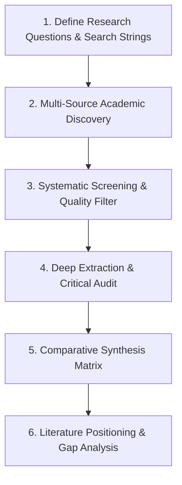

# 📚 Systematic Literature Research & Analysis Skill

This skill provides an end-to-end, scientifically rigorous methodology for finding, evaluating, organizing, and synthesizing academic research papers, datasets, and benchmark baselines. It ensures research positioning is solid, grounded in current state-of-the-art (SOTA), and protected against outdated or unsubstantiated claims.

---

## 🎯 When to Use This Skill

Activate this skill when:
- Formulating a research scope, thesis proposal, or conference paper submission.
- Identifying candidate baseline algorithms, standard datasets, or evaluation protocols.
- Verifying whether a proposed technique or architectural modification has already been published.
- Synthesizing related works into structured comparative matrices.
- Finding solutions to technical hurdles (e.g., non-IID client drift, severe class imbalance, low-latency edge constraints).

---

## 🔍 Step-by-Step Research Workflow



---

### Step 1: Define Research Scope & Search Queries

Avoid vague keyword searches. Structure queries using the **PICO / SPIDER** research query framework adapted for Computer Science & AI:

| Component | Definition | Example (FL IoT-IDS) | Example (LLM Efficiency) |
| :--- | :--- | :--- | :--- |
| **Problem / Domain** | Core domain and application environment | IoT Intrusion Detection, Network Traffic | Long-context inference |
| **Intervention / Method** | Specific algorithms, frameworks, or models | Federated Learning, FedProx, Dirichlet non-IID | Speculative decoding, KV cache quantization |
| **Comparison / Baseline** | What standard methods are contrasted against | FedAvg, Centralized baseline | Standard autoregressive generation |
| **Outcome / Metric** | Key evaluation indicators | Macro-F1, Minority Recall, Communication Cost | Latency speedup, Perplexity degradation |

#### Constructing Boolean Search Strings:
* Primary string: `("Federated Learning" OR "FL") AND ("Intrusion Detection" OR "IDS" OR "Anomaly Detection") AND ("Non-IID" OR "Heterogeneous" OR "Data Skew") AND ("IoT" OR "Edge")`
* Baseline string: `("FedProx" OR "FedAvg" OR "Scaffold") AND ("Network Traffic" OR "Flow-based")`
* Dataset string: `("CICIoT2023" OR "CIC-IoMT2024" OR "CIC IoT-DIAD") AND ("Benchmark" OR "Evaluation")`

---

### Step 2: Multi-Source Academic Discovery

Search across tier-1 academic databases, preprint servers, and code repositories:

1. **Preprint & Open Access Archives:**
   - [arXiv.org](https://arxiv.org/): Computer Science categories `cs.CR` (Cryptography and Security), `cs.LG` (Machine Learning), `cs.DC` (Distributed Computing), `cs.NI` (Networking and Internet Architecture).
   - [OpenReview](https://openreview.net/): Transparent peer-review comments and rebuttal discussions from NeurIPS, ICLR, ICML.
2. **Top Venues & Digital Libraries:**
   - **AI/ML:** NeurIPS, ICML, ICLR, MLSys, CVPR, AAAI.
   - **Security:** IEEE S&P (Oakland), USENIX Security, ACM CCS, NDSS.
   - **Networking & IoT:** IEEE INFOCOM, IEEE IoT Journal, IEEE TIFS, IEEE TDSC, ACM SenSys/MobiCom.
   - **Digital Repositories:** IEEE Xplore, ACM Digital Library, Google Scholar, Semantic Scholar.
3. **Reproducibility & Benchmark Repositories:**
   - [Papers with Code](https://paperswithcode.com/): Compare SOTA leaderboards, official code repositories, and dataset tasks.
   - Author GitHub repositories and official benchmark release notes.

#### Backward & Forward Snowballing:
* **Backward Snowballing:** Inspect references cited by the top 3 seminal papers in the domain.
* **Forward Snowballing:** Use Google Scholar "Cited by" and Semantic Scholar citation graphs to find recent works (last 12–24 months) that built upon seminal papers.

---

### Step 3: Screening & Quality Filtering Criteria

Filter candidate literature through a 3-tier gate:

1. **Tier 1 — Quick Title & Abstract Screening:**
   - Does the paper directly address the target problem setting?
   - Is it empirical, theoretical, or merely a high-level survey?
2. **Tier 2 — Venue & Peer-Review Credibility:**
   - Check venue rating on [CORE Portal](http://portal.core.edu.au/conf-ranks/) (target: A*, A, or reputable IEEE/ACM/Springer journals).
   - For arXiv preprints: verify author lab track record, publication history, and whether peer review is pending.
3. **Tier 3 — Technical & Experimental Rigor Filter:**
   - **Code Availability:** Is an open-source repository or reproducible Docker environment provided?
   - **Baselines:** Are realistic, non-strawman baselines compared?
   - **Dataset Realism:** Are modern, non-synthetic datasets used (e.g., rejecting 25-year-old KDD99 in favor of CICIoT2023 / UNSW-NB15)?

---

### Step 4: Paper Extraction Protocol (The "15-Minute Audit")

When reading a candidate paper, extract the following schema into your research notes:

```markdown
### [Paper Title] (Authors, Venue Year)
- **URL/BibTeX Key:**
- **Core Problem:** Exactly what bottleneck are they solving?
- **Key Assumptions:** (e.g., convex loss, synchronized client participation, honest-but-curious server)
- **Proposed Architecture / Algorithm:** High-level mathematical formulation and mechanics.
- **Datasets & Partitioning:** How is non-IID simulated? (Dirichlet α, pathological class slicing, quantity skew).
- **Baselines Compared:** Did they compare against standard FedAvg, FedProx, SCAFFOLD, etc.?
- **Key Results & Claims:** Headline metrics achieved.
- **Hidden Caveats & Limitations:**
  - What didn't they report? (e.g., reported accuracy but skipped Macro-F1 on imbalanced classes; ignored communication overhead).
  - Hardware / compute limitations (e.g., only tested with 3 clients on synthetic toy datasets).
- **Direct Relevance to Our Work:** How this informs our implementation or baseline choices.
```

---

### Step 5: Comparative Synthesis Matrix

Synthesize papers into a structured comparison table to clearly reveal the research landscape:

| Reference | Target Domain | Dataset | Model Architecture | FL Algorithm | Non-IID Handling / Distribution | Evaluation Metrics | Code Available |
| :--- | :--- | :--- | :--- | :--- | :--- | :--- | :--- |
| **McMahan et al. (2017)** | General FL | MNIST, CIFAR-10, Shakespeare | 2-layer CNN, 2-layer LSTM | FedAvg | Pathological partition (2 classes/client) | Test accuracy, communication rounds | Yes |
| **Li et al. (2020)** | General Heterogeneous FL | Synthetic, MNIST, Sent140 | MLP, Linear regression | FedProx | $\mu$-proximal regularization, straggler tolerance | Dissimilarity metrics, test accuracy | Yes |
| **Neto et al. (2023)** | IoT IDS Benchmark | CICIoT2023 (105 IoT devices, 33 attacks) | MLP, Random Forest, XGBoost, CNN | Centralized Baseline | N/A | Accuracy, Precision, Recall, F1 | Yes |
| **Huang et al. (2022)** | IoT Security | N-BaIoT | Autoencoder, MLP | FedAvg vs Local | Device-level non-IID | Detection rate, False alarm rate | Partial |
| **Our Target Prototype** | IoT IDS | CICIoT2023 | Tabular MLP | FedAvg vs FedProx | Dirichlet ($\alpha \in \{1.0, 0.5, 0.1\}$) | Macro-F1, Minority Recall, Comm Cost, Latency | **Yes (Full)** |

---

### Step 6: Gap Identification & Research Positioning

Translate literature findings into explicit research defenses:
1. **The Empirical Gap:** *"While theoretical FL papers evaluate on vision benchmarks (CIFAR-10), network-flow tabular IoT data exhibits unique tabular correlations, heavy skewness, and extreme class imbalance requiring multi-metric validation."*
2. **The Metric Gap:** *"Most existing IDS studies report global Accuracy, masking catastrophic failure on rare attack classes (Web attacks < 0.5%). We mandate Macro-F1 and Minority Recall."*
3. **The Systems Gap:** *"Prior works often simulate FL purely at the mathematical weight level without measuring real wall-clock training latency, network transmission payloads, and client memory constraints."*

---

## 🛠️ Verification Checklist for Research Validity

- [ ] Has every claim of novelty or superiority been checked against papers from the last 2 years?
- [ ] Are all cited datasets available with verifiable licensing and documentation?
- [ ] Are comparison baselines implemented under identical data splits, feature dimensions, and random seeds?
- [ ] Are mathematical formulas and notations consistent with canonical literature (e.g., standard FedAvg/FedProx formulations)?
- [ ] Are BibTeX entries complete (including authors, title, journal/venue, year, volume/pages, DOI)?
