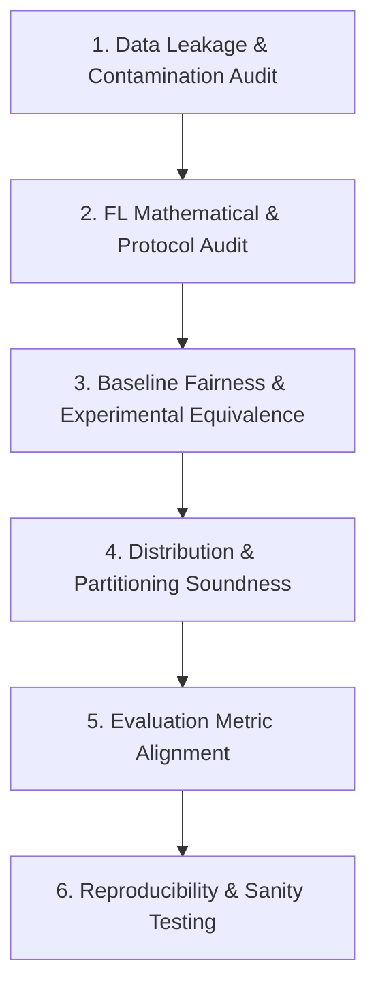

# 🛡️ Methodology Audit & Scientific Rigor Skill

This skill provides an exhaustive framework for critically vetting the soundness, integrity, and correctness of research methodologies in machine learning, deep learning, and distributed/federated systems. It acts as an automated "peer reviewer" and quality-control gatekeeper to detect subtle flaws before experiments or papers are finalized.

---

## 🎯 When to Use This Skill

Activate this skill when:
- Designing or reviewing experimental protocols, data splits, and model architectures.
- Verifying whether a distributed/federated optimization algorithm (e.g., FedAvg, FedProx, SCAFFOLD) is implemented with mathematical fidelity.
- Checking for data leakage, label leakage, or test-set contamination.
- Auditing baseline comparisons to ensure fairness (no strawman baselines).
- Preparing thesis defense chapters, research proposals, or paper submissions.

---

## 🔬 Core Audit Pillars



---

### Pillar 1: Data Leakage & Contamination Audit

Data leakage occurs when information from outside the training dataset is inadvertently used to create the model, artificially inflating test scores and destroying real-world generalization.

#### 1. Preprocessing & Transformation Leakage:
* ❌ **Flaw:** Computing global mean/standard deviation, Min-Max scalers, or PCA across the entire dataset *before* performing train/test split or client partitioning.
* ✅ **Audit Rule:** `fit()` must ONLY ever be called on the centralized `train_set` (or local client training data). The validation and test sets must strictly be transformed using `transform()` with statistics learned exclusively from `train_set`.
```python
# CORRECT IMPLEMENTATION:
# 1. Split raw data first
X_train, X_test, y_train, y_test = train_test_split(X, y, test_size=0.2, stratify=y, random_state=42)

# 2. Fit scaler strictly on train set
scaler = RobustScaler()
X_train_scaled = scaler.fit_transform(X_train)
X_test_scaled = scaler.transform(X_test)  # NEVER fit on test!
```

#### 2. Temporal / Flow-Level Leakage (Network & IoT Data):
* ❌ **Flaw:** Performing uniform random row-level k-fold cross-validation on time-series network flows where packets from the same connection or attack burst appear in both train and test.
* ✅ **Audit Rule:** Check if consecutive rows share flow IDs, device IPs, or timestamps. For temporal data, split chronologically or group by device/session (`GroupShuffleSplit` on session or device ID).

#### 3. Label & Identifier Leakage:
* ❌ **Flaw:** Retaining columns that are deterministic proxies of the label (e.g., specific destination IPs dedicated only to the attack server, high-entropy unique connection IDs, or artificial dataset generator artifacts).
* ✅ **Audit Rule:** Audit feature correlation against the label. Any single feature with $>0.98$ mutual information or linear correlation should be investigated for artifact leakage.

---

### Pillar 2: Federated Optimization & Mathematical Correctness

When auditing Federated Learning algorithms, verify the exact mathematical mechanics against canonical literature:

#### 1. FedAvg Weighting Correctness:
FedAvg parameters must be aggregated proportionally to client dataset size:
$$w_{t+1} = \sum_{k=1}^K \frac{n_k}{N} w_{t+1}^k \quad \text{where } N = \sum_{k=1}^K n_k$$
* ❌ **Flaw:** Simple unweighted averaging ($\frac{1}{K}\sum w_k$) when clients have unequal sample sizes (quantity skew). This violates convergence theorems and gives disproportionate influence to sparse clients.
* ✅ **Audit Rule:** Verify aggregator extracts `num_examples` from each client fit result and computes normalized fractional weights.

#### 2. FedProx Proximal Objective & Gradient Correctness:
FedProx modifies local client loss to constrain drift from the round's starting global parameters $w_t$:
$$\min_w h_k(w; w_t) = \mathcal{L}_{task}(w) + \frac{\mu}{2} \|w - w_t\|_2^2$$
* ❌ **Flaw 1:** Omitting the factor $\frac{1}{2}$, leading to an effective proximal penalty of $2\mu$.
* ❌ **Flaw 2:** Adding proximal loss but retaining Adam optimizer with default momentum states without resetting, causing past trajectory drift.
* ❌ **Flaw 3:** Comparing FedProx with $\mu = 0$ against FedAvg and claiming performance differences (when $\mu=0$, FedProx mathematically reduces to FedAvg).
* ✅ **Audit Rule (PyTorch Implementation Check):**
```python
# CORRECT FedProx Local Step:
proximal_term = 0.0
for w, w_t in zip(model.parameters(), global_model.parameters()):
    proximal_term += torch.sum((w - w_t) ** 2)

total_loss = task_loss + (mu / 2.0) * proximal_term
total_loss.backward()
optimizer.step()
```

#### 3. Client Evaluation Set Alignment:
* ❌ **Flaw:** Evaluating global model only on clients' local validation sets and averaging scores. If clients have skewed Non-IID data, local validation averages do not reflect generalized global performance.
* ✅ **Audit Rule:** The central server must evaluate the aggregated global model on a dedicated, held-out **Global Test Set** representing the true multi-class task distribution.

---

### Pillar 3: Baseline Fairness & Experimental Equivalence

A paper or thesis is invalidated if comparisons are unfair or baseline methods are handicapped.

| Potential Bias | Description | Mandatory Remediation |
| :--- | :--- | :--- |
| **Unequal Tuning** | Proposed method gets grid search; baseline uses default arbitrary parameters. | Allocate identical tuning budgets (e.g., same number of Bayesian optimization or grid points for both). |
| **Different Backbones** | Proposed method uses modern deeper backbone; baseline uses a shallow baseline. | Lock model architecture (depth, width, activations, initialization) identical across FedAvg and FedProx. |
| **Different Data Splits** | Running baseline on Split A and proposed method on Split B. | Use fixed random seeds and identical partition assignments across all compared methods. |
| **Omitted Centralized Bound** | Evaluating FL without comparing to a centralized upper bound. | Always run **Centralized Baseline (E1)** to measure the "FL Performance Gap" ($GAP = \text{Score}_{centralized} - \text{Score}_{FL}$). |

---

### Pillar 4: Statistical Heterogeneity & Partition Soundness

When simulating non-IID conditions using the **Dirichlet Distribution** ($\mathbf{p}_c \sim \text{Dir}(\alpha)$):

#### 1. Mathematical Mechanics of Dirichlet Parameter $\alpha$:
* $\alpha \to \infty$: Converges to identical class distributions across all clients (**IID**).
* $\alpha = 1.0$: Mild statistical heterogeneity; clients observe all classes with moderate proportion variations.
* $\alpha = 0.5$: Moderate heterogeneity; some classes dominate specific clients.
* $\alpha = 0.1$: Severe heterogeneity; clients hold 1–2 dominant classes and almost zero samples for others (**extreme label skew**).

#### 2. Pitfalls in Non-IID Partition Generation:
* ❌ **Degenerate / Empty Clients:** With small $\alpha=0.1$ and small datasets, some clients may receive 0 samples, crashing training batches.
* ❌ **Zero-variance Batches:** A client receiving only 1 class will produce NaN in certain metrics or gradients if loss functions assume multi-class batches.
* ✅ **Audit Rule:** Enforce a minimum sample threshold per client ($n_{min} \ge 100$) and ensure the data partition generator checks for non-empty splits before training starts.

---

### Pillar 5: Metric Alignment & Scientific Integrity

* ❌ **Flaw:** Reporting only overall Accuracy on datasets with severe class imbalance (e.g., CICIoT2023 where DDoS is 37.6% and Brute-force is 0.26%). A naive model predicting majority classes achieves >98% accuracy while failing 100% of minority intrusions.
* ✅ **Audit Rule:**
  - Must report **Macro-F1** (unweighted arithmetic mean of per-class F1-scores).
  - Must report **Minority Recall** specifically for classes $< 1\%$ prevalence.
  - Must provide a normalized **Confusion Matrix**.
  - Must report system metrics: wall-clock training time, convergence rounds, and communication bytes.

---

## 🚨 The "10 Red Flags" Methodology Checklist

Audit your project against this sanity checklist before running final experiments:

- [ ] **Red Flag 1:** Is any feature standardizer/normalizer fitted on the combined train+test set? *(Must be: No)*
- [ ] **Red Flag 2:** Does FedProx with $\mu=0$ produce different results from FedAvg under identical seeds? *(If yes: implementation bug)*
- [ ] **Red Flag 3:** Are minority attack classes excluded or ignored in evaluation? *(Must be: No, tracked via Minority Recall)*
- [ ] **Red Flag 4:** Are batch sizes or local epochs varied between FedAvg and FedProx without justification? *(Must be: Kept strictly equal)*
- [ ] **Red Flag 5:** Does the client send raw data, gradients with batch-reconstruction leakage, or only aggregated weights? *(Must verify privacy boundary)*
- [ ] **Red Flag 6:** Is the experiment run on only 1 arbitrary random seed? *(Must run $\ge 3$ distinct seeds and report mean $\pm$ std)*
- [ ] **Red Flag 7:** Does the simulation assume zero communication overhead or infinite bandwidth? *(Must model realistic payload bytes)*
- [ ] **Red Flag 8:** Are infinite, NaN, or negative time values present in features without explicit handling? *(Must clean and document)*
- [ ] **Red Flag 9:** Does FedProx achieve higher accuracy on extreme Non-IID while suffering catastrophic convergence degradation? *(Check convergence speed)*
- [ ] **Red Flag 10:** Is the test set partitioned among clients during final reporting? *(Must be evaluated on a unified global test set)*
