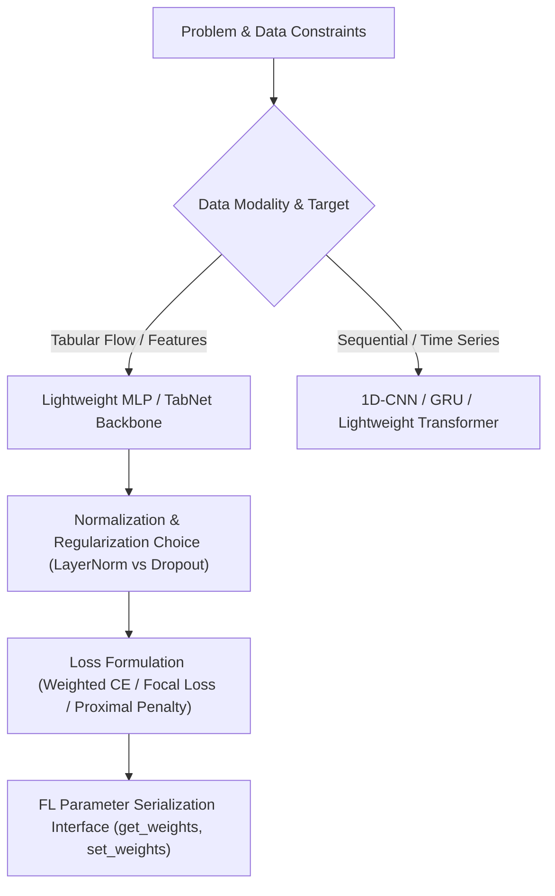

# 🧠 Model Design & Implementation Skill

This skill guides the principled engineering of deep learning model architectures, loss functions, and optimization routines tailored to specific data properties and deployment constraints (tabular network flows, distributed/federated edge learning, extreme class imbalance, and resource-bounded edge devices).

---

## 🎯 When to Use This Skill

Activate this skill when:
- Designing a neural network backbone for tabular, network-flow, or edge IoT data.
- Implementing PyTorch models compatible with Federated Learning frameworks (Flower, PySyft).
- Selecting normalization, activation, and regularization layers suitable for Non-IID distributed training.
- Implementing custom loss functions (Weighted Cross-Entropy, Focal Loss, FedProx Proximal Regularization).
- Debugging model convergence, exploding/vanishing gradients, or numerical instability.

---

## 🏗️ Architecture Design Principles



---

### Principle 1: Choosing the Backbone for Tabular Network Flows

For tabular network intrusion detection features (e.g., CICIoT2023, UNSW-NB15):
1. **Multi-Layer Perceptron (MLP):**
   - **Why:** Tabular flow records lack continuous spatial topology (unlike images). MLPs provide high computational efficiency, low parameter count, ultra-fast forward/backward passes on edge devices, and minimal communication payload in Federated Learning.
   - **Baseline Architecture:** Input $\to$ Dense(128) $\to$ ReLU/LeakyReLU $\to$ Dropout(0.2) $\to$ Dense(64) $\to$ ReLU $\to$ Dropout(0.2) $\to$ Dense(NumClasses).
2. **Parameter Footprint & Communication Budget:**
   - For an input dimension of $D_{in} = 39$ and $C = 8$ classes:
     $$\text{Weights} = (39 \times 128 + 128) + (128 \times 64 + 64) + (64 \times 8 + 8) = 5,120 + 8,256 + 520 = 13,896 \text{ parameters}$$
     $$\text{Model Size (float32)} = 13,896 \times 4 \text{ bytes} \approx 55.6 \text{ KB}$$
   - This ultra-light footprint allows edge IoT devices to transmit updates in $<10\text{ms}$ over low-bandwidth Wi-Fi/LTE connections.

---

### Principle 2: The Normalization Dilemma in Federated Learning

> ⚠️ **CRITICAL FL ARCHITECTURAL PITFALL: Avoid Standard BatchNorm in Non-IID FL!**

* **The Problem:** Batch Normalization (`nn.BatchNorm1d`) maintains running statistics (running mean $\mu_{run}$ and running variance $\sigma_{run}^2$) during local training. In Non-IID environments, client data distributions differ drastically. Averaging BatchNorm running statistics across heterogeneous clients at the server corrupts internal feature representations, leading to severe test performance collapse.
* **The Solution:**
  1. **Option A (Recommended for Tabular MLPs):** Omit normalization layers entirely if input features are properly scaled with `RobustScaler` / `StandardScaler`. Use **Dropout** for regularization.
  2. **Option B:** If normalization is required inside deep hidden layers, use **LayerNorm** (`nn.LayerNorm`) or **GroupNorm** (`nn.GroupNorm`), which compute normalization statistics across channel/feature dimensions per sample independently of batch statistics.

---

### Principle 3: Imbalance-Aware Loss Functions

When datasets exhibit heavy class imbalance (e.g., rare attack classes $<0.5\%$):

#### 1. Class-Weighted Cross-Entropy Loss:
Penalizes mistakes on rare attack classes proportionally to inverse class frequency:
$$\mathcal{L}_{WCE} = -\sum_{c=1}^C w_c \cdot y_c \log(\hat{y}_c)$$

#### 2. Multi-Class Focal Loss (PyTorch Implementation):
Down-weights easy well-classified examples and focuses training on hard minority samples:
```python
import torch
import torch.nn as nn
import torch.nn.functional as F

class MultiClassFocalLoss(nn.Module):
    def __init__(self, alpha=None, gamma=2.0, reduction='mean'):
        """
        Multi-class Focal Loss.
        alpha: Tensor of shape (num_classes,) containing per-class weights.
        gamma: Focusing parameter (default 2.0).
        """
        super().__init__()
        self.alpha = alpha
        self.gamma = gamma
        self.reduction = reduction

    def forward(self, inputs, targets):
        ce_loss = F.cross_entropy(inputs, targets, weight=self.alpha, reduction='none')
        pt = torch.exp(-ce_loss) # Probability of ground truth class
        focal_loss = ((1.0 - pt) ** self.gamma) * ce_loss
        
        if self.reduction == 'mean':
            return focal_loss.mean()
        elif self.reduction == 'sum':
            return focal_loss.sum()
        return focal_loss
```

---

### Principle 4: Implementing FedProx Proximal Regularization

In FedProx, the local objective includes a quadratic penalty constraining local model parameters $w$ to remain in the neighborhood of global parameters $w_t$:
$$\min_w h_k(w; w_t) = \mathcal{L}_{CE}(w) + \frac{\mu}{2} \sum_{l=1}^L \|w^{(l)} - w_t^{(l)}\|_2^2$$

#### Complete Local Trainer with FedProx:
```python
import copy
import torch

class LocalClientTrainer:
    def __init__(self, model, optimizer, criterion, device="cpu"):
        self.model = model
        self.optimizer = optimizer
        self.criterion = criterion
        self.device = device

    def train_epoch(self, dataloader, global_model=None, mu=0.0):
        """
        Trains model for 1 epoch.
        If global_model is provided and mu > 0, applies FedProx regularization.
        """
        self.model.train()
        total_loss = 0.0
        correct = 0
        total_samples = 0
        
        for X_batch, y_batch in dataloader:
            X_batch, y_batch = X_batch.to(self.device), y_batch.to(self.device)
            self.optimizer.zero_grad()
            
            outputs = self.model(X_batch)
            loss = self.criterion(outputs, y_batch)
            
            # FedProx Proximal Term
            if global_model is not None and mu > 0.0:
                proximal_term = 0.0
                for w, w_t in zip(self.model.parameters(), global_model.parameters()):
                    proximal_term += torch.sum((w - w_t) ** 2)
                loss = loss + (mu / 2.0) * proximal_term
                
            loss.backward()
            
            # Gradient clipping to guarantee numerical stability
            torch.nn.utils.clip_grad_norm_(self.model.parameters(), max_norm=5.0)
            
            self.optimizer.step()
            
            total_loss += loss.item() * len(y_batch)
            preds = outputs.argmax(dim=1)
            correct += (preds == y_batch).sum().item()
            total_samples += len(y_batch)
            
        avg_loss = total_loss / total_samples
        accuracy = correct / total_samples
        return avg_loss, accuracy
```

---

### Principle 5: Modular PyTorch Model Architecture with Flower Serialization

A clean model must decouple forward computation from parameter serialization:

```python
import torch
import torch.nn as nn
from typing import List
import numpy as np

class TabularIoTMLP(nn.Module):
    """
    Lightweight Multi-Layer Perceptron for Network Flow Intrusion Detection.
    """
    def __init__(self, input_dim: int = 39, num_classes: int = 8, dropout_rate: float = 0.2):
        super().__init__()
        self.network = nn.Sequential(
            nn.Linear(input_dim, 128),
            nn.ReLU(),
            nn.Dropout(dropout_rate),
            nn.Linear(128, 64),
            nn.ReLU(),
            nn.Dropout(dropout_rate),
            nn.Linear(64, num_classes)
        )

    def forward(self, x: torch.Tensor) -> torch.Tensor:
        return self.network(x)

    def get_weights(self) -> List[np.ndarray]:
        """Extract model parameters as a list of NumPy arrays for Flower server aggregation."""
        return [val.cpu().numpy() for _, val in self.state_dict().items()]

    def set_weights(self, weights: List[np.ndarray]) -> None:
        """Update model parameters from aggregated NumPy weights."""
        state_dict = dict(zip(self.state_dict().keys(), [torch.tensor(w) for w in weights]))
        self.load_state_dict(state_dict, strict=True)
```

---

## 🛠️ Verification & Debugging Protocol

Before launching multi-client FL simulations, run this 3-step sanity check:

1. **Step 1: The "Overfit Single Batch" Golden Sanity Check:**
   - Train the model on a single batch of 32 samples for 50 epochs with lr $= 10^{-3}$.
   - **Verification:** Training loss must drop to $< 0.05$ and accuracy reach $100\%$. If it fails, check for incorrect loss criteria, bad learning rate, or frozen weights.
2. **Step 2: Gradient Check & NaN Audit:**
   - Print gradient norms `[p.grad.norm().item() for p in model.parameters()]` after the first backward pass.
   - **Verification:** Gradients must be non-zero and finite (no NaNs or Infs).
3. **Step 3: Weight Setter / Getter Round-Trip Check:**
   - `weights = model.get_weights()` $\to$ `model.set_weights(weights)`.
   - **Verification:** Model predictions before and after must match exactly (`torch.allclose`).
