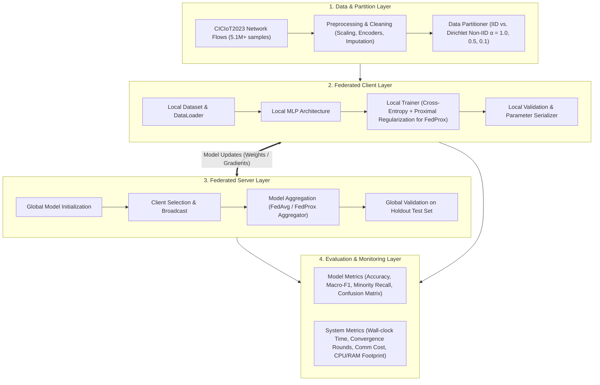

# 🌐 FL-IoT-IDS: Federated Learning-based IoT Intrusion Detection System in Non-IID Environments

[](https://www.python.org/)
[](https://pytorch.org/)
[](https://flower.ai/)
[](https://www.unb.ca/cic/datasets/iotdataset-2023.html)
[](LICENSE)

---

## 📌 Project Overview

* **Vietnamese Title:** *Xây dựng và đánh giá prototype hệ thống phát hiện xâm nhập IoT sử dụng Federated Learning trong môi trường dữ liệu non-IID*
* **English Title:** *Development and evaluation of an IoT intrusion detection system prototype using Federated Learning in non-IID data environments*
* **Author:** Nguyễn Việt Kỳ Quân (Student ID: 23521267)
* **Supervisor:** PGS.TS Lê Trung Quân
* **Institution:** Faculty of Computer Networks and Communications, University of Information Technology (UIT - VNU-HCM)
* **Timeline:** 15/09/2026 – 17/12/2026

---

## 🚀 Interactive Notebooks (Google Colab)

Run full experiments directly in your browser with zero local setup:

| Notebook | Focus & Methodology | Colab Quick Link |
| :--- | :--- | :--- |
| **Flower Distributed FL (gRPC)** | Standalone Flower server & $K=5$ edge clients via multi-process gRPC over TCP/IP sockets | [](https://colab.research.google.com/github/NVKQ2022/FedLearning/blob/main/notebooks/flower_federated_pipeline.ipynb) |
| **Federated Simulation Pipeline** | End-to-end PyTorch FL loop benchmarking IID (FedAvg) vs. Dirichlet Non-IID $\alpha=0.1$ (FedProx $\mu=0.05$) | [](https://colab.research.google.com/github/NVKQ2022/FedLearning/blob/main/notebooks/federated_training_pipeline.ipynb) |
| **Centralized Baseline** | Centralized Tabular IoT MLP with Weighted Cross-Entropy & Minority Attack Recall profiling | [](https://colab.research.google.com/github/NVKQ2022/FedLearning/blob/main/notebooks/centralized_training_pipeline.ipynb) |
| **Comprehensive EDA** | Statistical diagnosis, heavy-tail skewness, and Dirichlet client heterogeneity visualization | [](https://colab.research.google.com/github/NVKQ2022/FedLearning/blob/main/notebooks/comprehensive_eda.ipynb) |
| **Multi-Scenario Benchmark Suite** | Automated all-in-one runner comparing Centralized, FedAvg (IID), and FedProx (Non-IID) | [](https://colab.research.google.com/github/NVKQ2022/FedLearning/blob/main/notebooks/colab_experiment_runner.ipynb) |

---

## 🎯 Motivation & Problem Statement

Internet of Things (IoT) ecosystems are expanding rapidly, presenting massive attack surfaces susceptible to multi-vector cyber threats (DDoS, DoS, Reconnaissance, Spoofing, Mirai, Brute Force, Web attacks). Traditional Centralized Intrusion Detection Systems (IDS) require aggregating massive, highly sensitive edge network flows to a central cloud server, raising severe privacy concerns, high bandwidth strain, and single-point-of-failure vulnerabilities.

**Federated Learning (FL)** presents a privacy-preserving paradigm by training local models on distributed client devices and only exchanging model parameters with an aggregation server. However, real-world IoT deployments present significant **statistical heterogeneity (Non-IID data)**:
1. **Label Skew:** Certain IoT devices encounter specific attack vectors more frequently than others.
2. **Client Drift:** Non-IID distributions cause local optimization trajectories to diverge, degrading global convergence and catastrophic forgetting on minority attack classes.
3. **Resource Constraints:** Edge IoT gateways have limited compute and bandwidth budgets.

This project focuses on building an empirical, highly reproducible **FL-IDS prototype** using **PyTorch** and **Flower (`flwr`)**, benchmarking **FedAvg** vs. **FedProx** under controlled Dirichlet-partitioned Non-IID scenarios on the **CICIoT2023** dataset.

```
                    ┌─────────────────────────┐
                    │   Federated Server      │
                    │   - Aggregator (FedAvg/ │
                    │     FedProx)            │
                    │   - Global Evaluation   │
                    └───────────┬─────────────┘
                                │ (Weights w_t)
                 ▲ (Δw_k)       │
            ┌────┴──────────────┼───────────────┐
            │                   │               │
    ┌───────▼────────┐  ┌───────▼────────┐  ┌───▼────────────┐
    │ Client 1 (IoT) │  │ Client 2 (IoT) │  │ Client K (IoT) │
    │ Local MLP      │  │ Local MLP      │  │ Local MLP      │
    │ Non-IID Data 1 │  │ Non-IID Data 2 │  │ Non-IID Data K │
    └────────────────┘  └────────────────┘  └────────────────┘
```

---

## 🏗️ System Architecture

The prototype is decoupled into 4 modular layers:



---

## 📊 Dataset & Exploratory Data Analysis (EDA)

The core benchmark utilizes **CICIoT2023**, containing **5,116,391 network flows** across 39 tabular features.

### 1. Attack Class Distribution (8 Grouped Classes)

| Group Class | Sample Count | Percentage (%) | Imbalance Ratio (vs. Largest) |
| :--- | :--- | :--- | :--- |
| **DDoS** | 1,922,002 | 37.57% | 1.000 |
| **Benign** | 1,098,191 | 21.46% | 0.571 |
| **DoS** | 730,344 | 14.27% | 0.380 |
| **Recon** | 690,534 | 13.50% | 0.359 |
| **Spoof** | 426,604 | 8.34% | 0.222 |
| **Mirai** | 210,823 | 4.12% | 0.110 |
| **Web-based** *(Minority)* | 24,829 | 0.49% | 0.013 |
| **Brute-force** *(Minority)* | 13,064 | 0.26% | 0.007 |
| **Total** | **5,116,391** | **100.0%** | — |

> ⚠️ **Key Observation:** Severe class imbalance exists for `Web-based` (0.49%) and `Brute-force` (0.26%). Under high non-IID partition ($\alpha=0.1$), these minority classes can be easily forgotten by the global model, making **Macro-F1** and **Minority Recall** mandatory evaluation criteria.

### 2. Feature Summary (39 Network-Flow Attributes)
* **Statistical Flow Metrics:** `IAT` (Inter-Arrival Time), `Rate`, `Tot sum`, `Tot size`, `AVG`, `Std`, `Variance`, `Min`, `Max`, `Number`
* **Transport & Protocol Flags:** `Protocol Type`, `Header_Length`, `Time_To_Live`, `fin_flag_number`, `syn_flag_number`, `rst_flag_number`, `psh_flag_number`, `ack_flag_number`, `ece_flag_number`, `cwr_flag_number`, flag counts (`fin_count`, `syn_count`, `rst_count`, `ack_count`)
* **Application Protocols & L2/L3 Identifiers:** `HTTP`, `HTTPS`, `DNS`, `Telnet`, `SMTP`, `SSH`, `IRC`, `TCP`, `UDP`, `DHCP`, `ARP`, `ICMP`, `IGMP`, `IPv`, `LLC`

---

## 🧠 Federated Learning Strategies

### 1. FedAvg (Federated Averaging Baseline)
Aggregates parameters based on the relative sample volume of each client:
$$w_{t+1} = \sum_{k=1}^K \frac{n_k}{N} w_{t+1}^k$$

### 2. FedProx (Federated Proximal Optimization)
Addresses client drift in Non-IID distributions by adding a proximal penalty to the local objective function:
$$\min_{w} h_k(w; w_t) = F_k(w) + \frac{\mu}{2} \|w - w_t\|^2$$
* $\mu \ge 0$: Proximal regularization coefficient constraining local updates from wandering too far from the global model $w_t$.

### 3. Non-IID Dirichlet Partitioning
Client class distributions $p_c \sim \text{Dir}(\alpha)$ are generated across 3 distinct heterogeneity tiers:
* **$\alpha = 1.0$:** Mild statistical heterogeneity.
* **$\alpha = 0.5$:** Moderate statistical heterogeneity.
* **$\alpha = 0.1$:** Severe statistical heterogeneity (extreme label skew).

---

## 🧪 Experimental Roadmap & Scenarios

| ID | Configuration | Aggregation | Partition Setting | Primary Objective |
| :--- | :--- | :--- | :--- | :--- |
| **E1** | Centralized MLP | N/A | Centralized Train/Val/Test (80/10/10) | Empirical performance upper-bound |
| **E2** | Federated (5 clients) | FedAvg & FedProx | Uniform IID Partition | Baseline verification under ideal FL setting |
| **E3** | Federated (5 clients) | FedAvg & FedProx | Non-IID Dirichlet ($\alpha = 1.0$) | Mild heterogeneity assessment |
| **E4** | Federated (5 clients) | FedAvg & FedProx | Non-IID Dirichlet ($\alpha = 0.5$) | Moderate heterogeneity & client drift impact |
| **E5** | Federated (5 clients) | FedAvg & FedProx | Non-IID Dirichlet ($\alpha = 0.1$) | Extreme non-IID resilience & FedProx penalty evaluation |
| **E6** | Scalability Test | FedAvg & FedProx | 5, 7, and 10 Clients | Impact on convergence, communication cost, and memory |

### Evaluation Metrics
* **Model Classification Performance:** Accuracy, Precision, Recall, Macro-F1, Minority Recall, Confusion Matrix.
* **FL & System Efficiency:** Convergence Rounds (to target F1), Total Wall-clock Training Time, Communication Cost (MB uploaded/downloaded: $2 \times m_t \times |w| \times T$), CPU/RAM/VRAM consumption.

---

## 📁 Repository Structure

```text
FedLearning/
├── datasets/                    # Dataset directory
│   └── CICIOT2023/              # Preprocessed & raw CICIoT2023 CSVs
├── notebooks/                   # Jupyter exploratory & visualization notebooks
│   ├── 01_eda_ciciot2023.ipynb
│   └── 02_centralized_mlp.ipynb
├── docs/                        # Additional project documentation & reports
├── notes/                       # Research logs & meeting notes
├── papers/                      # Key reference literature & surveys
├── reports/                     # Generated experiment artifacts
│   └── eda_result/              # EDA statistics, distributions, and correlation maps
├── thesis_proposal/             # Official thesis proposal & outline (KLTN)
│   ├── DeCuongChiTiet_KLTN.md
│   └── DeCuongChiTiet_KLTN.docx.pdf
├── src/                         # Source code modules (planned)
│   ├── data/                    # Preprocessing, loaders, Dirichlet partitioners
│   ├── models/                  # PyTorch MLP architecture definitions
│   ├── fl/                      # Flower client & server implementations (FedAvg, FedProx)
│   ├── utils/                   # Metrics calculation, logging, resource monitors
│   └── run_experiments.py       # Main experiment runner entry point
├── configs/                     # Experiment YAML configurations
├── requirements.txt             # Python dependencies
└── README.md                    # Project documentation
```

---

## 🚀 Getting Started

### 1. Environment Setup

```bash
# Clone repository
git clone https://github.com/NVKQ2022/FedLearning.git
cd FedLearning

# Create and activate virtual environment
python3 -m venv venv
source venv/bin/activate

# Install dependencies
pip install --upgrade pip
pip install -r requirements.txt
```

### 2. Dependencies (`requirements.txt`)
* `torch>=2.0.0`
* `flwr>=1.7.0`
* `scikit-learn>=1.3.0`
* `pandas>=2.0.0`
* `numpy>=1.24.0`
* `matplotlib>=3.7.0`
* `seaborn>=0.12.0`
* `psutil>=5.9.0`
* `tqdm>=4.65.0`
* `pyyaml>=6.0`

---

## 📚 Key References

1. **CICIoT2023 Benchmark:** Neto et al., *"CICIoT2023: A Real-Time Dataset and Benchmark for Large-Scale Attacks in IoT Environment"*, Sensors, 2023.
2. **FedAvg:** McMahan et al., *"Communication-Efficient Learning of Deep Networks from Decentralized Data"*, AISTATS, 2017.
3. **FedProx:** Li et al., *"Federated Optimization in Heterogeneous Networks"*, MLSys, 2020.
4. **FL-IDS on Non-IID Data:** Huang et al., *"Federated learning-based IoT intrusion detection on non-IID data"*, GIoTS, 2022.
5. **Flower Framework:** Beutel et al., *"Flower: A Friendly Federated Learning Research Framework"*, arXiv:2007.14390.

---

*Graduation Thesis Project (2026 – 2027) | Faculty of Computer Networks and Communications, UIT - VNU-HCM*
