# 🏛️ Clean Architecture & Scalability Guide: FL-IoT-IDS

This document specifies the software architecture, design contracts, and extension points of the **FL-IoT-IDS** codebase. It adheres to **SOLID principles**, strict separation of concerns, and clean abstractions to guarantee that the system remains easily extensible for future research in centralized and federated learning.

---

## 🗺️ High-Level Class Hierarchy

```mermaid
classDiagram
    %% Base Models
    class BaseModel {
        <<abstract>>
        +forward(x)* Tensor
        +get_num_parameters(trainable_only) int
        +get_model_size_kb() float
        +save_weights(filepath)
        +load_weights(filepath)
        +freeze()
        +unfreeze()
        +summary() str
    }

    class BaseFederatedModel {
        <<abstract>>
        +get_weights() List[ndarray]
        +set_weights(weights)
        +get_weights_tensor() Dict[str, Tensor]
        +set_weights_tensor(state_dict)
        +compute_parameter_delta(ref) List[ndarray]
        +compute_l2_norm_delta(ref_model) float
    }
    BaseModel <|-- BaseFederatedModel
    BaseFederatedModel <|-- TabularIoTMLPModel

    %% Base Trainers
    class BaseTrainer {
        <<abstract>>
        +model: BaseModel
        +optimizer: Optimizer
        +criterion: BaseLoss
        +device: torch.device
        +max_grad_norm: float
        +train_epoch(dataloader)* (loss, acc)
        +evaluate(dataloader) (loss, acc)
        +clip_gradients() float
        +save_checkpoint(filepath)
        +load_checkpoint(filepath)
    }
    BaseTrainer <|-- CentralizedTrainer
    BaseTrainer <|-- FederatedClientTrainer

    %% Base Partitioner
    class BasePartitioner {
        <<abstract>>
        +num_clients: int
        +seed: int
        +partition(y)* Dict[int, ndarray]
        +verify_partition(partition_dict, total_samples) bool
        +get_client_distribution(y, partition_dict) DataFrame
        +compute_heterogeneity_score(y, partition_dict) Dict
    }
    BasePartitioner <|-- StratifiedIIDPartitioner
    BasePartitioner <|-- DirichletNonIIDPartitioner

    %% Base Strategy
    class BaseFederatedStrategy {
        <<abstract>>
        +name: str
        +aggregate_fit(round, client_results)* (weights, metrics)
        +aggregate_evaluate(round, client_eval_results)* (loss, metrics)
        +weighted_average(weights, samples)$ List[ndarray]
        +coordinate_wise_median(weights)$ List[ndarray]
        +trimmed_mean(weights, beta)$ List[ndarray]
    }
    BaseFederatedStrategy <|-- FedAvgStrategy
    FedAvgStrategy <|-- FedProxStrategy
    BaseFederatedStrategy <|-- FedMedianStrategy
    BaseFederatedStrategy <|-- FedTrimmedMeanStrategy

    %% Base Preprocessor
    class BasePreprocessor {
        <<abstract>>
        +is_fitted: bool
        +fit(df, target_col)* BasePreprocessor
        +transform(df, target_col)* (X, y)
        +fit_transform(df, target_col) (X, y)
        +save(filepath)
        +load(filepath)$ BasePreprocessor
    }
    BasePreprocessor <|-- TabularDataPreprocessor

    %% Base Loss
    class BaseLoss {
        <<abstract>>
        +reduction: str
        +class_weights: Tensor
        +forward(inputs, targets)* Tensor
        +validate_inputs(inputs, targets)
        +apply_reduction(unreduced_loss) Tensor
    }
    BaseLoss <|-- MultiClassFocalLoss
```



---

## 🧩 1. The 6 Core Base Contracts

All fundamental interfaces reside in the [`src/base/`](file:///home/quan/projects/FedLearning/src/base/) package and are re-exported by their respective domain namespaces (`src.models`, `src.training`, `src.data`, `src.losses`, `src.federated`).

### 1.1 `BaseModel` & `BaseFederatedModel` (`src/base/model.py`)
- **`BaseModel`**: Root PyTorch model contract. Implements:
  - `get_num_parameters(trainable_only: bool)`: Precise parameter accounting.
  - `get_model_size_kb()`: Footprint estimation in KB.
  - `save_weights(filepath)` / `load_weights(filepath)`: Safe serialization.
  - `freeze()` / `unfreeze()`: Backbone gradient toggling.
  - `summary()`: Architectural string overview.
- **`BaseFederatedModel`**: Extends `BaseModel` for distributed learning:
  - `get_weights() -> List[np.ndarray]`: Extracts flat NumPy arrays for Flower / FedAvg.
  - `set_weights(weights: List[np.ndarray])`: Safely updates model state.
  - `compute_parameter_delta(ref_weights)`: Computes $\Delta w = w - w_{ref}$.
  - `compute_l2_norm_delta(ref_model)`: Computes Euclidean parameter divergence $||w - w_{ref}||_2$.

### 1.2 `BaseTrainer` (`src/base/trainer.py`)
- Standardizes the training lifecycle for both centralized and client-local training:
  - `train_epoch(dataloader) -> Tuple[float, float]`: Abstract forward/backward pass.
  - `evaluate(dataloader) -> Tuple[float, float]`: Universal zero-grad validation/test inference.
  - `clip_gradients() -> float`: Centralized gradient norm clipping (`max_grad_norm`).
  - `save_checkpoint()` / `load_checkpoint()`: Model, optimizer, and metadata serialization.

### 1.3 `BasePreprocessor` (`src/base/preprocessor.py`)
- Enforces strict data leakage prevention:
  - `fit(df, target_col)`: Learns parameters *strictly* from training data.
  - `transform(df, target_col)`: Applies learned imputations/scalers to unseen data.
  - `fit_transform(df, target_col)`: Combined convenience method.
  - `save(filepath)` / `load(filepath)`: Persistent state serialization.

### 1.4 `BasePartitioner` (`src/base/partitioner.py`)
- Standardizes client data partitioning for federated simulations:
  - `partition(y, **kwargs) -> Dict[int, np.ndarray]`: Assigns sample indices to $K$ clients.
  - `verify_partition()`: Verifies zero index overlap across clients (data isolation audit).
  - `get_client_distribution()`: Returns a client-by-class contingency table.
  - `compute_heterogeneity_score()`: Computes Mean Total Variation (TV) distance against the global distribution.

### 1.5 `BaseFederatedStrategy` (`src/base/strategy.py`)
- Server-side aggregation and coordination contract:
  - `aggregate_fit(server_round, client_results)`: Combines client updates.
  - `aggregate_evaluate(server_round, client_eval_results)`: Combines client evaluation scores.
  - Built-in primitives:
    - `weighted_average(weights, samples)`: Sample-weighted parameter averaging (FedAvg).
    - `coordinate_wise_median(weights)`: Byzantine fault-tolerant aggregation.
    - `trimmed_mean(weights, trim_fraction)`: Adversarial outlier mitigation.

### 1.6 `BaseLoss` (`src/base/loss.py`)
- Imbalance-aware loss interface:
  - `forward(inputs, targets)`: Abstract objective calculation.
  - `validate_inputs(inputs, targets)`: Dimension compatibility and device checks.
  - `apply_reduction(loss)`: Consistent reduction (`'mean'`, `'sum'`, `'none'`).

---

## 🚀 2. Scalability Guide: How to Extend in the Future

### 2.1 Adding a New Neural Network Architecture (e.g., 1D-CNN or TabNet)
To add a new architecture, subclass `BaseFederatedModel` and implement `forward()`. All parameter extraction, serialization, and footprint analytics are inherited for free:

```python
import torch
import torch.nn as nn
from src.base.model import BaseFederatedModel

class Tabular1DCNN(BaseFederatedModel):
    def __init__(self, input_dim: int = 39, num_classes: int = 8):
        super().__init__()
        self.conv = nn.Sequential(
            nn.Conv1d(1, 32, kernel_size=3, padding=1),
            nn.ReLU(),
            nn.MaxPool1d(2),
            nn.Flatten(),
            nn.Linear(32 * (input_dim // 2), 64),
            nn.ReLU(),
            nn.Linear(64, num_classes)
        )

    def forward(self, x: torch.Tensor) -> torch.Tensor:
        # Reshape (batch, features) -> (batch, 1, features)
        return self.conv(x.unsqueeze(1))
```

### 2.2 Adding a New Federated Aggregation Strategy (e.g., FedNova or SCAFFOLD)
To add an aggregation algorithm, subclass `BaseFederatedStrategy`:

```python
from src.base.strategy import BaseFederatedStrategy

class FedNovaStrategy(BaseFederatedStrategy):
    def __init__(self, **kwargs):
        super().__init__(name="FedNova", **kwargs)

    def aggregate_fit(self, server_round, client_results):
        # 1. Normalize gradient updates by client local steps
        # 2. Re-aggregate using weighted_average
        return aggregated_weights, {"round": server_round, "strategy": "FedNova"}

    def aggregate_evaluate(self, server_round, client_eval_results):
        # Weighted evaluation
        ...
```

### 2.3 Adding a New Partitioning Scheme (e.g., Pathological Label Skew)
Subclass `BasePartitioner` to simulate non-Dirichlet scenarios (e.g. each client gets strictly 2 classes):

```python
from src.base.partitioner import BasePartitioner

class PathologicalPartitioner(BasePartitioner):
    def __init__(self, num_clients: int, classes_per_client: int = 2, seed: int = 42):
        super().__init__(num_clients=num_clients, seed=seed)
        self.classes_per_client = classes_per_client

    def partition(self, y, **kwargs):
        # Assign sample indices
        # ...
        return client_dict
```

### 2.4 Adding a New Loss Function (e.g., Label-Smoothing Cross Entropy)
Subclass `BaseLoss`:

```python
import torch.nn.functional as F
from src.base.loss import BaseLoss

class LabelSmoothingCELoss(BaseLoss):
    def __init__(self, smoothing: float = 0.1, class_weights=None, reduction="mean"):
        super().__init__(class_weights=class_weights, reduction=reduction)
        self.smoothing = smoothing

    def forward(self, inputs, targets):
        self.validate_inputs(inputs, targets)
        loss = F.cross_entropy(inputs, targets, weight=self.class_weights, label_smoothing=self.smoothing, reduction="none")
        return self.apply_reduction(loss)
```

---

## 🛡️ 3. Verification & Compliance Checklist

| Architecture Pillar | Verification Standard | Implementation Status |
| :--- | :--- | :--- |
| **Separation of Concerns** | Models, Trainers, Partitioners, and Strategies are completely decoupled. | ✅ Passed |
| **Liskov Substitution** | Any subclass of `BaseModel` can be trained by any `BaseTrainer`. | ✅ Passed |
| **Data Leakage Prevention** | `BasePreprocessor` fits on train splits only; `BasePartitioner.verify_partition()` enforces zero inter-client overlap. | ✅ Passed |
| **Byzantine Robustness** | `BaseFederatedStrategy` provides coordinate-wise median and trimmed-mean aggregators. | ✅ Passed |
| **Backward Compatibility** | All legacy functional calls (`partition_iid`, `CentralizedTrainer`, `TabularIoTMLP`) remain 100% intact. | ✅ Passed |
