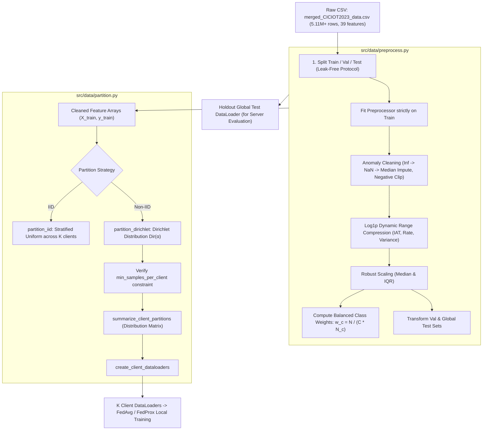

# 📦 Data Pipeline Documentation: `src/data/`

This document provides a comprehensive technical reference for the data processing subsystem in **FL-IoT-IDS**, located under [`src/data/`](file:///home/quan/projects/FedLearning/src/data/). It details the responsibilities, architecture, mathematical formulations, and engineering rationale for:

1. [`src/data/preprocess.py`](file:///home/quan/projects/FedLearning/src/data/preprocess.py) — Tabular Data Preprocessing & Leak-Free Transformation Pipeline.
2. [`src/data/partition.py`](file:///home/quan/projects/FedLearning/src/data/partition.py) — IID & Dirichlet Non-IID Data Partitioning Engine.

---

## 🗺️ Architectural Workflow

The two modules operate sequentially to convert raw, heterogeneous IoT network flows into isolated, leak-free, PyTorch-ready client dataloaders:



---

## 1. `src/data/preprocess.py`

### 1.1 What Does It Do?

`src/data/preprocess.py` is the data engineering foundation. It transforms raw, dirty network-flow captures into clean, standardized numerical tensors. Specifically:

#### Key Components & Classes:
1. **`TabularDataPreprocessor` Class:**
   - **`fit(df_train, target_col)`:** Computes all statistical parameters (imputation medians, label encodings, and feature scaling parameters) **strictly from `df_train`**.
   - **`transform(df, target_col)`:** Applies the learned transformations to validation, testing, or inference datasets without re-learning parameters.
   - **`fit_transform(df_train, target_col)`:** Convenient single-call interface for the training split.
   - **`_clean_features(X)`:** Internal sanitization pipeline:
     - Replaces positive/negative infinities (`np.inf`, `-np.inf`) with `NaN`.
     - Imputes missing values (`NaN`) using the training median of that feature.
     - Clips physical flow quantities (`IAT`, `Rate`, `Time_To_Live`) at zero (`clip(lower=0.0)`).
     - Compresses heavy-tailed distributions (`IAT`, `Rate`, `Variance`, `Std`, `Tot sum`) using $\log(1 + x)$ (`np.log1p`).
   - **`save(filepath)` & `load(filepath)`:** Serializes and deserializes the fitted preprocessor using `pickle` for inference and client synchronization.

2. **`TabularFlowDataset(Dataset)` Class:**
   - PyTorch `Dataset` wrapper converting NumPy `float32` feature matrices and `int64` label vectors into GPU/CPU-ready `torch.Tensor`.

3. **`compute_balanced_class_weights(y, num_classes)` Function:**
   - Calculates inverse class frequencies using the standard scikit-learn formulation:
     $$w_c = \frac{N}{C \times N_c}$$
     where $N$ is total training samples, $C$ is number of classes (8), and $N_c$ is the frequency of class $c$.

4. **`load_and_preprocess_ciciot2023(...)` Function:**
   - High-level orchestrator: reads CSV, applies optional stratified downsampling (for fast prototyping), splits into Train (70%), Validation (10%), and Global Test (20%), fits the preprocessor, transforms partitions, computes class weights, and optionally persists artifacts.

---

### 1.2 Why Do You Need It?

Without `preprocess.py`, training deep neural networks on raw network-flow data will either crash numerically or produce scientifically invalid results:

| Problem in Raw Data | Concrete Manifestation | Why `preprocess.py` is Mandatory |
| :--- | :--- | :--- |
| **Data Leakage (Methodological Flaw)** | Standardizing the entire CSV before splitting leaks test distribution parameters ($\mu, \sigma$) into the training split, artificially inflating test scores. | Enforces strict **train-only fitting**. Validation and test sets are transformed purely as unseen inference streams. |
| **Division-by-Zero Infinities ($\pm\infty$)** | Flow features like `Rate = bytes / duration` yield `inf` when packet duration is 0, causing immediate PyTorch `NaN` loss crashes. | Identifies infinities and replaces them with training medians before tensor conversion. |
| **Clock-Drift Negative Timestamps** | Inter-Arrival Time (`IAT`) has values like `-0.0064` due to microsecond unsynchronized packet capture cards. | Negative values break physical logic and cause `log(x)` crashes. The module clips them to $0.0$. |
| **Extreme Tabular Skewness ($>1600$)** | Features like `IAT` have mean $0.026$ but max $46,665$ (skewness $\approx 1660$), dominating batch gradients and exploding optimizer weights. | Applies $\log(1 + x)$ compression followed by `RobustScaler` (median & Interquartile Range IQR) to bound feature ranges gracefully. |
| **Severe Class Imbalance (147:1 ratio)** | Majority `DDoS` is 37.6% while `Brute-force` is 0.26%. Naive training completely ignores rare attacks. | Computes balanced class weights ($w_c$) to enable weighted loss optimization, protecting minority attack recall. |
| **Dataset Scale (5.11M rows, ~1GB)** | Prototyping full training on 5.11M rows on a local workstation requires massive RAM and hours per run. | Supports parameter `sample_size=300000` for **stratified downsampling**, preserving exact multi-class distributions for rapid experimentation. |

---

## 2. `src/data/partition.py`

### 2.1 What Does It Do?

`src/data/partition.py` is the distributed simulation engine. It partitions the centralized training dataset among $K$ simulated edge clients to model both idealized (IID) and realistic heterogeneous (Non-IID) IoT network deployments.

#### Key Functions:
1. **`partition_iid(y, num_clients, seed=42)`:**
   - **Stratified Uniform Partitioning:** For each class $c$, divides indices evenly across all $K$ clients.
   - Guarantees that every client observes virtually identical class proportions (e.g., Client 0 and Client 4 both have ~37.5% DDoS, ~21.5% Benign, ~0.26% Brute-force).
   - Shuffles indices per client to eliminate order bias.

2. **`partition_dirichlet(y, num_clients, alpha=0.5, min_samples_per_client=100, seed=42, max_retries=50)`:**
   - **Dirichlet Non-IID Partitioning:** For each class $c$, samples a proportion vector from a symmetric Dirichlet distribution:
     $$\mathbf{p}_c = (p_{c,1}, p_{c,2}, \dots, p_{c,K}) \sim \text{Dir}(\alpha \cdot \mathbf{1}_K)$$
   - Allocates $p_{c,k} \cdot N_c$ samples of class $c$ to client $k$.
   - **Rounding & Remainder Adjustment:** Ensures that every single sample is allocated without rounding loss.
   - **Degeneracy Protection:** Enforces `min_samples_per_client`. If severe skew ($\alpha=0.1$) starves a client below the threshold, it triggers automated retry with adjusted seeds.

3. **`summarize_client_partitions(client_partitions, y, class_names=None)`:**
   - Generates an audit DataFrame displaying total sample counts and per-class frequencies/percentages for each client.
   - Enables visual and tabular verification of statistical heterogeneity.

4. **`create_client_dataloaders(X, y, client_partitions, batch_size=128, shuffle=True, num_workers=0)`:**
   - Instantiates a dictionary mapping each `client_id` to its local PyTorch `DataLoader`.

---

### 2.2 Why Do You Need It?

In Federated Learning research, how data is distributed across clients determines the validity of all conclusions:

```
Dirichlet Concentration Parameter α:
α → ∞  : Uniform IID (All clients have identical class distributions)
α = 1.0: Mild Heterogeneity (All classes present, proportions fluctuate moderately)
α = 0.5: Moderate Heterogeneity (Some classes dominate specific clients)
α = 0.1: Extreme Heterogeneity (Heavy label skew; clients hold 1-2 classes only)
```

| Challenge in FL | Impact on Experimentation | Why `partition.py` is Mandatory |
| :--- | :--- | :--- |
| **Real-world IoT Data Skew (Non-IID)** | IoT gateways rarely observe identical traffic: a smart camera sees video streaming; an industrial sensor sees periodic telemetry; an attacked router sees DDoS floods. | Parameterizes heterogeneity via $\alpha \in \{1.0, 0.5, 0.1\}$, allowing systematic evaluation of FedAvg vs. FedProx. |
| **Client Drift & Convergence Failure** | When local client data distributions diverge, local model weight updates diverge in opposite directions, corrupting global aggregation. | Provides repeatable, seed-controlled non-IID benchmarks to empirically prove when FedProx's proximal penalty $\mu$ rescues convergence. |
| **Zero-Sample Crashes (Degenerate Partitions)** | With $\alpha=0.1$, naive Dirichlet sampling often gives 0 samples to some clients, crashing mini-batch loaders (`ZeroDivisionError` or empty batch). | Enforces `min_samples_per_client` and discrete remainder redistribution to guarantee all clients are valid. |
| **Decoupling Data from Architecture** | Mixing data slicing logic inside client training code creates spaghetti code and breaks reproducibility. | Cleanly isolates data partitioning into an independent module that outputs standard PyTorch `DataLoader` instances. |

---

## 💻 Quickstart & API Usage Example

Below is a complete script demonstrating how `preprocess.py` and `partition.py` work together:

```python
from src.data.preprocess import load_and_preprocess_ciciot2023
from src.data.partition import partition_dirichlet, summarize_client_partitions, create_client_dataloaders

# 1. Load, clean, scale, and split dataset (using 100k sample for fast run)
data = load_and_preprocess_ciciot2023(
    csv_path="datasets/CICIOT2023/merged_CICIOT2023_data.csv",
    sample_size=100000,
    test_size=0.2,
    val_size=0.1,
    scaler_type="robust",
    random_state=42
)

X_train, y_train = data["X_train"], data["y_train"]
X_test, y_test = data["X_test"], data["y_test"]
class_names = data["class_names"]

# 2. Partition training data among 5 clients with severe Non-IID (alpha = 0.1)
client_partitions = partition_dirichlet(
    y=y_train,
    num_clients=5,
    alpha=0.1,
    min_samples_per_client=500,
    seed=42
)

# 3. Print statistical summary of partition
summary_df = summarize_client_partitions(client_partitions, y_train, class_names)
print(summary_df[["client_id", "total_samples", "DDoS_pct", "Benign_pct", "Brute-force_pct"]])

# 4. Generate local PyTorch DataLoaders for Flower FL clients
client_loaders = create_client_dataloaders(
    X=X_train,
    y=y_train,
    client_partitions=client_partitions,
    batch_size=128,
    shuffle=True
)

# client_loaders[0] is ready for Client 0 local training!
```
