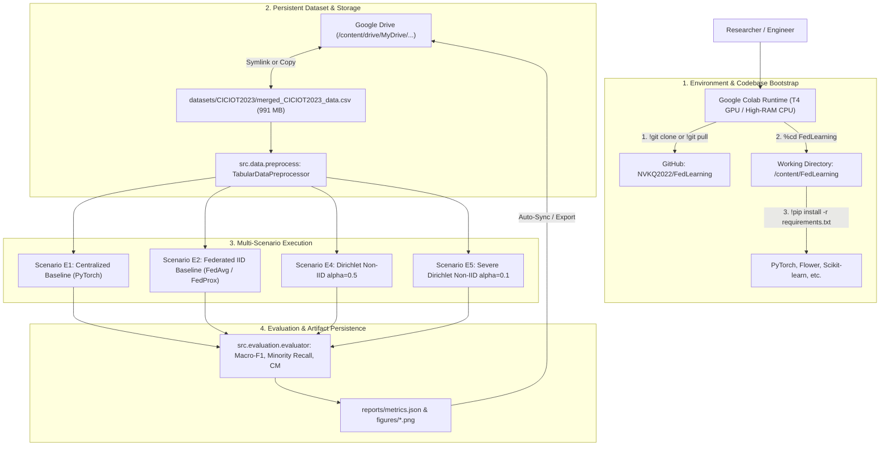

# ☁️ Google Colab Experiment Guide: FL-IoT-IDS

Comprehensive, step-by-step technical guide for configuring, pulling, and orchestrating multi-scenario Federated Learning and Centralized benchmark experiments on **Google Colab**.

* **Repository:** [`https://github.com/NVKQ2022/FedLearning.git`](https://github.com/NVKQ2022/FedLearning.git)
* **Associated Notebooks:**
  * Centralized Pipeline: [`notebooks/centralized_training_pipeline.ipynb`](file:///home/quan/projects/FedLearning/notebooks/centralized_training_pipeline.ipynb)
  * Federated Pipeline: [`notebooks/federated_training_pipeline.ipynb`](file:///home/quan/projects/FedLearning/notebooks/federated_training_pipeline.ipynb)
  * Multi-Scenario Runner: [`notebooks/colab_experiment_runner.ipynb`](file:///home/quan/projects/FedLearning/notebooks/colab_experiment_runner.ipynb)
* **Skill Reference:** [skills/experiment-orchestration/SKILL.md](file:///home/quan/projects/FedLearning/.agents/skills/experiment-orchestration/SKILL.md) & [skills/code-documentation/SKILL.md](file:///home/quan/projects/FedLearning/.agents/skills/code-documentation/SKILL.md)

---

## 🗺️ Architectural Context: Colab Cloud Workflow



---

## 1. What Does It Do?

This guide provides researchers with a turnkey, publication-grade workflow to execute intrusion detection benchmarks on Google Colab. It decouples ephemeral cloud compute from persistent storage, ensuring all model checkpoints, confusion matrices, and empirical metrics survive Colab session disconnections.

### 1.1 Experimental Scenarios Covered

| Scenario ID | Task Name | Framework | Aggregation | Partition Scheme | Clients ($K$) | Proximal $\mu$ | Objective |
| :--- | :--- | :--- | :--- | :--- | :--- | :--- | :--- |
| **E1** | Centralized Baseline | PyTorch | N/A | Full Split (70/10/20) | 1 | 0.0 | Empirical performance upper bound ceiling |
| **E2** | IID FL Baseline | Flower | FedAvg & FedProx | Uniform Stratified | 5 | 0.0 vs 0.01 | Quantify FL penalty under ideal data distribution |
| **E4** | Moderate Non-IID | Flower | FedAvg & FedProx | Dirichlet $\alpha = 0.5$ | 5 | 0.0 vs 0.05 | Client drift emergence and FedProx stability |
| **E5** | Severe Non-IID | Flower | FedAvg & FedProx | Dirichlet $\alpha = 0.1$ | 5 | 0.0 vs 0.1 | Resilience to extreme label skew (rare attack isolation) |

---

## 2. Why Do You Need It?

| Colab Limitation / Risk | Failure Mode Without This Guide | How This Workflow Solves It |
| :--- | :--- | :--- |
| **Ephemeral Disk Storage** | Colab instances terminate after 12 hours or brief inactivity; all trained weights and logs are permanently lost. | Mounts **Google Drive** directly to persist dataset inputs and experiment outputs (`reports/` and figures). |
| **Large Dataset Constraint (991 MB)** | GitHub restricts files $>100$ MB (`merged_CICIOT2023_data.csv` is git-ignored); `git clone` alone lacks data. | Documents 3 distinct data acquisition options: Google Drive mount, direct cloud download, or rapid synthetic dry-run. |
| **Module Import Errors (`ModuleNotFoundError`)** | Python does not automatically add cloned directories to `sys.path`, breaking `from src.models import ...`. | Enforces `%cd /content/FedLearning` and explicit `sys.path.append` at notebook startup. |
| **Flower Simulation Thread Contention** | Colab free tier provides 2 virtual CPUs. Naive Flower configs spawn too many Ray workers, causing OOM freezes. | Optimizes client concurrency via `client_resources={"num_cpus": 1}` for smooth execution within Colab limits. |
| **GPU/CPU Tensor Mismatch** | Models placed on `cuda` while Flower numpy client loads CPU arrays crash training. | Uses standardized device dispatching in `src.training.trainer` and `src.evaluation.evaluator`. |

---

## 3. Step-by-Step Execution Guide

### Step 1: Open Google Colab & Select Hardware Accelerator

1. Go to [Google Colab](https://colab.research.google.com/).
2. Click **File** $\to$ **New Notebook** (or open [`notebooks/colab_experiment_runner.ipynb`](file:///home/quan/projects/FedLearning/notebooks/colab_experiment_runner.ipynb)).
3. Select Runtime Type:
   * Navigate to **Runtime** $\to$ **Change runtime type**.
   * Under **Hardware accelerator**, select **T4 GPU** (recommended for faster forward/backward passes) or **CPU** (our ultra-lightweight 13.9K parameter MLP runs cleanly on CPU as well).
   * Click **Save**.

---

### Step 2: Clone Repository & Setup Environment

In the first Colab cell, clone the repository, change into the project directory, and pull the latest code:

```python
# 1. Clone repository from GitHub (or pull if already present)
import os, sys, subprocess

repo_url = "https://github.com/NVKQ2022/FedLearning.git"
repo_dir = "/content/FedLearning"

if not os.path.exists(repo_dir):
    print(f"Cloning {repo_url}...")
    subprocess.run(["git", "clone", repo_url, repo_dir], check=True)
else:
    print("Repository already present. Pulling latest updates...")
    subprocess.run(["git", "-C", repo_dir, "pull", "origin", "main"], check=True)

# 2. Enter repository root & add to sys.path
os.chdir(repo_dir)
if repo_dir not in sys.path:
    sys.path.insert(0, repo_dir)
print(f"✅ Current working directory: {os.getcwd()}")
```

---

### Step 3: Install Dependencies, Configure Hyperparameters & Set Seed

Install the exact versions specified in `requirements.txt`:

```python
!pip install -q -r requirements.txt
print("✅ All dependencies installed successfully!")
```

Define all experimental hyperparameters upfront before running any data processing or training using the unified `ExperimentConfig`:

```python
from src.utils.config import ExperimentConfig
from src.utils.seed import set_seed

CONFIG = ExperimentConfig(
    experiment_name="centralized_e1_baseline",
    seed=42,                            # Integer seed for 100% bit-level reproducibility
    sample_size=100000,                 # 100000 for rapid iteration, or None for full 5.11M rows
    test_size=0.2,                      # 20% holdout test set
    val_size=0.1,                       # 10% validation set
    scaler_type="robust",               # 'robust' or 'standard'
    batch_size=128,                     # Mini-batch size
    hidden_dims=(128, 64),              # (128, 64) or deeper funnel (256, 128, 64)
    dropout_rate=0.2,
    loss_type="focal_loss",             # 'focal_loss', 'cross_entropy', or 'weighted_ce'
    class_weight_strategy="balanced",   # 'balanced', 'sqrt_balanced', or 'none'
    focal_gamma=2.0,                    # Focusing parameter
    optimizer_type="adamw",
    learning_rate=1e-3,
    weight_decay=1e-4,
    epochs=15,
    patience=4,
    monitor_metric="val_loss",          # 'val_loss' (lowest loss) or 'val_acc' (highest accuracy)
    save_top_k=3,                       # Automatically preserve Top-K best model checkpoints
    verbose=True
)

# Enforce global deterministic seed
set_seed(CONFIG.seed)

# Display formatted configuration table
CONFIG.display()
```

---

### Step 4: Dataset Placement (Choose Option A, B, or C)

Because `merged_CICIOT2023_data.csv` is ~991 MB, it is excluded from Git tracking via `.gitignore`. Choose one of the following methods to supply the dataset:

#### Option A: Mount Google Drive (Recommended for Real Experiments)
If you uploaded `merged_CICIOT2023_data.csv` to your Google Drive:

```python
from google.colab import drive
import shutil

drive.mount('/content/drive')

# Primary path configured for thesis project
gdrive_csv_path = "/content/drive/MyDrive/NguyenVietKyQuanKLTN/datasets/merged_CICIOT2023_data.csv"
target_csv_path = "/content/FedLearning/datasets/CICIOT2023/merged_CICIOT2023_data.csv"

# Fallback check if stored under alternative Drive folder
if not os.path.exists(gdrive_csv_path):
    alt_gdrive_csv = "/content/drive/MyDrive/FedLearning/merged_CICIOT2023_data.csv"
    if os.path.exists(alt_gdrive_csv):
        gdrive_csv_path = alt_gdrive_csv

os.makedirs(os.path.dirname(target_csv_path), exist_ok=True)

if os.path.exists(gdrive_csv_path):
    if not os.path.exists(target_csv_path):
        print("Copying dataset from Google Drive to local Colab SSD...")
        shutil.copy(gdrive_csv_path, target_csv_path)
    print(f"✅ Dataset ready: {os.path.getsize(target_csv_path) / (1024**2):.2f} MB")
else:
    print(f"⚠️ File not found at {gdrive_csv_path}. Check your Drive path.")
```

#### Option B: Direct Cloud Download (gdown / Wget)
```python
# Download directly to target directory if hosted on a shareable link
!gdown <YOUR_GOOGLE_DRIVE_FILE_ID> -O datasets/CICIOT2023/merged_CICIOT2023_data.csv
```

#### Option C: Synthetic Rapid Dry-Run (Zero-Download Verification)
If you just want to verify the entire pipeline in 1 minute before loading the full 1GB file, generate a synthetic CICIoT2023-compatible dataset:

```python
import numpy as np
import pandas as pd

dummy_path = "/content/FedLearning/datasets/CICIOT2023/merged_CICIOT2023_data.csv"
os.makedirs(os.path.dirname(dummy_path), exist_ok=True)

if not os.path.exists(dummy_path):
    print("Generating synthetic CICIoT2023 dataset for dry-run...")
    n_samples = 20000
    classes = ["Benign", "DDoS", "DoS", "Recon", "Spoof", "Mirai", "Web-based", "Brute-force"]
    # Replicate severe imbalance
    p = [0.18, 0.38, 0.23, 0.10, 0.05, 0.04, 0.015, 0.005]
    
    mock_data = {f"feat_{i}": np.random.exponential(scale=1.5, size=n_samples) for i in range(39)}
    # Add skew and outliers
    mock_data["feat_0"] = np.random.pareto(a=1.5, size=n_samples) * 10.0
    mock_data["group_class_name"] = np.random.choice(classes, size=n_samples, p=p)
    
    pd.DataFrame(mock_data).to_csv(dummy_path, index=False)
    print(f"✅ Generated synthetic dataset with {n_samples:,} rows at {dummy_path}")
```

---

### Step 5: Run Experiments (Scenarios E1 to E5)

#### 5.1 Load and Preprocess Data
```python
from src.data.preprocess import load_and_preprocess_ciciot2023, compute_balanced_class_weights

csv_path = "/content/FedLearning/datasets/CICIOT2023/merged_CICIOT2023_data.csv"

# sample_size=100000 enables rapid iteration; set sample_size=None for full 5.11M rows
data = load_and_preprocess_ciciot2023(
    csv_path=csv_path,
    test_size=0.2,
    val_size=0.1,
    sample_size=100000,
    scaler_type="robust",
    batch_size=128,
    random_state=42
)

class_weights = compute_balanced_class_weights(data["y_train"], num_classes=8)
print(f"Preprocessed features shape: {data['X_train'].shape}")
print(f"Class names: {data['class_names']}")
```

#### 5.2 Scenario E1: Centralized Baseline Upper Bound
```python
import torch
from src.models.mlp import TabularIoTMLP
from src.losses.focal_loss import build_loss_function
from src.optimizers.optimizer import build_optimizer
from src.training.trainer import CentralizedTrainer
from src.evaluation.evaluator import evaluate_comprehensive

device = "cuda" if torch.cuda.is_available() else "cpu"

model = TabularIoTMLP(input_dim=39, num_classes=8)
optimizer = build_optimizer(model, "adamw", lr=1e-3, weight_decay=1e-4)
criterion = build_loss_function("focal_loss", class_weights=class_weights, gamma=2.0, device=device)

trainer = CentralizedTrainer(model, optimizer, criterion, device=device, max_grad_norm=5.0)
history = trainer.fit(
    train_loader=data["train_loader"],
    val_loader=data["val_loader"],
    epochs=15,
    patience=3,
    monitor="val_loss",    # or 'val_acc' to rank by validation accuracy
    save_top_k=3,          # Preserves Top-3 model weight checkpoints
    verbose=True
)

# Display Top-K Checkpoints preserved during training
print("\n🏆 Top-K Best Model Versions Preserved in Memory:")
top_k_summary = trainer.get_top_k_summary()
if top_k_summary:
    import pandas as pd
    print(pd.DataFrame(top_k_summary).to_string(index=False))

# Evaluate on holdout test set (automatically evaluated with the Top-1 best weights)
e1_results = evaluate_comprehensive(
    model=model,
    dataloader=data["test_loader"],
    class_names=data["class_names"],
    minority_classes=["Web-based", "Brute-force"],
    device=device
)

print(f"🏆 Scenario E1 (Centralized) - Test Macro-F1: {e1_results['macro_f1']*100:.2f}%")
print(f"Minority Recall: {e1_results['minority_recall']}")
```

#### 5.3 Scenario E2: IID Federated Learning (FedAvg vs. FedProx)
```python
from src.data.partition import partition_iid, create_client_dataloaders
from src.training.trainer import LocalClientTrainer
import copy

num_clients = 5
iid_parts = partition_iid(data["y_train"], num_clients=num_clients, seed=42)
client_loaders = create_client_dataloaders(data["X_train"], data["y_train"], iid_parts, batch_size=64)

# Run federated communication rounds
global_model = TabularIoTMLP(input_dim=39, num_classes=8).to(device)
num_rounds = 10
local_epochs = 2

for round_idx in range(1, num_rounds + 1):
    client_weights = []
    
    for client_id in range(num_clients):
        # Instantiate local client model with current global weights
        local_model = copy.deepcopy(global_model)
        opt = build_optimizer(local_model, "adamw", lr=1e-3)
        c_trainer = LocalClientTrainer(local_model, opt, criterion, device=device)
        
        # Train locally
        c_trainer.train_epochs(
            dataloader=client_loaders[client_id],
            num_epochs=local_epochs,
            global_model=global_model,
            mu=0.0  # FedAvg
        )
        client_weights.append(local_model.get_weights())
        
    # FedAvg Server Aggregation: w_global = (1/K) * sum(w_k)
    avg_weights = [np.mean([cw[layer_idx] for cw in client_weights], axis=0) for layer_idx in range(len(client_weights[0]))]
    global_model.set_weights(avg_weights)

e2_results = evaluate_comprehensive(
    model=global_model,
    dataloader=data["test_loader"],
    class_names=data["class_names"],
    minority_classes=["Web-based", "Brute-force"],
    device=device
)
print(f"🌐 Scenario E2 (IID FedAvg) - Test Macro-F1: {e2_results['macro_f1']*100:.2f}%")
```

#### 5.4 Scenario E5: Severe Non-IID Dirichlet Skew ($\alpha = 0.1$)
```python
from src.data.partition import partition_dirichlet

# Simulate severe label skew (rare attacks concentrated on specific edge routers)
non_iid_parts = partition_dirichlet(
    y=data["y_train"],
    num_clients=5,
    alpha=0.1,
    min_samples_per_client=200,
    seed=42
)
non_iid_loaders = create_client_dataloaders(data["X_train"], data["y_train"], non_iid_parts, batch_size=64)

# Run FedProx with proximal penalty mu = 0.05 to resist client drift
fedprox_global = TabularIoTMLP(input_dim=39, num_classes=8).to(device)

for round_idx in range(1, num_rounds + 1):
    client_weights = []
    for client_id in range(num_clients):
        local_model = copy.deepcopy(fedprox_global)
        opt = build_optimizer(local_model, "adamw", lr=1e-3)
        c_trainer = LocalClientTrainer(local_model, opt, criterion, device=device)
        
        c_trainer.train_epochs(
            dataloader=non_iid_loaders[client_id],
            num_epochs=local_epochs,
            global_model=fedprox_global,
            mu=0.05  # FedProx proximal penalty active
        )
        client_weights.append(local_model.get_weights())
        
    avg_weights = [np.mean([cw[l] for cw in client_weights], axis=0) for l in range(len(client_weights[0]))]
    fedprox_global.set_weights(avg_weights)

e5_results = evaluate_comprehensive(
    model=fedprox_global,
    dataloader=data["test_loader"],
    class_names=data["class_names"],
    minority_classes=["Web-based", "Brute-force"],
    device=device
)
print(f"🔥 Scenario E5 (Severe Non-IID FedProx) - Test Macro-F1: {e5_results['macro_f1']*100:.2f}%")
```

---

### Step 6: Preserving Top-K Models & Archiving to Google Drive

```python
from src.visualization import plot_learning_curves, plot_confusion_matrix, plot_scenario_comparison
import json, shutil

# 1. Serialize all Top-K model checkpoints & manifest locally
os.makedirs("checkpoints", exist_ok=True)
saved_ckpt_paths = trainer.save_top_k(
    output_dir="checkpoints",
    prefix="e1_centralized",
    monitor="val_loss"
)

# 2. Generate publication-grade scenario comparison plot
plot_scenario_comparison(
    results={
        "E1: Centralized": e1_results["macro_f1"],
        "E2: IID FedAvg": e2_results["macro_f1"],
        "E5: Non-IID FedProx": e5_results["macro_f1"]
    },
    metric="macro_f1",
    save_path="reports/figures/colab_scenario_comparison.png",
    show=True
)

# 3. Export Metrics JSON
metrics_path = "reports/colab_benchmark_metrics.json"
os.makedirs("reports", exist_ok=True)
with open(metrics_path, "w") as f:
    json.dump({
        "E1_Centralized": {k: v for k, v in e1_results.items() if k != "confusion_matrix"},
        "E2_IID_FedAvg": {k: v for k, v in e2_results.items() if k != "confusion_matrix"},
        "E5_NonIID_FedProx": {k: v for k, v in e5_results.items() if k != "confusion_matrix"},
    }, f, indent=4)

# 4. Copy all checkpoints, manifests, plots, and metrics to Google Drive
drive_ckpt_dir = "/content/drive/MyDrive/NguyenVietKyQuanKLTN/checkpoints"
drive_rep_dir = "/content/drive/MyDrive/NguyenVietKyQuanKLTN/reports"

if os.path.exists("/content/drive/MyDrive"):
    os.makedirs(drive_ckpt_dir, exist_ok=True)
    os.makedirs(drive_rep_dir, exist_ok=True)
    for p in saved_ckpt_paths:
        shutil.copy(p, os.path.join(drive_ckpt_dir, os.path.basename(p)))
    shutil.copy(plot_path, os.path.join(drive_rep_dir, "colab_scenario_comparison.png"))
    shutil.copy(metrics_path, os.path.join(drive_rep_dir, "colab_benchmark_metrics.json"))
    print(f"🎉 Successfully archived all Top-K models to Google Drive: {drive_ckpt_dir}")
else:
    print("Google Drive not mounted; artifacts saved locally in Colab runtime.")
```

---

### 📦 Top-K Model Checkpoint Management

The `CentralizedTrainer` supports continuous ranking and multi-version persistence through the `save_top_k` and `monitor` arguments:

1. **Ranking Metric (`monitor`)**:
   - `"val_loss"`: Lower is better (ranks by lowest validation cross-entropy/focal loss).
   - `"val_acc"`: Higher is better (ranks by highest validation accuracy percentage).
2. **In-Memory Heap**: Up to `K` best models are maintained in memory as deep-copied `state_dict` objects during training. At the end of training, the model weights automatically correspond to the **Top-1 Best** model.
3. **Serialization Schema**: When `trainer.save_top_k(...)` is called, it outputs:
   - `{prefix}_best.pth`: Symlink or direct copy of the Top-1 model weights.
   - `{prefix}_top1_epoch{epoch:02d}_{metric}_{score:.4f}.pth`
   - `{prefix}_top2_epoch{epoch:02d}_{metric}_{score:.4f}.pth`
   - `{prefix}_top3_epoch{epoch:02d}_{metric}_{score:.4f}.pth`
   - `{prefix}_top_k_manifest.json`: Structured metadata listing each rank, epoch, val loss, val accuracy, and file path.
4. **Restoring a Specific Version**:
   ```python
   # Load the rank-2 model back into the trainer's model:
   trainer.load_checkpoint_by_rank(rank=2)
   ```


---

## 4. Common Colab Pitfalls & Troubleshooting

| Issue / Symptom | Root Cause | Immediate Fix |
| :--- | :--- | :--- |
| `ModuleNotFoundError: No module named 'src'` | The Colab working directory is `/content` instead of `/content/FedLearning`. | Run `%cd /content/FedLearning` and verify with `!pwd`. |
| Session Disconnected & Data Lost | Free Colab times out after 60-90 minutes of inactivity. | Save all checkpoints and metrics to `/content/drive/MyDrive/` after every experiment block. |
| `OutOfMemoryError: CUDA out of memory` | Batch size too large or tensors accumulating in history. | Reduce `batch_size` (e.g. from 128 to 64) and ensure evaluation uses `torch.no_grad()`. |
| Slow training on CPU | Runtime was started without a GPU accelerator. | Go to **Runtime** $\to$ **Change runtime type** $\to$ select **T4 GPU**. |
| `FileNotFoundError: datasets/CICIOT2023/...` | Git clone completed, but CSV was not copied from Google Drive or downloaded. | Run **Option A** (Google Drive mount) or **Option C** (Synthetic generator) in Step 4. |
