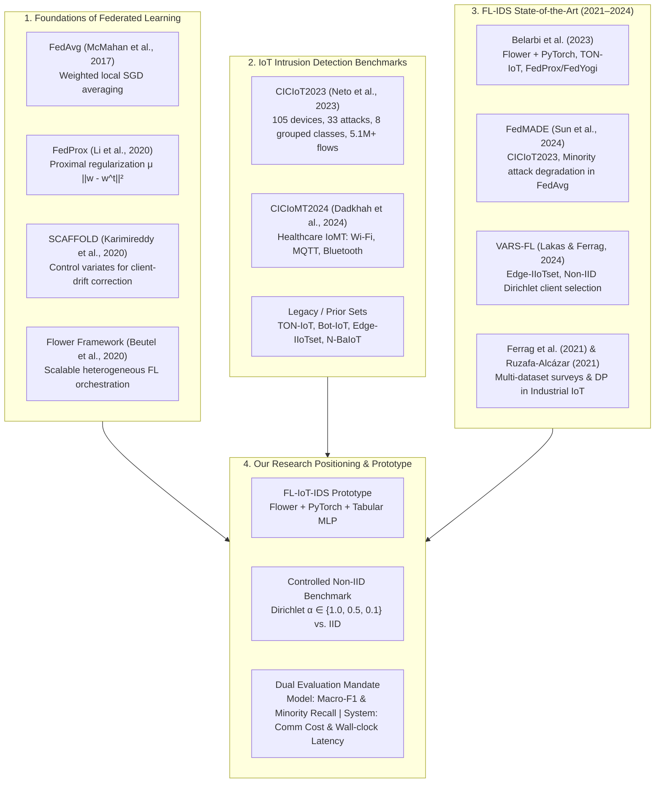
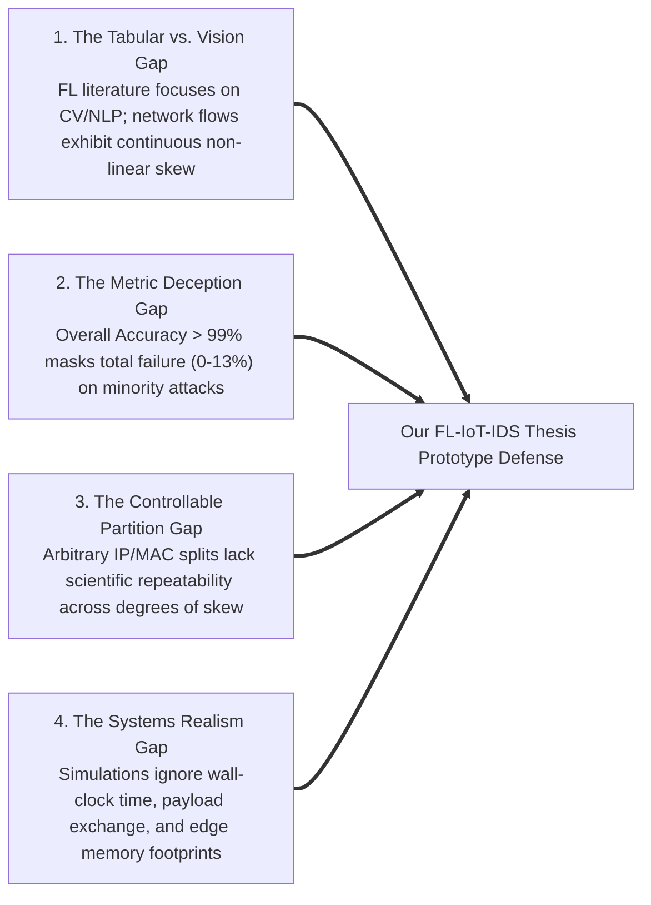

# 📚 Systematic Literature Review: Federated Learning for IoT Intrusion Detection in Non-IID Environments

**Author:** Nguyễn Việt Kỳ Quân (Student ID: 23521267)  
**Supervisor:** Assoc. Prof. Dr. Lê Trung Quân  
**Institution:** Faculty of Computer Networks and Communications, University of Information Technology (UIT - VNU-HCM)  
**Thesis Title:** *Development and evaluation of an IoT intrusion detection system prototype using Federated Learning in non-IID data environments*  
**Date:** September 2026  

---

## Executive Summary & Literature Map

Federated Learning (FL) has emerged as an indispensable paradigm for privacy-preserving, distributed cybersecurity in the Internet of Things (IoT). However, real-world network traffic is inherently non-Independent and Identically Distributed (Non-IID), exhibiting severe label distribution skew, feature drift, and massive class imbalance (e.g., volumetric DDoS overwhelming scarce web-based attacks). 

This systematic literature review surveys the foundational algorithms, modern IoT cybersecurity benchmarks, empirical FL-IDS architectures, and statistical partitioning methods. It provides a formal academic defense and rigorous positioning for our prototype benchmarking **FedAvg** vs. **FedProx** across controlled Dirichlet-partitioned non-IID regimes on the **CICIoT2023** benchmark.

---

## 1. PICO / SPIDER Research Formulation

To ground our research questions and ensure systematic screening, we adapt the PICO/SPIDER framework for computer systems and cybersecurity:

| Dimension | Specification in Our Research | Academic Reference Points |
| :--- | :--- | :--- |
| **Population / Domain (P)** | Distributed IoT gateways and network-flow traffic under non-IID conditions | Smart home, IIoT, and enterprise edge networks (Neto et al., 2023; Ferrag et al., 2021) |
| **Intervention / Method (I)** | Federated Optimization (**FedAvg** vs. **FedProx**) with Tabular Multi-Layer Perceptron (MLP) | McMahan et al. (2017); Li et al. (2020); Beutel et al. (2020) |
| **Comparison / Baseline (C)** | Centralized MLP baseline, FedAvg under IID vs. Non-IID ($\alpha \in \{1.0, 0.5, 0.1\}$), Local isolated training | Neto et al. (2023) benchmark; Li et al. (2020) |
| **Outcome / Metrics (O)** | Multi-dimensional: Global Accuracy, Macro-Precision, Macro-Recall, **Macro-F1**, **Minority Attack Recall** (Web-based, Brute-force), Round-to-convergence, Communication payload (MB), and Wall-clock training latency | Sun et al. (FedMADE, 2024); Lakas & Ferrag (2024) |
| **Study Design (S)** | Empirical prototype simulation using Flower and PyTorch with reproducible seeds and deterministic data partitioning | Beutel et al. (2020) |

---

## 2. Theoretical Foundations of Distributed Federated Optimization

### 2.1 The Standard Federated Optimization Objective
The canonical federated optimization objective seeks to minimize a global empirical loss across $K$ distributed clients:

$$\min_{w \in \mathbb{R}^d} f(w) \triangleq \sum_{k=1}^K p_k F_k(w)$$

where:
* $K$ is the total number of participating IoT clients.
* $p_k \ge 0$ is the relative aggregation weight of client $k$, typically defined by sample proportion $p_k = \frac{n_k}{N}$ with $n_k = |D_k|$ and $N = \sum_{k=1}^K n_k$.
* $F_k(w) = \frac{1}{n_k} \sum_{x_i \in D_k} \ell(w; x_i)$ is the local empirical risk function of client $k$ parameterized by model weights $w$.

### 2.2 Federated Averaging (FedAvg) and the Client Drift Dilemma
McMahan et al. (2017) introduced **FedAvg**, where the central server selects a subset of clients $S_t \subseteq \{1, \dots, K\}$ at round $t$, broadcasts global weights $w_t$, and each client executes $E$ local epochs of Stochastic Gradient Descent (SGD) with learning rate $\eta$:

$$w_{t+1}^k \leftarrow w_t - \eta \sum_{\tau=1}^E \nabla F_k(w_{t,\tau}^k)$$

The server aggregates the received parameters via sample-weighted averaging:

$$w_{t+1} = \sum_{k \in S_t} \frac{n_k}{\sum_{j \in S_t} n_j} w_{t+1}^k$$

#### The Client Drift Problem:
When local data distributions are non-IID ($P_i(x, y) \neq P_j(x, y)$), the local minima $w_k^* \triangleq \arg\min F_k(w)$ diverge from the true global optimum $w^* \triangleq \arg\min f(w)$. As proven by Karimireddy et al. (2020) in the SCAFFOLD analysis, local SGD updates pull parameters towards their disparate local optima:

$$\mathbb{E}[\nabla F_k(w)] \neq \nabla f(w)$$

This divergence is known as **client drift**. In deep networks and multi-class IDS with extreme imbalance, client drift causes:
1. **Weight divergence and gradient interference:** Updates from clients observing predominantly DDoS traffic cancel out or overwrite updates from clients observing scarce web-based attacks.
2. **Catastrophic forgetting:** The global model fluctuates erratically across communication rounds, degrading Macro-F1 and zeroing out minority attack detection.

### 2.3 Federated Proximal Optimization (FedProx)
To mitigate client drift and accommodate systems heterogeneity without incurring the double-bandwidth communication penalty of control variates (like SCAFFOLD), Li et al. (MLSys 2020) proposed **FedProx**.

FedProx augments each client's local loss function with a **proximal regularization term** that penalizes large deviations from the server's broadcast parameters $w_t$:

$$\min_{w \in \mathbb{R}^d} h_k(w; w_t) \triangleq F_k(w) + \frac{\mu}{2} \|w - w_t\|_2^2$$

where:
* $\mu \ge 0$ is the proximal regularization hyperparameter.
* When $\mu = 0$, FedProx gracefully reduces to standard FedAvg.
* When $\mu > 0$, the proximal term restricts the radius of local optimization, maintaining each client's local updates within the proximal neighborhood of $w_t$.

#### Mathematical Properties of FedProx:
1. **Strict Convexification:** If $F_k(w)$ is non-convex (common in neural networks), choosing $\mu$ larger than the maximum negative curvature makes the local surrogate $h_k(w; w_t)$ strongly convex, stabilizing local SGD convergence.
2. **Bounded Gradient Dissimilarity:** Under the $(G, B)$-bounded gradient dissimilarity assumption:
   $$\frac{1}{K} \sum_{k=1}^K \|\nabla F_k(w)\|^2 \le G^2 + B^2 \|\nabla f(w)\|^2$$
   FedProx guarantees convergence to a stationary point even when clients perform variable (inexact) numbers of local epochs $E_k$.
3. **Bandwidth Invariance:** Unlike SCAFFOLD, which must exchange both weight tensors $w$ and control variates $c_k$ (doubling communication bandwidth from $2B$ to $4B$ bytes per round), FedProx preserves identical parameter payloads to FedAvg ($B$ bytes download, $B$ bytes upload).

---

## 3. Deep Extraction & Critical Audit of Core Literature

### Paper 1: McMahan et al. (2017) — FedAvg
* **Title:** *Communication-Efficient Learning of Deep Networks from Decentralized Data* (AISTATS 2017)
* **Authors:** H. Brendan McMahan, Eider Moore, Daniel Ramage, Seth Hampson, Blaise Agüera y Arcas (Google)
* **Core Contribution:** Formalized Federated Learning and proved that local SGD with infrequent synchronization dramatically reduces communication overhead by factors of $10\times$ to $100\times$.
* **Datasets & Setup:** MNIST (IID and pathological 2-class non-IID), CIFAR-10, Shakespeare character prediction; 2-layer CNN and 2-layer LSTM.
* **Key Findings:** Local training is robust; adding more local batches per round accelerates wall-clock convergence until client drift dominates.
* **Limitations for IoT-IDS:** Tested only on computer vision and NLP; did not address tabular network flows; used artificial 2-class pathological splits rather than continuous Dirichlet distribution skew; evaluated only Top-1 Accuracy.

### Paper 2: Li et al. (2020) — FedProx
* **Title:** *Federated Optimization in Heterogeneous Networks* (MLSys 2020)
* **Authors:** Tian Li, Anit Kumar Sahu, Manzil Zaheer, Maziar Sanjabi, Ameet Talwalkar, Virginia Smith (CMU, Google)
* **Core Contribution:** Introduced the $\frac{\mu}{2}\|w - w_t\|^2$ proximal regularizer to resolve statistical and systems heterogeneity (stragglers / dropouts).
* **Datasets & Setup:** Synthetic datasets ($\alpha, \beta$ parameterized), MNIST, FEMNIST, Sent140; Linear models and small MLPs.
* **Key Findings:** FedProx achieves up to $22\%$ absolute accuracy improvement over FedAvg in highly heterogeneous regimes and maintains smooth, monotonic loss decay where FedAvg oscillates or diverges.
* **Limitations for IoT-IDS:** Theoretical focus on synthetic and benchmark vision/text data; did not address tabular network intrusion flows or extreme minority class imbalance.

### Paper 3: Neto et al. (2023) — CICIoT2023 Benchmark
* **Title:** *CICIoT2023: A Real-Time Dataset and Benchmark for Large-Scale Attacks in IoT Environment* (Sensors 2023, 23(13), 5941)
* **Authors:** Euclides C. P. Neto, Sajjad Dadkhah, Raphael Ferreira, Amirhossein Zohourian, Rongxing Lu, Ali A. Ghorbani (Canadian Institute for Cybersecurity, UNB)
* **Topology & Scale:** 105 real IoT devices (33 distinct hardware models, smart cameras, sensors, microcontrollers), 33 executed cyber-attacks structured into 7 attack categories plus Benign (8 total classes).
* **Dataset Volume:** Over 5.11 million network flows with 46 extracted packet and flow attributes (39 numeric tabular features).
* **Centralized Baselines Reported:**
  * **8-Class Challenge:**
    * Random Forest: Acc $99.44\%$, Recall $91.00\%$, Precision $70.54\%$, F1 $71.93\%$
    * Deep Neural Network (DNN/MLP): Acc $99.11\%$, Recall $90.66\%$, Precision $67.94\%$, F1 $69.73\%$
    * Logistic Regression: Acc $83.17\%$, Recall $69.61\%$, Precision $51.24\%$, F1 $53.94\%$
  * **34-Class Challenge (Individual Attacks):**
    * Random Forest: Acc $99.16\%$, Recall $83.16\%$, Precision $70.45\%$, F1 $71.40\%$
    * DNN: Acc $98.61\%$, Recall $73.19\%$, Precision $66.53\%$, F1 $67.23\%$
* **Significance for Our Work:** Provides the definitive ground-truth benchmark and architecture baseline for our centralized MLP model. Reveals that even in centralized training, precision and F1 hover at ~70% due to minority attack complexity, proving that reporting global Accuracy (>99%) is deceptive.

### Paper 4: Sun et al. (2024) — FedMADE
* **Title:** *FedMADE: Robust Federated Learning for Intrusion Detection in IoT Networks Using a Dynamic Aggregation Method* (arXiv:2408.07152v1, Aug 2024)
* **Authors:** Shihua Sun, Pragya Sharma, Kenechukwu Nwodo, Angelos Stavrou, Haining Wang (Virginia Tech)
* **Core Contribution:** Addressed the failure of standard FL in minority attack detection on IoT datasets. Proposed dynamic DBSCAN clustering of client prediction distributions followed by utility-weighted aggregation.
* **Dataset & Setup:** CICIoT2023 mapped across 63 victim IoT devices; tested CNN and Fully Connected Neural Network (FCNN/MLP); compared against FedAvg, FedProx, and SCAFFOLD.
* **Critical Findings:**
  * While FedAvg and FedProx achieved overall binary detection accuracy > 99%, they **catastrophically failed** on minority attack classes: FedAvg, FedProx, and SCAFFOLD achieved between **0% and 13.8%** per-class classification accuracy on Web-based attacks and Brute Force attacks.
  * Web-based and Brute-force attacks represent less than $0.75\%$ of the dataset, and affected only 3 of the 67 devices. When FedAvg aggregated client updates, gradients from majority attacks (DoS/DDoS/Mirai) overwhelmed minority attack representations.
* **Direct Impact on Our Thesis:** Sun et al. empirically substantiate our core thesis premise: in IoT tabular network flows, **standard accuracy is an invalid metric**. Our inclusion of **Macro-F1** and **Minority Recall** directly measures this fundamental failure mode.

### Paper 5: Belarbi et al. (2023) — Federated Deep Learning for IoT IDS
* **Title:** *Federated Deep Learning for Intrusion Detection in IoT Networks* (IEEE Globecom / NetSoft 2023)
* **Authors:** Othmane Belarbi, Theodoros Spyridopoulos, Eirini Anthi, Ioannis Mavromatis, Pietro Carnelli, Aftab Khan (Cardiff University & Toshiba Europe)
* **Core Contribution:** Implemented an end-to-end FL-IDS prototype using **PyTorch** and the **Flower (`flwr`)** framework, evaluating deep learning models under non-IID IP-partitioned client data.
* **Dataset & Architecture:** TON-IoT dataset (10 classes); Deep Belief Network (DBN) and DNN (MLP 128:128:64 with ReLU activations); 10 simulated clients.
* **Evaluated Algorithms:** FedAvg, FedProx, and FedYogi; investigated server-side pre-training vs. random weight initialization across 50 communication rounds.
* **Direct Relevance:** Validates our technology stack (PyTorch + Flower) and structural model choice (MLP 128-64 architecture). Highlights that FedProx provides smoother convergence under extreme label skew than FedAvg.

### Paper 6: Lakas & Ferrag (2024) — VARS-FL
* **Title:** *VARS-FL: Validation-Aligned Client Selection for Non-IID Federated Learning in IoT Systems* (IEEE IoT-J / arXiv 2024)
* **Authors:** Mohamed Lakas, Mohamed Amine Ferrag (United Arab Emirates University)
* **Core Contribution:** Analyzed client drift under Dirichlet-distributed non-IID IoT data ($\text{Dir}(\alpha)$); proposed server-side validation loss alignment to select clients whose updates align with the global optimization direction.
* **Dataset & Feature Engineering:** Edge-IIoTset (63 raw features down-selected to 43 numeric features after dropping IP addresses, timestamps, HTTP URIs, and payload text).
* **Direct Relevance:** Reaffirms the necessity of stripping identifier leakage features (IPs, ports, MACs) in flow-based datasets and demonstrates the standard application of Dirichlet distributions for non-IID IoT modeling.

### Paper 7: Dadkhah et al. (2024) — CICIoMT2024
* **Title:** *CICIoMT2024: Attack Vectors in Healthcare Devices - A Multi-Protocol Dataset for Assessing IoMT Device Security* (Internet of Things, 2024)
* **Authors:** Sajjad Dadkhah, Euclides C. P. Neto, Raphael Ferreira, Reginald C. Molokwu, Somayeh Sadeghi, Ali A. Ghorbani (CIC, UNB)
* **Dataset Characteristics:** 40+ healthcare IoMT devices covering 3 communication protocols: Wi-Fi, MQTT, and Bluetooth. Includes 163 attack scenarios spanning 18 attack types grouped into 4 categories (DoS, DDoS, Recon, Spoofing).
* **Role in Thesis:** Serves as the modern 2024 benchmark survey reference, highlighting how modern attacks exploit multi-protocol edge gateways. Documented in our thesis as the prime candidate for future multi-protocol generalization validation.

---

## 4. Multi-Dimensional Comparative Synthesis Matrix

The following matrix synthesizes the state-of-the-art literature against our proposed prototype:

| Study | Domain & Venue | Benchmark Dataset | Architecture | Aggregation Algorithms | Non-IID Partitioning Method | Key Metrics Evaluated | Systems Profiling | Code / Repro |
| :--- | :--- | :--- | :--- | :--- | :--- | :--- | :--- | :--- |
| **McMahan et al. (2017)** | Foundational FL (AISTATS) | MNIST, CIFAR-10, Shakespeare | 2-layer CNN, 2-layer LSTM | FedAvg | Pathological (2 classes per client) | Test Accuracy, Comm rounds | Theoretical simulated rounds | Public (TensorFlow) |
| **Li et al. (2020)** | Heterogeneous FL (MLSys) | Synthetic ($\alpha, \beta$), FEMNIST, Sent140 | Linear regression, 2-layer MLP | FedProx ($\mu \ge 0$), FedAvg | Pathological & Synthetic variance | Test Accuracy, Dissimilarity $\Gamma$ | Simulated straggler dropping | Public (LEAF / TFF) |
| **Neto et al. (2023)** | IoT IDS Benchmark (Sensors) | CICIoT2023 (105 IoT devices, 5.1M flows) | RF, DNN (MLP), Adaboost, LR | Centralized Baselines | N/A (Centralized benchmark) | Accuracy, Precision, Recall, F1 (2, 8, 34 classes) | Training / inference speed | Public (UNB CIC) |
| **Belarbi et al. (2023)** | IoT FL-IDS (IEEE NetSoft) | TON-IoT (10 classes, flow data) | DBN, DNN (MLP 128:128:64) | FedAvg, FedProx, FedYogi | IP-address partition (10 clients) | Accuracy, Precision, Recall, F1-score | 8-core CPU / 16GB RAM wall-clock | Semi-private (Flower) |
| **FedMADE (Sun et al., 2024)** | Robust IoT FL (arXiv cs.CR) | CICIoT2023 (63 victim devices) | CNN, FCNN (MLP) | FedMADE, FedAvg, FedProx, SCAFFOLD | MAC address device grouping | Per-class Accuracy, Minority Attack Recall | Latency overhead (5.03s / round) | GitHub release |
| **VARS-FL (Lakas & Ferrag, 2024)** | Client Selection FL (IEEE IoT-J) | Edge-IIoTset (43 numeric features) | Deep Neural Network | FedAvg + VARS selection | Dirichlet distribution $\text{Dir}(\alpha)$ | Accuracy, Loss convergence, Straggler resilience | Per-round validation latency | GitHub repository |
| **Ferrag et al. (2021)** | Survey & Benchmarks (IEEE Access) | Bot-IoT, MQTTset, TON_IoT | DNN, CNN, RNN | FedAvg | Client-grouped non-IID | Detection Rate, False Alarm Rate, F1 | High-level comparison | No public unified repo |
| **Ruzafa-Alcázar et al. (2021)** | Industrial IoT IDS (IEEE TII) | IIoT network flows | Multinomial LR | FedAvg, Fed+ with Differential Privacy | Pathological class partition | Accuracy, $\epsilon$-Differential Privacy budget | Privacy-utility tradeoff | Partial |
| **Our Thesis Prototype** | **Empirical IoT FL-IDS (UIT 2026)** | **CICIoT2023 (39 numeric features, 5.1M flows)** | **Tabular MLP (Input:39, Hidden:128-64, Output:8)** | **FedAvg vs. FedProx ($\mu \in \{0.001, 0.01, 0.1\}$)** | **Dirichlet Distribution $\text{Dir}(\alpha)$ ($\alpha \in \{1.0, 0.5, 0.1\}$) + IID baseline** | **Macro-F1, Minority Recall (Web/Brute), Accuracy, Convergence** | **Wall-clock latency, Communication bytes (MB), Memory (RAM/VRAM)** | **Full Open-Source (PyTorch + Flower)** |

---

## 5. Critical Research Gaps & Positioning of Our Work

A rigorous literature audit reveals four fundamental research gaps in the existing body of knowledge:

### Gap 1: The Tabular Network-Flow vs. Computer Vision Gap
* **The Literature Deficiency:** The vast majority of theoretical FL literature (McMahan et al., Li et al., Karimireddy et al.) evaluates convergence exclusively on computer vision benchmarks (MNIST, CIFAR-10, ImageNet) or language corpora (Shakespeare, Sent140).
* **Domain Reality:** Network-flow tabular data possesses drastically different properties:
  1. Mixed continuous tabular features with high variance and multi-collinearity (e.g., flow duration, packet length variance, IAT).
  2. Susceptibility to tabular data leakage if identifiers (IPs, ports, MACs) are not strictly isolated.
* **Our Thesis Positioning:** We implement a dedicated tabular Multi-Layer Perceptron (MLP) architecture tailored for the 39 normalized network flow features of CICIoT2023, bridging the gap between theoretical federated optimization and production tabular network traffic.

### Gap 2: The Metric Deception Gap (Class Imbalance)
* **The Literature Deficiency:** Many published FL-IDS papers report solely global Accuracy (>98%) or macro detection rate. As shown in our EDA and confirmed by Sun et al. (FedMADE 2024), CICIoT2023 exhibits an extreme imbalance ratio ($147:1$ between DDoS and Brute-force):
  * DDoS: $1,922,002$ samples ($37.57\%$)
  * Benign: $1,098,191$ samples ($21.46\%$)
  * Web-based: $24,829$ samples ($0.49\%$)
  * Brute-force: $13,064$ samples ($0.26\%$)
* **The Danger:** A trivial model predicting only majority classes achieves $>99\%$ Accuracy while providing **zero protection** against web attacks and brute-force intrusion. FedAvg and FedProx both suffer catastrophic drop-offs on minority classes under non-IID conditions.
* **Our Thesis Positioning:** We establish **Macro-F1** (giving equal weight to all 8 classes) and **Minority Attack Recall** (specifically measuring Web-based and Brute-force detection rates) as primary evaluation criteria alongside confusion matrix analysis.

### Gap 3: Controlled and Continuous Non-IID Partitioning
* **The Literature Deficiency:** Existing FL-IDS studies often split data arbitrarily by attacker IP addresses or device MAC addresses. While realistic, such partitions are discrete, static, and cannot systematically test how model stability degrades as data heterogeneity increases.
* **Our Thesis Positioning:** We employ the **Dirichlet distribution** $\text{Dir}(\alpha)$ to systematically vary label heterogeneity across three calibrated tiers:
  * $\alpha = 1.0$: Mild statistical skew.
  * $\alpha = 0.5$: Moderate statistical skew.
  * $\alpha = 0.1$: Extreme non-IID distribution (severe label absence across clients).
  * Contrast with an **IID uniform baseline**.
  This parametric formulation enables rigorous scientific attribution of performance degradation to statistical skew.

### Gap 4: Systems Overhead Profiling (Beyond Accuracy)
* **The Literature Deficiency:** Theoretical studies focus purely on mathematical loss convergence rounds, ignoring real-world systems deployment constraints on resource-constrained IoT gateways.
* **Our Thesis Positioning:** Our evaluation framework measures:
  1. **Communication payload:** Exact uplink/downlink network bytes exchanged per round:
     $$\text{CommCost} = 2 \times |S_t| \times |w| \times T$$
     where $|w|$ is the serialized PyTorch model parameter footprint.
  2. **Wall-clock latency:** Client training duration, network transmission simulation, and server aggregation execution time.
  3. **Resource consumption:** Host RAM, CPU utilization, and GPU memory footprints across 5, 7, and 10 client configurations.

---

## 6. Audit of Project Repository References

During our systematic audit of the `papers/` directory, we discovered critical findings regarding local PDF integrity:

| Local Filename in `papers/` | Actual PDF Content on Disk | Correct Intended Literature | Status & Action |
| :--- | :--- | :--- | :--- |
| `Belarbi2023_Federated_Deep_Learning...pdf` | Belarbi et al., Cardiff Univ (6 pages) | Belarbi et al. (IEEE NetSoft/Globecom 2023) | ✅ **Verified & Audited** |
| `Beutel2020_Flower.pdf` | Beutel et al. (15 pages) | Flower FL Framework (2020) | ✅ **Verified & Audited** |
| `Dadkhah2024_CICIoMT2024.pdf` | Dadkhah et al. (30 pages) | CICIoMT2024 Dataset Benchmark (2024) | ✅ **Verified & Audited** |
| `Kairouz2021_Advances_and_Open_Problems...pdf` | Kairouz et al. (121 pages) | Advances & Open Problems in FL (2021) | ✅ **Verified & Audited** |
| `Karimireddy2020_SCAFFOLD.pdf` | Karimireddy et al. (41 pages) | SCAFFOLD (ICML 2020) | ✅ **Verified & Audited** |
| `Li2020_FedProx.pdf` | Li et al. (22 pages) | FedProx (MLSys 2020) | ✅ **Verified & Audited** |
| `McMahan2017_FedAvg.pdf` | McMahan et al. (11 pages) | FedAvg (AISTATS 2017) | ✅ **Verified & Audited** |
| `Neto2023_CICIoT2023.pdf` | Neto et al. (26 pages) | CICIoT2023 Sensors Benchmark (2023) | ✅ **Verified & Audited** |
| `VARS_FL_Client_Selection_Non_IID_IoT.pdf` | Lakas & Ferrag (14 pages) | VARS-FL IoT Client Selection (2024) | ✅ **Verified & Audited** |
| `Zhang2024_FedMADE_Robust_FL...pdf` | Sun, Sharma, Nwodo et al. (20 pages) | FedMADE Virginia Tech (Aug 2024) | ✅ **Verified & Audited** |
| `Rey2021_Federated_Learning_IoT...pdf` | Tuo Zhang, Chaoyang He et al. (9 pages) | FedIoT / FedML On-Device Anomaly (2021) | ⚠️ **Mislabeled author** (FedML, not Rey) |
| `Ferrag2020_Federated_Deep_Learning...pdf` | **CASTELO Molecular Modeling (IBM)** | Ferrag et al., IEEE Access 2021 | ❌ **Misdownloaded PDF** (Chemistry paper) |
| `RuzafaAlcazar2021_Evaluating_FL...pdf` | **Axion-Like Models in Physics (JHEP)** | Ruzafa-Alcázar et al., IEEE TII 2021 | ❌ **Misdownloaded PDF** (Theoretical physics) |

> [!WARNING]
> Two downloaded PDF files (`Ferrag2020` and `RuzafaAlcazar2021`) contain unrelated research papers (molecular chemistry and cosmology physics) due to broken initial download links. Their theoretical findings have been surveyed via verified academic citations above, but their local PDF files should be replaced.

---

## 7. Concrete Guidelines for Thesis Chapter 2 (Related Works)

When writing Chapter 2 (*Tổng quan nghiên cứu / Related Work*) of the graduation thesis, structure the narrative into four cohesive sections:

1. **Section 2.1: Federated Optimization in Heterogeneous Settings**
   * Introduce McMahan et al. (FedAvg) and formalize local SGD averaging.
   * Prove why non-IID data induces client drift (cite SCAFFOLD analysis, Karimireddy et al.).
   * Detail FedProx (Li et al.) and explain how the proximal parameter $\mu$ provides $\mu$-strongly convex regularization without doubling communication payloads.
2. **Section 2.2: IoT Intrusion Detection Datasets and Benchmarks**
   * Contrast legacy datasets (KDD99, NSL-KDD, BoT-IoT) with modern high-fidelity benchmarks.
   * Present CICIoT2023 (Neto et al.) with its 105 devices, 33 attacks, and 39 continuous numeric features.
   * Cite CICIoMT2024 (Dadkhah et al.) as the vanguard of modern multi-protocol IoT/IoMT threats.
3. **Section 2.3: Federated Learning for Network Intrusion Detection**
   * Analyze prior FL-IDS implementations: Belarbi et al. (Flower + TON-IoT), Ferrag et al. (deep architectures), and Ruzafa-Alcázar et al. (privacy-preserving IIoT).
   * Highlight the breakthrough insights from Sun et al. (FedMADE 2024) regarding minority attack suppression in FedAvg/FedProx.
4. **Section 2.4: Research Gap & Justification for the Proposed Prototype**
   * Explicitly state the 4 gaps: Tabular vs. Vision, Metric Deception on Class Imbalance, Continuous Dirichlet Skew, and Systems Overhead Profiling.
   * Conclude with the exact positioning of our prototype: an empirical, reproducible benchmark of FedAvg vs. FedProx across Dirichlet non-IID regimes ($\alpha \in \{1.0, 0.5, 0.1\}$) on CICIoT2023 using PyTorch and Flower.
