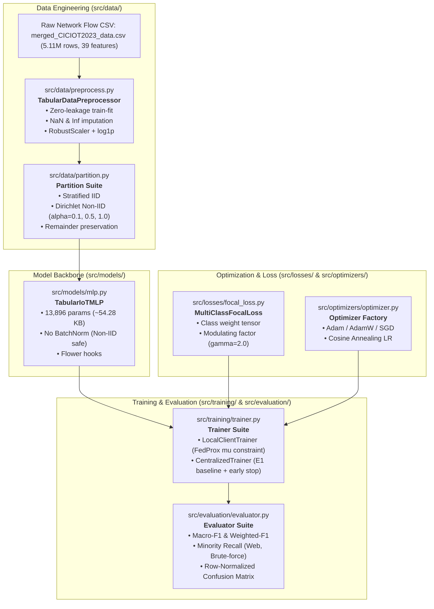

# 📚 Architecture & Module Documentation Index

Comprehensive, publication-grade documentation for the core decoupled source code modules of the Federated Learning Network Intrusion Detection System (**FL-IoT-IDS**).

---

## 🗺️ System Architecture & End-to-End Pipeline



---

## 📑 Core Modules Catalog

| Module | Source Path | Documentation Link | Core Responsibility |
| :--- | :--- | :--- | :--- |
| **`preprocessing`** | [`src/data/preprocess.py`](file:///home/quan/projects/FedLearning/src/data/preprocess.py) | [Documentation](file:///home/quan/projects/FedLearning/docs/modules/preprocess.md) | Leak-free tabular preprocessing, RobustScaler, non-negative clipping, logarithmic skew compression, and class weight generation. |
| **`partition`** | [`src/data/partition.py`](file:///home/quan/projects/FedLearning/src/data/partition.py) | [Documentation](file:///home/quan/projects/FedLearning/docs/modules/partition.md) | Stratified IID and Dirichlet Non-IID label skew simulator ($\alpha \in \{1.0, 0.5, 0.1\}$), remainder allocation, and PyTorch `DataLoader` factory. |
| **`mlp`** | [`src/models/mlp.py`](file:///home/quan/projects/FedLearning/src/models/mlp.py) | [Documentation](file:///home/quan/projects/FedLearning/docs/modules/mlp.md) | Ultra-lightweight MLP backbone (13.9K params, 54.28 KB), BatchNorm-free for Non-IID FL, Kaiming normal init, Flower array serialization. |
| **`trainer`** | [`src/training/trainer.py`](file:///home/quan/projects/FedLearning/src/training/trainer.py) | [Documentation](file:///home/quan/projects/FedLearning/docs/modules/trainer.md) | Unified local client trainer with FedProx proximal regularization ($\mu$) and gradient clipping; standalone centralized baseline trainer with early stopping. |
| **`focal_loss`** | [`src/losses/focal_loss.py`](file:///home/quan/projects/FedLearning/src/losses/focal_loss.py) | [Documentation](file:///home/quan/projects/FedLearning/docs/modules/focal_loss.md) | Multi-Class Focal Loss down-weighting easy background samples ($400\times$ suppression) and focusing gradients on rare minority attacks (147:1 imbalance). |
| **`optimizer`** | [`src/optimizers/optimizer.py`](file:///home/quan/projects/FedLearning/src/optimizers/optimizer.py) | [Documentation](file:///home/quan/projects/FedLearning/docs/modules/optimizer.md) | Factory for Adam, AdamW (decoupled decay), SGD with momentum, and Cosine Annealing learning rate schedulers. |
| **`evaluator`** | [`src/evaluation/evaluator.py`](file:///home/quan/projects/FedLearning/src/evaluation/evaluator.py) | [Documentation](file:///home/quan/projects/FedLearning/docs/modules/evaluator.md) | Multi-metric evaluation preventing "the accuracy paradox": Macro-F1, isolated Minority Recall, and row-normalized confusion matrices. |

---

## 🚀 Quick Execution Walkthrough

```python
# Complete end-to-end simulation across all 7 modules
from src.data.preprocess import load_and_preprocess_ciciot2023, compute_balanced_class_weights
from src.data.partition import partition_dirichlet, create_client_dataloaders
from src.models.mlp import TabularIoTMLP
from src.losses.focal_loss import build_loss_function
from src.optimizers.optimizer import build_optimizer
from src.training.trainer import LocalClientTrainer
from src.evaluation.evaluator import evaluate_comprehensive

# 1. Preprocess tabular flows
data = load_and_preprocess_ciciot2023(sample_size=50000, random_state=42)

# 2. Partition across 3 clients with Dirichlet Non-IID skew (alpha=0.5)
parts = partition_dirichlet(data["y_train"], num_clients=3, alpha=0.5, min_samples_per_client=100)
client_loaders = create_client_dataloaders(data["X_train"], data["y_train"], parts, batch_size=64)

# 3. Instantiate model, loss, optimizer
model = TabularIoTMLP(input_dim=39, num_classes=8)
weights = compute_balanced_class_weights(data["y_train"], num_classes=8)
criterion = build_loss_function(loss_type="focal_loss", class_weights=weights, gamma=2.0)
optimizer = build_optimizer(model, optimizer_type="adamw", lr=1e-3)

# 4. Train 1 round locally on Client 0 with FedProx constraint
trainer = LocalClientTrainer(model, optimizer, criterion, max_grad_norm=5.0)
trainer.train_epochs(dataloader=client_loaders[0], num_epochs=2, global_model=model, mu=0.01)

# 5. Evaluate on Holdout Test Set
results = evaluate_comprehensive(
    model=model,
    dataloader=data["test_loader"],
    class_names=data["class_names"],
    minority_classes=["Web-based", "Brute-force"]
)
print(f"Holdout Macro-F1: {results['macro_f1']*100:.2f}% | Minority Recall: {results['minority_recall']}")
```
