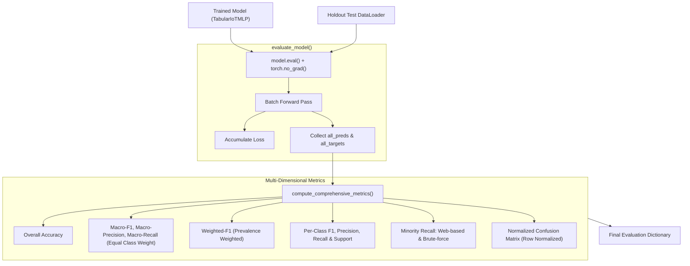

# 📦 Module Documentation: `src/evaluation/evaluator.py`

Publication-grade evaluation and benchmarking suite for network intrusion detection, providing multi-dimensional performance auditing (Macro-F1, Minority Recall, Normalized Confusion Matrices, and zero-leakage inference).

* **Source File:** [`src/evaluation/evaluator.py`](file:///home/quan/projects/FedLearning/src/evaluation/evaluator.py)
* **Parent Package:** [`src.evaluation`](file:///home/quan/projects/FedLearning/src/evaluation/__init__.py)
* **Skill Reference:** [skills/evaluation-and-benchmarking/SKILL.md](file:///home/quan/projects/FedLearning/.agents/skills/evaluation-and-benchmarking/SKILL.md) & [skills/methodology-audit/SKILL.md](file:///home/quan/projects/FedLearning/.agents/skills/methodology-audit/SKILL.md)

---

## 🗺️ Architectural Context & Evaluation Pipeline



---

## 1. What Does It Do?

`src/evaluation/evaluator.py` conducts rigorous, leak-free evaluation of network flow classifiers. It specifically prevents the "high accuracy trap" common in imbalanced intrusion detection datasets by isolating performance on stealthy attack vectors.

### 1.1 Key Components & API Contracts

#### 1. `compute_comprehensive_metrics(...) -> Dict[str, Any]` (Function)
* **Signature:**
  ```python
  def compute_comprehensive_metrics(
      all_preds: np.ndarray,
      all_targets: np.ndarray,
      class_names: List[str],
      minority_classes: Optional[List[str]] = None
  ) -> Dict[str, Any]
  ```
* **Metrics Computed:**
  * `accuracy`: Global fraction of correct predictions across all flows.
  * `macro_f1`, `macro_precision`, `macro_recall`: Unweighted average across all $C=8$ classes, giving equal weight to rare and dominant classes.
  * `weighted_f1`: Sample-weighted F1 reflecting overall test population distribution.
  * `per_class_f1`, `per_class_recall`, `per_class_precision`: Fine-grained dictionaries keyed by class name.
  * `minority_recall`: Dictionary isolating recall on critical low-frequency attacks (`Web-based`, `Brute-force`).
  * `confusion_matrix`: $C \times C$ matrix normalized by true rows ($C_{i, j} = \frac{N_{i \to j}}{\sum_k N_{i \to k}}$), such that each row sums to $1.0$.
  * `zero_division=0`: Explicitly configured to prevent division-by-zero crashes when rare classes receive 0 predictions.

#### 2. `evaluate_model(...) -> Tuple[float, float, np.ndarray, np.ndarray]` (Function)
* **Role:** Executes an inference pass over a PyTorch `DataLoader` with gradient tracking disabled (`torch.no_grad()`).
* **Returns:** `(avg_loss, accuracy, all_predictions, all_targets)`.

#### 3. `evaluate_comprehensive(...) -> Dict[str, Any]` (Function)
* **Role:** End-to-end wrapper combining `evaluate_model` and `compute_comprehensive_metrics`.

### 1.2 Mathematical Formulations

#### Macro-Averaged F1-Score
Given per-class Precision $P_c$ and Recall $R_c$ for class $c \in \{0, \dots, C-1\}$:

$$F_{1, c} = \frac{2 \cdot P_c \cdot R_c}{P_c + R_c}, \qquad \text{Macro-}F_1 = \frac{1}{C} \sum_{c=0}^{C-1} F_{1, c}$$

#### Minority Class Recall
For rare attack class $m$ with true instance set $Y_m$:

$$\text{Recall}_m = \frac{\text{True Positives}_m}{\text{True Positives}_m + \text{False Negatives}_m}$$

If a model predicts 0 true instances for `Brute-force` ($N_{\text{rare}} = 100$), $\text{Recall}_m = 0.0\%$, and $\text{Macro-}F_1$ drops precipitously, immediately alerting researchers.

---

## 2. Why Do You Need It?

| Metric / Evaluation Risk | Failure Mode in Naive Evaluation | How `evaluator.py` Solves It |
| :--- | :--- | :--- |
| **"The Accuracy Paradox"** | In CICIoT2023, predicting only majority classes yields $>95\%$ accuracy while scoring **0% detection** on stealthy attacks. | Enforces **Macro-F1** and dedicated **Minority Recall** as the primary scientific validation metrics. |
| **Silent Evaluation Leakage** | Forgetting `model.eval()` keeps Dropout active during evaluation, introducing random stochastic noise into test benchmarks. | `evaluate_model` strictly enforces `model.eval()` and wraps iteration in `torch.no_grad()`. |
| **Zero-Division Runtime Crashes** | When a model fails to predict any instances of a rare class, standard Scikit-Learn functions raise runtime warnings or errors. | Configures `zero_division=0` across all metric calculations, guaranteeing deterministic execution. |
| **Raw Count Confusion Misinterpretation** | In raw confusion matrices with 1M DDoS flows and 1,000 Web flows, minority error rates are invisible to the eye. | Implements **row-normalized confusion matrices** (`normalize='true'`), showing true percentage error rates per class. |

---

## 3. How To Use It?

### 3.1 Minimal Quickstart

```python
import numpy as np
from src.evaluation.evaluator import compute_comprehensive_metrics

# 1. Setup mock true vs predicted labels
class_names = ["Benign", "DDoS", "DoS", "Recon", "Spoof", "Mirai", "Web-based", "Brute-force"]
y_true = np.array([0, 1, 2, 6, 7, 7, 0, 1])
y_pred = np.array([0, 1, 2, 6, 0, 7, 0, 1])  # One rare Brute-force (7) misclassified as Benign (0)

# 2. Compute comprehensive metrics
metrics = compute_comprehensive_metrics(
    all_preds=y_pred,
    all_targets=y_true,
    class_names=class_names,
    minority_classes=["Web-based", "Brute-force"]
)

# 3. Print critical metrics
print(f"Overall Accuracy: {metrics['accuracy']*100:.2f}%")
print(f"Macro-F1 Score:   {metrics['macro_f1']*100:.2f}%")
print("Minority Recall:", metrics["minority_recall"])
```

### 3.2 End-to-End Model Evaluation Recipe

```python
from src.evaluation.evaluator import evaluate_comprehensive

# Run complete evaluation on holdout test set
test_results = evaluate_comprehensive(
    model=model,
    dataloader=test_loader,
    class_names=data["class_names"],
    minority_classes=["Web-based", "Brute-force"],
    criterion=criterion,
    device="cuda" if torch.cuda.is_available() else "cpu"
)

print(f"Test Loss:     {test_results['loss']:.4f}")
print(f"Test Macro-F1: {test_results['macro_f1']*100:.2f}%")
for cls, recall in test_results["minority_recall"].items():
    print(f"  -> {cls} Recall: {recall*100:.2f}%")
```

### 3.3 Common Pitfalls & Troubleshooting

| Pitfall / Issue | Root Cause | Solution |
| :--- | :--- | :--- |
| Discrepancy between training loss and test loss | Evaluation was run without `model.eval()`, so Dropout (0.2) remained active. | Always use `evaluate_model` or `evaluate_comprehensive` which automatically toggles `model.eval()`. |
| Out of memory (OOM) during evaluation | Accumulated gradients in evaluation loop. | Ensure all evaluation calls are wrapped in `torch.no_grad()` (guaranteed inside `evaluate_model`). |
| Missing minority classes in summary | Class name strings do not exactly match entries in `class_names`. | Ensure exact case-sensitive matching (e.g. `"Web-based"`, not `"web_based"`). |
