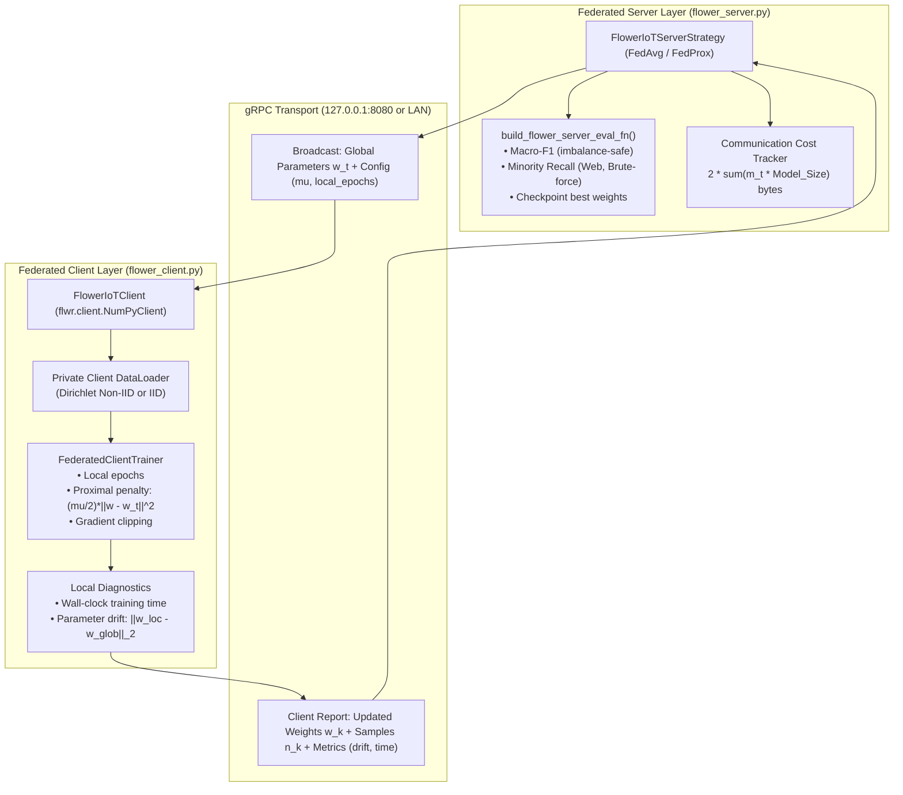

# 📦 Module Documentation: `src/federated/flower_client.py` & `src/federated/flower_server.py`

Publication-grade Flower framework implementation for decentralized IoT Network Intrusion Detection (FL-IoT-IDS) under non-IID conditions.

* **Client File:** [`src/federated/flower_client.py`](file:///home/quan/projects/FedLearning/src/federated/flower_client.py)
* **Server File:** [`src/federated/flower_server.py`](file:///home/quan/projects/FedLearning/src/federated/flower_server.py)
* **Thesis Mapping:** Directly realizes Sections 5, 6, 7, 8, and 9 of the thesis proposal:
  *"Xây dựng và đánh giá prototype hệ thống phát hiện xâm nhập IoT sử dụng Federated Learning trong môi trường dữ liệu non-IID"* (Nguyễn Việt Kỳ Quân, 2026).

---

## 🗺️ Architectural Context & Flower gRPC Pipeline



---

## 1. What Do They Do?

### 1.1 `FlowerIoTClient` ([`flower_client.py`](file:///home/quan/projects/FedLearning/src/federated/flower_client.py))
* **Framework Interface:** Subclasses `flwr.client.NumPyClient`.
* **Zero Protobuf Friction:** Exchanging weights as universal `List[np.ndarray]` via Flower's high-level API.
* **FedProx Proximal Loss Support:** Receives `mu` parameter dynamically from server config, constraining parameter drift:
  $$\mathcal{L}_{\text{prox}}(w) = \mathcal{L}_{\text{task}}(w) + \frac{\mu}{2} \|w - w_t\|_2^2$$
* **Client Diagnostics:** Measures client parameter drift $\|w_{\text{local}} - w_{\text{global}}\|_2$ and local wall-clock training time per round.
* **Standalone CLI Execution:** Can be launched as an independent OS process:
  ```bash
  python -m src.federated.flower_client --client-id 0 --server-address 127.0.0.1:8080
  ```

### 1.2 `FlowerIoTServerStrategy` ([`flower_server.py`](file:///home/quan/projects/FedLearning/src/federated/flower_server.py))
* **Framework Interface:** Subclasses `flwr.server.strategy.FedAvg` / `FedProx`.
* **Centralized Holdout Evaluation:** Evaluates global model on the unseen test set after every round, tracking:
  - **Macro-F1 Score:** Prevents majority DDoS/DoS traffic from dominating evaluation.
  - **Minority Class Recall:** Tracks stealth attack isolation (`Web-based`, `Brute-force`).
  - **Best Checkpoint Preservation:** Automatically archives top weights (`flower_fedprox_best_weights.npz`).
* **Communication Cost Tracking:** Accurately estimates cumulative payload in megabytes:
  $$\text{Cumulative Communication} = 2 \times \sum_{t=1}^T m_t \times B$$
  where $m_t$ is participating clients and $B \approx 54.28\text{ KB}$ for `TabularIoTMLPModel`.
* **Standalone Server Process:**
  ```bash
  python -m src.federated.flower_server --server-address 0.0.0.0:8080 --rounds 10 --strategy fedprox --mu 0.05
  ```

---

## 2. Why Do You Need It?

| Thesis Problem / Constraint | Naive Approach Failure Mode | How Our Flower Implementation Solves It |
| :--- | :--- | :--- |
| **Non-IID Client Drift** | Standard FedAvg oscillates or diverges under severe label skew ($\alpha = 0.1$). | `FlowerIoTClient` applies proximal regularization with $\mu$ and tracks parameter drift $\|w - w_t\|_2$. |
| **Evaluation Skew in FL** | Averaging client validation metrics gives biased scores because clients have skewed local classes. | Server executes **centralized holdout evaluation** (`build_flower_server_eval_fn`) using a balanced test set with zero client data leakage. |
| **System Profiling Requirement** | Most FL repos only measure accuracy, ignoring thesis Section 9 (communication & time). | `FlowerIoTServerStrategy` automatically logs total wall-clock times, round durations, and communication megabytes. |
| **Single-Machine Reality** | Buying 10 physical Raspberry Pis is impractical for rapid development. | Clients and Server can run as separate OS processes over `127.0.0.1:8080` or via Flower simulation. |

---

## 3. How To Use It?

### 3.1 Localhost Multi-Process Execution (Real gRPC over `127.0.0.1:8080`)

```python
# 1. Start Server in terminal 1:
python -m src.federated.flower_server --server-address 127.0.0.1:8080 --rounds 10 --strategy fedprox --mu 0.05

# 2. Start Client 0 in terminal 2:
python -m src.federated.flower_client --client-id 0 --server-address 127.0.0.1:8080

# 3. Start Client 1 in terminal 3:
python -m src.federated.flower_client --client-id 1 --server-address 127.0.0.1:8080
```

### 3.2 Programmatic Integration in Python / Notebooks

```python
from src.federated.flower_client import FlowerIoTClient
from src.federated.flower_server import FlowerIoTServerStrategy, build_flower_server_eval_fn

# 1. Server Centralized Evaluation
eval_fn = build_flower_server_eval_fn(
    model=global_model,
    val_loader=data["val_loader"],
    class_names=class_names,
    minority_classes=["Web-based", "Brute-force"],
    device=device
)

# 2. Strategy
strategy = FlowerIoTServerStrategy(
    strategy_name="fedprox",
    mu=0.05,
    min_fit_clients=5,
    evaluate_fn=eval_fn
)
```

---

## 4. Evaluation Paradigms: Client-Side vs Server-Side Evaluation

A critical design consideration in Federated Learning and this thesis is the distinction between **where** and **what** is being evaluated.

### 4.1 Evaluation Taxonomy

| Evaluation Type | Model Evaluated | Dataset Evaluated | Question It Answers | Primary Role in Thesis |
| :--- | :--- | :--- | :--- | :--- |
| **Client Evaluation**<br>(`client.evaluate()` in Flower) | **Global Model** ($w_t$)<br>sent from server | **Local Private Data** ($D_k^{\text{val}}$)<br>client's private partition | *"How well does the global consensus model perform on this specific edge subnet?"* | Measures edge fairness and client disparity across heterogeneous nodes. |
| **Server Evaluation**<br>(`evaluate_fn` in Flower) | **Global Model** ($w_t$)<br>aggregated weights | **Global Holdout Benchmark** ($D^{\text{test}}$)<br>unseen 20% CICIoT2023 | *"How well does the global model generalize across all 8 attack classes in the real world?"* | **Primary thesis benchmark metric** (Macro-F1, Minority Recall, Confusion Matrix). |
| **Local Training Metric**<br>(inside `client.fit()`) | **Local Model** ($w_k^t$)<br>after local SGD steps | **Local Private Training Set** ($D_k^{\text{train}}$) | *"Did local gradient steps successfully decrease loss on local traffic?"* | Optimization convergence and gradient health diagnostic. |

### 4.2 Exact Execution Flow in `FlowerIoTClient.evaluate()`

```python
def evaluate(self, parameters: List[np.ndarray], config: Dict[str, Scalar]):
    # 1. Injects the incoming GLOBAL parameters received from the server
    self.model.set_weights(parameters)

    # 2. Runs inference strictly on the client's own PRIVATE LOCAL validation partition
    loss, acc = self.trainer.evaluate(self.val_loader)

    # 3. Returns scalar loss and accuracy back to server over gRPC
    return float(loss), len(self.val_loader.dataset), {"accuracy": float(acc)}
```

### 4.3 Why Client Evaluation Exists in Flower
1. **Zero-Knowledge Privacy (Production FL):** In production cross-silo FL (e.g., hospitals, banks, smartphone telemetry), the central server owns **zero raw data**. Client evaluation is the only mathematical mechanism to monitor loss convergence without violating privacy regulations (GDPR/HIPAA).
2. **Fairness & Disparity Auditing:** A global model may achieve 85% average accuracy, but under Dirichlet label skew ($\alpha = 0.1$), client-side evaluation reveals if specific edge clients suffer severe accuracy drops.
3. **Local Safety Verification:** Edge IoT routers can test incoming global parameters against local traffic before accepting them into active intrusion prevention filters.

### 4.4 Why Your Thesis Relies on Server-Side Evaluation for Benchmark Claims
Under severe non-IID partitioning (Dirichlet $\alpha = 0.1$), client-side metrics suffer from the **"Statistical Illusion"**:
* A client with 98% Benign traffic naturally reports **98.5% accuracy**, despite being completely blind to network intrusions.
* A client with 70% rare `Web-based` attacks might report **52% accuracy**, despite being the most critical node learning stealth penetration.

Averaging these client scores yields misleading results. Therefore, as specified in the thesis proposal (Sections 2.2 & 9), all official benchmark claims are evaluated via `build_flower_server_eval_fn()` on the balanced holdout test set using **Macro-F1** and isolated **Minority Recall**.
