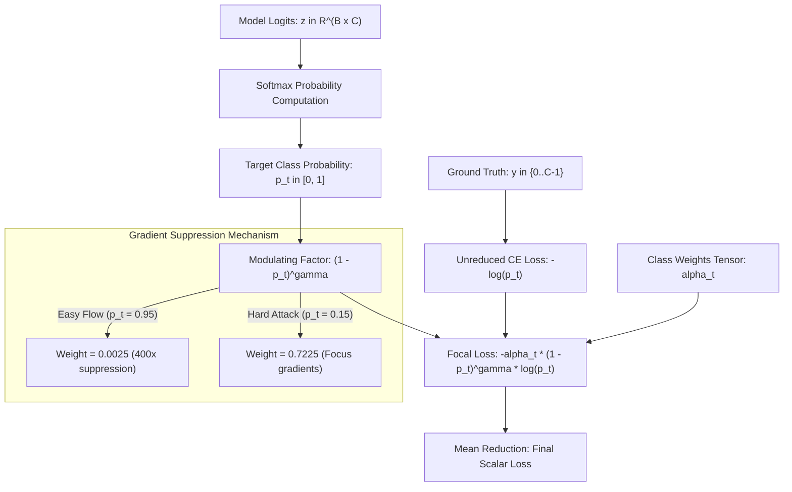

# 📦 Module Documentation: `src/losses/focal_loss.py`

Imbalance-aware loss function suite featuring Multi-Class Focal Loss and unified factory constructors to mitigate extreme class skew in network intrusion detection workloads.

* **Source File:** [`src/losses/focal_loss.py`](file:///home/quan/projects/FedLearning/src/losses/focal_loss.py)
* **Parent Package:** [`src.losses`](file:///home/quan/projects/FedLearning/src/losses/__init__.py)
* **Skill Reference:** [skills/model-design-and-implementation/SKILL.md](file:///home/quan/projects/FedLearning/.agents/skills/model-design-and-implementation/SKILL.md) & [skills/dataset-analysis-and-strategy/SKILL.md](file:///home/quan/projects/FedLearning/.agents/skills/dataset-analysis-and-strategy/SKILL.md)

---

## 🗺️ Architectural Context & Gradient Modulation



---

## 1. What Does It Do?

`src/losses/focal_loss.py` dynamically rescales loss contributions based on classification difficulty, preventing abundant majority flows (e.g. DDoS, Benign) from overwhelming gradient updates and starving rare, stealthy intrusions (e.g. Web-based, Brute-force).

### 1.1 Key Components & API Contracts

#### 1. `MultiClassFocalLoss(nn.Module)` (Class)
Direct multi-class extension of Lin et al.'s Focal Loss formulation.

* **Constructor Parameters:**
  * `alpha: Optional[Union[torch.Tensor, np.ndarray]] = None`: 1D tensor of shape `(num_classes,)` specifying class-specific weighting factors $\alpha_t$.
  * `gamma: float = 2.0`: Focusing parameter. Higher $\gamma$ increases suppression on easy examples ($\gamma = 0$ corresponds to standard Cross-Entropy).
  * `reduction: str = 'mean'`: Reduction applied to the output (`'mean'`, `'sum'`, or `'none'`).
* **`forward(inputs: torch.Tensor, targets: torch.Tensor) -> torch.Tensor`**:
  * `inputs`: Predicted unnormalized logits of shape `(batch_size, num_classes)`.
  * `targets`: Ground-truth class indices of shape `(batch_size,)`.
  * Returns: Scalar loss tensor (or per-sample vector if `reduction='none'`).

#### 2. `build_loss_function(...) -> nn.Module` (Factory Function)
Standardized constructor providing uniform initialization across models and trainers.

* **Signature:**
  ```python
  def build_loss_function(
      loss_type: str = "cross_entropy",
      class_weights: Optional[Union[torch.Tensor, np.ndarray]] = None,
      gamma: float = 2.0,
      device: Union[str, torch.device] = "cpu"
  ) -> nn.Module
  ```
* **Supported `loss_type` Options:**
  * `"focal_loss"`: Returns `MultiClassFocalLoss` with specified $\gamma$ and class weights.
  * `"weighted_ce"`: Returns PyTorch `nn.CrossEntropyLoss(weight=class_weights)`.
  * `"cross_entropy"`: Returns unweighted standard PyTorch `nn.CrossEntropyLoss()`.

### 1.2 Mathematical Formulation

Given ground-truth class $t \in \{0, \dots, C-1\}$ and predicted probability $p_t = \frac{\exp(z_t)}{\sum_c \exp(z_c)}$:

$$\text{FL}(p_t) = -\alpha_t \left(1 - p_t\right)^\gamma \log\left(p_t\right)$$

#### Modulating Factor Impact ($\gamma = 2.0$)
* For an **easy background flow** where the model is confident ($p_t = 0.95$):
  $$(1 - 0.95)^2 = 0.0025 \implies \mathbf{400\times\text{ loss reduction}}$$
* For a **hard, rare penetration attack** where the model is uncertain ($p_t = 0.20$):
  $$(1 - 0.20)^2 = 0.6400 \implies \mathbf{\text{Retains 64\% of original loss}}$$

The derivative with respect to logit $z_t$:
$$\frac{\partial \text{FL}}{\partial z_t} = \alpha_t (1 - p_t)^\gamma \left( \gamma p_t \log(p_t) + p_t - 1 \right)$$
Easy examples generate vanishingly small gradients, focusing backpropagation almost entirely on edge cases and underrepresented attack classes.

---

## 2. Why Do You Need It?

| Data Characteristic in CICIoT2023 | Failure Mode Under Standard Cross-Entropy | How `focal_loss.py` Solves It |
| :--- | :--- | :--- |
| **Severe Class Imbalance (147:1 Ratio)** | Majority classes (`DDoS` 37.6%, `DoS` 22.8%) dominate loss sums; the model predicts majority labels and achieves 98%+ nominal accuracy while scoring **0.0% Recall on Web-based attacks**. | $\alpha_t$ class weighting scales loss proportionally to class scarcity, ensuring rare attacks carry sufficient gradient weight. |
| **Vast Volume of Easy Negative Flows** | Benign and standard volumetric DDoS packets are easily distinguished; their sheer sample count swamps the gradient signal. | Modulating factor $(1 - p_t)^\gamma$ suppresses loss on well-classified flows by up to $400\times$, focusing optimization on ambiguous decision boundaries. |
| **Silent Device Incompatibility** | Passing CPU weight arrays to GPU loss functions causes uninformative PyTorch device mismatch crashes. | `build_loss_function` guarantees automatic type conversion and target device placement (`weights.to(device)`). |

---

## 3. How To Use It?

### 3.1 Minimal Quickstart

```python
import torch
from src.losses.focal_loss import MultiClassFocalLoss

# 1. Mock predictions (4 samples, 8 classes) and true labels
logits = torch.randn(4, 8)
targets = torch.tensor([0, 7, 2, 7])  # Class 7 is a rare minority attack

# 2. Assign higher weight to class 7
class_weights = torch.ones(8)
class_weights[7] = 15.0

# 3. Compute weighted focal loss
criterion = MultiClassFocalLoss(alpha=class_weights, gamma=2.0)
loss = criterion(logits, targets)
print(f"Computed Focal Loss: {loss.item():.4f}")
```

### 3.2 Production Factory Integration Recipe

```python
from src.data.preprocess import compute_balanced_class_weights
from src.losses.focal_loss import build_loss_function

# Step 1: Compute inverse-frequency class weights from training labels
weights = compute_balanced_class_weights(y_train, num_classes=8)

# Step 2: Build focal loss criterion mapped directly to GPU/CPU
device = "cuda" if torch.cuda.is_available() else "cpu"
criterion = build_loss_function(
    loss_type="focal_loss",
    class_weights=weights,
    gamma=2.0,
    device=device
)

# Step 3: Pass seamlessly to LocalClientTrainer or CentralizedTrainer
trainer = LocalClientTrainer(model=model, optimizer=optimizer, criterion=criterion, device=device)
```

### 3.3 Common Pitfalls & Troubleshooting

| Pitfall / Issue | Root Cause | Solution |
| :--- | :--- | :--- |
| Negative or zero loss values | Numerical underflow in $\log(p_t)$ when $p_t \to 0$. | `MultiClassFocalLoss` computes $p_t = \exp(-\text{ce})$, leveraging PyTorch's numerically stabilized LogSumExp implementation. |
| Training divergence with large $\alpha$ | Setting minority weights to extreme values (e.g. $> 1000$) causes massive gradient spikes. | Pair `MultiClassFocalLoss` with gradient clipping (`max_grad_norm=5.0` in `trainer.py`). |
| Unknown loss type error | Passing invalid string identifier. | Select from `'cross_entropy'`, `'weighted_ce'`, or `'focal_loss'`. |
