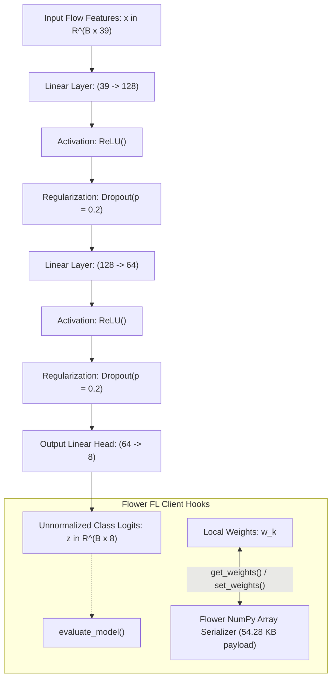

# 📦 Module Documentation: `src/models/mlp.py`

Ultra-lightweight Multi-Layer Perceptron (MLP) neural network backbone optimized for low-latency tabular network intrusion detection and communication-efficient federated learning on edge IoT gateways.

* **Source File:** [`src/models/mlp.py`](file:///home/quan/projects/FedLearning/src/models/mlp.py)
* **Parent Package:** [`src.models`](file:///home/quan/projects/FedLearning/src/models/__init__.py)
* **Skill Reference:** [skills/model-design-and-implementation/SKILL.md](file:///home/quan/projects/FedLearning/.agents/skills/model-design-and-implementation/SKILL.md) & [skills/methodology-audit/SKILL.md](file:///home/quan/projects/FedLearning/.agents/skills/methodology-audit/SKILL.md)

---

## 🗺️ Architectural Context & Tensor Flow



---

## 1. What Does It Do?

`src/models/mlp.py` provides the canonical neural network architecture for classifying network flows into 8 distinct attack categories (or benign). It exposes native serialization interfaces for seamless integration with the Flower federated learning framework.

### 1.1 Key Components & API Contracts

#### 1. `TabularIoTMLP(nn.Module)` (Class)
The deep learning classifier designed specifically for continuous tabular network telemetry.

* **Constructor Parameters:**
  * `input_dim: int = 39`: Dimensionality of preprocessed flow features.
  * `hidden_dims: Tuple[int, ...] = (128, 64)`: Sizes of fully connected intermediate hidden layers.
  * `num_classes: int = 8`: Number of output target classes.
  * `dropout_rate: float = 0.2`: Inverted dropout probability during training to prevent co-adaptation.
* **`forward(x: torch.Tensor) -> torch.Tensor`**:
  * Input shape: `(batch_size, 39)` of type `torch.float32`.
  * Output shape: `(batch_size, 8)` unnormalized raw logits.
* **`get_weights() -> List[np.ndarray]`**:
  * Extracts all model parameter tensors (`state_dict`) as detached NumPy arrays on CPU. Essential for transmitting client updates to the Flower FL aggregation server.
* **`set_weights(weights: List[np.ndarray]) -> None`**:
  * Injects aggregated NumPy parameter arrays from Flower back into the PyTorch `state_dict` with strict key verification.
* **`get_num_parameters() -> int`**:
  * Computes total trainable parameters: exactly **13,896** parameters.
* **`get_model_size_kb() -> float`**:
  * Computes model payload size: $(13,896 \times 4\text{ bytes}) / 1024 = \mathbf{54.28\text{ KB}}$ (in FP32 precision).
* **`_init_weights() -> None`**:
  * Initializes linear layer weights using **Kaiming Normal** (`kaiming_normal_`, fan-in mode, ReLU nonlinearity) and biases to zero.

### 1.2 Mathematical Specifications

#### Parameter Breakdown

$$\begin{aligned}
\text{Layer 1: } & W_1 \in \mathbb{R}^{128 \times 39}, \; b_1 \in \mathbb{R}^{128} \implies (39 \times 128) + 128 = 5,120 \\
\text{Layer 2: } & W_2 \in \mathbb{R}^{64 \times 128}, \; b_2 \in \mathbb{R}^{64} \implies (128 \times 64) + 64 = 8,256 \\
\text{Layer 3: } & W_3 \in \mathbb{R}^{8 \times 64}, \; b_3 \in \mathbb{R}^{8} \implies (64 \times 8) + 8 = 520 \\
\mathbf{\text{Total Parameters: }} & 5,120 + 8,256 + 520 = \mathbf{13,896}
\end{aligned}$$

#### Kaiming (He) Weight Initialization

$$W \sim \mathcal{N}\left(0, \; \sigma^2\right) \quad \text{where} \quad \sigma = \sqrt{\frac{2}{\text{fan\_in}}}$$

Preserves signal variance across forward propagation through ReLU activation functions, eliminating vanishing or exploding activations at round 1.

---

## 2. Why Do You Need It?

| Architectural Decision | Naive Alternative | Why `TabularIoTMLP` is Superior |
| :--- | :--- | :--- |
| **Strict Exclusion of Batch Normalization** | Adding `nn.BatchNorm1d` | In Non-IID Federated Learning, client running means and variances diverge wildly. Averaging batch norm statistics on the server causes catastrophic representation collapse and severe accuracy degradation. Dropout + Kaiming normal provides regularization without running statistics. |
| **Ultra-Lightweight Footprint (54.28 KB)** | Heavy ResNet/Transformer/Tree models | Edge IoT nodes (Raspberry Pi, OpenWrt routers) possess constrained RAM and limited uplink bandwidth. A 54 KB payload transmits in sub-millisecond time over cellular/Wi-Fi channels. |
| **Microsecond Forward Pass Latency** | Deep recurrent architectures (LSTM/GRU) | Intrusion detection requires wire-speed line-rate packet flow classification. A 2-hidden-layer MLP executes in $<0.2$ ms per batch on standard edge CPUs. |
| **Built-in Flower Protocol Hooks** | Manual state dictionary slicing | `get_weights()` and `set_weights()` provide zero-boilerplate parameter serialization directly compatible with Flower `flwr.client.NumPyClient`. |

---

## 3. How To Use It?

### 3.1 Minimal Quickstart

```python
import torch
from src.models.mlp import TabularIoTMLP

# 1. Instantiate model
model = TabularIoTMLP(
    input_dim=39,
    hidden_dims=(128, 64),
    num_classes=8,
    dropout_rate=0.2
)

# 2. Check architecture complexity
print(f"Trainable parameters: {model.get_num_parameters():,}")  # 13,896
print(f"Network payload: {model.get_model_size_kb():.2f} KB")   # 54.28 KB

# 3. Forward pass inference
dummy_flow = torch.randn(8, 39)
logits = model(dummy_flow)
predicted_classes = logits.argmax(dim=-1)
print("Predicted classes:", predicted_classes.tolist())
```

### 3.2 Flower Client Integration Recipe

```python
import flwr as fl
from src.models.mlp import TabularIoTMLP

class IoTFlowerClient(fl.client.NumPyClient):
    def __init__(self, model: TabularIoTMLP):
        self.model = model

    def get_parameters(self, config):
        # Zero-overhead parameter extraction
        return self.model.get_weights()

    def set_parameters(self, parameters):
        # Direct weight injection from server aggregation
        self.model.set_weights(parameters)

    def fit(self, parameters, config):
        self.set_parameters(parameters)
        # Execute local training round ...
        return self.get_parameters(config={}), 1000, {}
```

### 3.3 Common Pitfalls & Troubleshooting

| Issue / Error | Cause | Remediation |
| :--- | :--- | :--- |
| `RuntimeError: mat1 and mat2 shapes cannot be multiplied` | Input feature dimension does not match `input_dim=39`. | Verify that the preprocessor did not drop or add columns (e.g. ensure target label was excluded from feature matrix). |
| Dropout active during inference | Calling `model(x)` without setting `model.eval()`. | Always call `model.eval()` before running evaluation passes or benchmarks. |
| Discrepancy in `set_weights` shapes | Server transmitted weight arrays with incompatible dimensions. | Ensure all clients and the server share the exact same `hidden_dims` configuration. |
