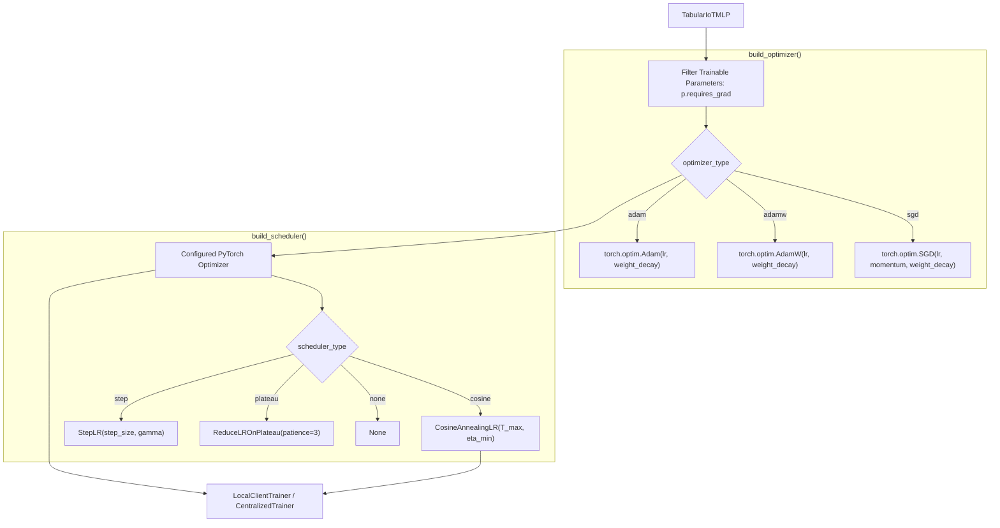

# 📦 Module Documentation: `src/optimizers/optimizer.py`

Standardized optimizer and learning rate scheduler factory suite supporting Adam, AdamW, SGD with momentum, and dynamic schedulers for federated clients and centralized baselines.

* **Source File:** [`src/optimizers/optimizer.py`](file:///home/quan/projects/FedLearning/src/optimizers/optimizer.py)
* **Parent Package:** [`src.optimizers`](file:///home/quan/projects/FedLearning/src/optimizers/__init__.py)
* **Skill Reference:** [skills/model-design-and-implementation/SKILL.md](file:///home/quan/projects/FedLearning/.agents/skills/model-design-and-implementation/SKILL.md) & [skills/methodology-audit/SKILL.md](file:///home/quan/projects/FedLearning/.agents/skills/methodology-audit/SKILL.md)

---

## 🗺️ Architectural Context & Optimizer Pipeline



---

## 1. What Does It Do?

`src/optimizers/optimizer.py` centralizes optimizer and learning rate scheduler instantiation, ensuring consistent parameter configurations between standalone centralized baselines and distributed federated local clients.

### 1.1 Key Components & API Contracts

#### 1. `build_optimizer(...) -> Optimizer` (Function)
* **Signature:**
  ```python
  def build_optimizer(
      model: nn.Module,
      optimizer_type: str = "adam",
      lr: float = 1e-3,
      weight_decay: float = 1e-4,
      momentum: float = 0.9
  ) -> torch.optim.Optimizer
  ```
* **Supported Optimizers:**
  * `"adam"`: Adaptive moment estimation with $L_2$ weight regularization.
  * `"adamw"`: Decoupled weight decay regularization, preventing weight explosion during extended multi-round training.
  * `"sgd"`: Classical stochastic gradient descent with Nesterov-style momentum buffer.
* **Internal Mechanics:** Explicitly filters `model.parameters()` for `requires_grad=True`, preventing errors on partially frozen models.

#### 2. `build_scheduler(...) -> Optional[_LRScheduler]` (Function)
* **Signature:**
  ```python
  def build_scheduler(
      optimizer: Optimizer,
      scheduler_type: str = "cosine",
      total_steps: int = 30,
      min_lr: float = 1e-5,
      step_size: int = 10,
      gamma: float = 0.5
  ) -> Optional[_LRScheduler]
  ```
* **Supported Schedules:**
  * `"cosine"`: Cosine annealing schedule decaying smoothly from initial `lr` down to `min_lr` over `total_steps` rounds.
  * `"step"`: Decays learning rate by factor `gamma` every `step_size` rounds.
  * `"plateau"`: Monitors validation loss and decays learning rate when loss stagnates.
  * `"none"`: Returns `None` (constant learning rate).

#### 3. `get_current_lr(optimizer: Optimizer) -> float` (Function)
* **Role:** Extracts the active learning rate from the primary parameter group of an optimizer for logging and metric reporting.

### 1.2 Mathematical Specifications

#### Cosine Annealing Learning Rate Decay
For communication round or epoch $t \in [0, T_{\max}]$:

$$\eta_t = \eta_{\min} + \frac{1}{2} (\eta_{\text{init}} - \eta_{\min}) \left( 1 + \cos\left( \frac{t}{T_{\max}} \pi \right) \right)$$

Provides aggressive exploratory updates in early federated rounds ($t \approx 0$), gradually transitioning to fine-grained convergence steps in later rounds ($t \to T_{\max}$).

---

## 2. Why Do You Need It?

| Architectural Risk | Naive Implementation Failure | How `optimizer.py` Solves It |
| :--- | :--- | :--- |
| **Inconsistent Federated vs. Centralized Optimization** | Centralized baseline uses AdamW with weight decay while FL clients use unregularized Adam, biasing comparisons. | Centralized factory guarantees that identical optimizer hyperparameters and weight decay are applied across all scenarios. |
| **Weight Drift in Extended FL Training** | In standard Adam, $L_2$ penalty interacts poorly with momentum, causing parameters to drift outward over 50+ communication rounds. | Provides first-class support for `AdamW` with decoupled weight decay. |
| **Late-Round Global Model Oscillation** | Constant learning rate causes client updates to overshoot optimal global consensus in heterogeneous Dirichlet settings. | `CosineAnnealingLR` smoothly decays step size, damping client update oscillations. |
| **Non-Trainable Parameter Contamination** | Passing frozen or non-gradient parameters to optimizers triggers PyTorch runtime exceptions. | Automatically filters `[p for p in model.parameters() if p.requires_grad]`. |

---

## 3. How To Use It?

### 3.1 Minimal Quickstart

```python
import torch
from src.models.mlp import TabularIoTMLP
from src.optimizers.optimizer import build_optimizer, build_scheduler, get_current_lr

# 1. Instantiate model
model = TabularIoTMLP(input_dim=39, num_classes=8)

# 2. Build AdamW optimizer with weight decay
optimizer = build_optimizer(
    model=model,
    optimizer_type="adamw",
    lr=1e-3,
    weight_decay=1e-4
)

# 3. Attach Cosine Annealing scheduler (30 communication rounds)
scheduler = build_scheduler(
    optimizer=optimizer,
    scheduler_type="cosine",
    total_steps=30,
    min_lr=1e-5
)

# 4. Step and inspect learning rate
print(f"Initial LR: {get_current_lr(optimizer)}")
scheduler.step()
print(f"Round 1 LR: {get_current_lr(optimizer):.6f}")
```

### 3.2 Common Pitfalls & Troubleshooting

| Pitfall / Issue | Root Cause | Solution |
| :--- | :--- | :--- |
| `ValueError: Unsupported optimizer_type` | Typo in string parameter (e.g. `'adam_w'`). | Use exact strings: `'adam'`, `'adamw'`, or `'sgd'`. |
| Scheduler steps out of sync with rounds | Calling `scheduler.step()` inside mini-batch loop instead of per federated round. | Step the scheduler once at the completion of each federated communication round. |
| Negative learning rates | Minimum LR `min_lr` set higher than initial `lr`. | Verify `min_lr < lr` (e.g., initial `1e-3`, minimum `1e-5`). |
