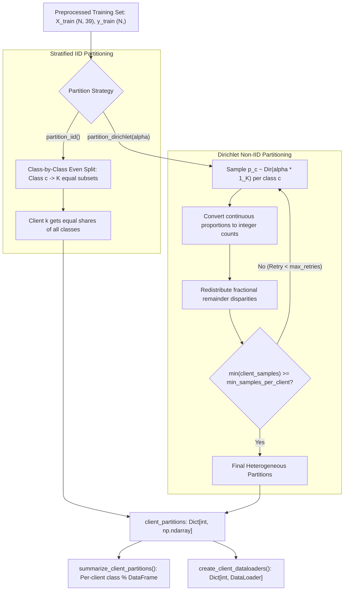

# 📦 Module Documentation: `src/data/partition.py`

Federated learning data partitioning suite providing Stratified IID and Dirichlet Non-IID statistical heterogeneity simulation across simulated IoT edge clients.

* **Source File:** [`src/data/partition.py`](file:///home/quan/projects/FedLearning/src/data/partition.py)
* **Parent Package:** [`src.data`](file:///home/quan/projects/FedLearning/src/data/__init__.py)
* **Skill Reference:** [skills/dataset-analysis-and-strategy/SKILL.md](file:///home/quan/projects/FedLearning/.agents/skills/dataset-analysis-and-strategy/SKILL.md) & [skills/methodology-audit/SKILL.md](file:///home/quan/projects/FedLearning/.agents/skills/methodology-audit/SKILL.md)

---

## 🗺️ Architectural Context & Dataflow



---

## 1. What Does It Do?

`src/data/partition.py` splits centralized training data across $K$ simulated edge clients to model distributed network topologies. It implements both baseline **Stratified IID** and realistic **Dirichlet Non-IID** label distributions.

### 1.1 Key Components & API Contracts

#### 1. `partition_iid(y: np.ndarray, num_clients: int, seed: int = 42) -> Dict[int, np.ndarray]`
* **Role:** Generates an exact stratified, uniformly distributed partition across $K$ clients.
* **Input Contract:**
  * `y`: 1D NumPy integer array of class labels for the training set (shape `(N,)`).
  * `num_clients`: Integer $K \ge 1$ representing number of simulated clients.
  * `seed`: Random seed for deterministic reproducibility.
* **Output Contract:**
  * Returns `Dict[int, np.ndarray]` mapping each `client_id` ($0$ to $K-1$) to an array of assigned sample indices.
* **Internal Mechanics:** Iterates over each unique class $c$, shuffles class indices, splits them evenly into $K$ chunks via `np.array_split`, assigns one chunk to each client, and shuffles per-client indices to eliminate sequential label ordering bias.

#### 2. `partition_dirichlet(...) -> Dict[int, np.ndarray]`
* **Role:** Simulates statistical label skew across clients using a symmetric Dirichlet distribution $\text{Dir}(\alpha)$.
* **Signature:**
  ```python
  def partition_dirichlet(
      y: np.ndarray,
      num_clients: int,
      alpha: float = 0.5,
      min_samples_per_client: int = 100,
      seed: int = 42,
      max_retries: int = 50
  ) -> Dict[int, np.ndarray]
  ```
* **Heterogeneity Regimes:**
  * $\alpha \to \infty$: Identical label distributions (equivalent to IID).
  * $\alpha = 1.0$: Mild statistical heterogeneity across clients.
  * $\alpha = 0.5$: Moderate statistical heterogeneity (standard benchmark setting).
  * $\alpha = 0.1$: Severe statistical heterogeneity (extreme label skew; rare attacks concentrated in single clients).
* **Defensive Guarantee:** Enforces `min_samples_per_client` to prevent degenerate partitions (e.g., clients with 0 samples causing zero-division or batch-size crashes). Retries with incremented seeds up to `max_retries`.

#### 3. `summarize_client_partitions(client_partitions, y, class_names=None) -> pd.DataFrame`
* **Role:** Generates an audit table summarizing per-client sample counts, class distributions, and class percentages.
* **Returns:** A pandas DataFrame indexed by client ID with columns `total_samples`, `{class_name}_count`, and `{class_name}_pct`.

#### 4. `create_client_dataloaders(X, y, client_partitions, batch_size=128, shuffle=True, num_workers=0) -> Dict[int, DataLoader]`
* **Role:** Builds native PyTorch `DataLoader` instances wrapped in `TensorDataset` for every client partition.

### 1.2 Algorithmic & Mathematical Formulations

For each class $c \in \{0, \dots, C-1\}$, a proportion vector $\mathbf{p}_c = (p_{c, 1}, p_{c, 2}, \dots, p_{c, K})$ is sampled:
$$\mathbf{p}_c \sim \text{Dir}(\alpha \cdot \mathbf{1}_K), \quad \sum_{k=1}^K p_{c, k} = 1$$
Discrete sample allocation for client $k$ on class $c$ with total class instances $N_c$:
$$n_{c, k} = \lfloor p_{c, k} \cdot N_c \rfloor$$
The fractional remainder disparity $\Delta_c = N_c - \sum_{k=1}^K n_{c, k}$ is allocated one-by-one to clients possessing the largest fractional remainders $(p_{c, k} \cdot N_c - n_{c, k})$, ensuring $\sum_{k=1}^K n_{c, k} = N_c$ with zero sample loss.

---

## 2. Why Do You Need It?

| Empirical Challenge / Risk | Failure Mode in Naive Partitioning | How `partition.py` Solves It |
| :--- | :--- | :--- |
| **Edge Network Heterogeneity** | Assuming IID traffic across all IoT routers is unrealistic; edge nodes observe fundamentally different attack vectors. | Dirichlet Non-IID partitioning parameterizes realistic statistical skew from mild ($\alpha=1.0$) to severe ($\alpha=0.1$). |
| **Client Starvation & Crashes** | Naive Dirichlet sampling at $\alpha \le 0.1$ frequently assigns zero samples to a client, crashing PyTorch `DataLoader` (`batch_size > dataset_size`). | Enforces `min_samples_per_client` guard with automatic retry logic (`max_retries=50`). |
| **Sample Truncation Disparities** | Standard `astype(int)` rounding drops fractional samples, discarding hundreds of rare attack instances (e.g. Web-based, Brute-force). | Implements **remainder disparity redistribution**, guaranteeing that every single training sample is allocated. |
| **Sequential Ordering Bias** | Appending class samples in order creates intra-batch label autocorrelation, corrupting SGD momentum. | Executes per-client random index shuffling before building tensors. |
| **Opaque Partition Auditing** | Inability to verify client distributions in research reports leads to unreproducible claims. | `summarize_client_partitions()` outputs publication-ready per-client distribution tables. |

---

## 3. How To Use It?

### 3.1 Minimal Quickstart

```python
import numpy as np
from src.data.partition import partition_dirichlet, summarize_client_partitions

# 1. Create mock ground-truth labels (8 classes, imbalanced)
mock_labels = np.random.choice(8, size=10000, p=[0.4, 0.25, 0.15, 0.1, 0.05, 0.03, 0.015, 0.005])

# 2. Partition across 5 simulated IoT clients with moderate Non-IID skew (alpha=0.5)
client_partitions = partition_dirichlet(
    y=mock_labels,
    num_clients=5,
    alpha=0.5,
    min_samples_per_client=100,
    seed=42
)

# 3. Inspect distribution
summary_df = summarize_client_partitions(client_partitions, mock_labels)
print(summary_df[["client_id", "total_samples", "Class_0_pct", "Class_7_pct"]])
```

### 3.2 End-to-End FL Integration Recipe

```python
import torch
from src.data.preprocess import load_and_preprocess_ciciot2023
from src.data.partition import partition_dirichlet, create_client_dataloaders

# Step 1: Preprocess dataset
data = load_and_preprocess_ciciot2023(
    data_path="data/merged_CICIOT2023_data.csv",
    sample_size=100000,
    random_state=42
)

# Step 2: Partition train data across 5 edge clients under extreme Non-IID skew (alpha=0.1)
client_partitions = partition_dirichlet(
    y=data["y_train"],
    num_clients=5,
    alpha=0.1,
    min_samples_per_client=500,
    seed=42
)

# Step 3: Instantiate PyTorch DataLoaders for each client
client_loaders = create_client_dataloaders(
    X=data["X_train"],
    y=data["y_train"],
    client_partitions=client_partitions,
    batch_size=64,
    shuffle=True
)

for client_id, loader in client_loaders.items():
    print(f"Client {client_id} ready: {len(loader.dataset)} samples, {len(loader)} batches.")
```

### 3.3 Common Pitfalls & Troubleshooting

| Error / Issue | Root Cause | Solution |
| :--- | :--- | :--- |
| `RuntimeError: Failed to generate a valid Dirichlet partition` | `min_samples_per_client` is set too high relative to `num_clients` and small $\alpha$. | Lower `min_samples_per_client` or increase `alpha` (e.g. from 0.05 to 0.1). |
| `ValueError: batch_size > len(dataset)` in client loop | Client has fewer samples than the training batch size. | Ensure `min_samples_per_client >= batch_size` when calling `partition_dirichlet`. |
| Non-deterministic partition across runs | Missing fixed seed or using standard `random` instead of `np.random.default_rng(seed)`. | Always pass explicit integer `seed` to `partition_iid` and `partition_dirichlet`. |
