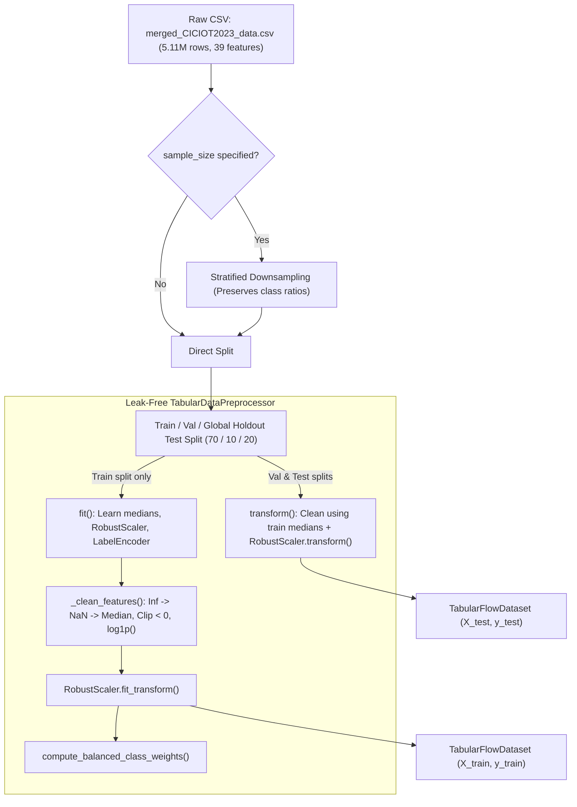

# 📦 Module Documentation: `src/data/preprocess.py`

High-performance, leak-free tabular data preprocessing pipeline tailored for network flow intrusion detection and federated learning workloads on the **CICIoT2023** dataset.

* **Source File:** [`src/data/preprocess.py`](file:///home/quan/projects/FedLearning/src/data/preprocess.py)
* **Parent Package:** [`src.data`](file:///home/quan/projects/FedLearning/src/data/__init__.py)

---

## 🗺️ Architectural Context & Dataflow



---

## 1. What Does It Do?

`src/data/preprocess.py` converts raw, uncurated network captures containing missing values, infinite bitrates, negative timestamps, and heavy-tailed traffic into standardized numerical PyTorch tensors without statistical data leakage.

### 1.1 Key Components & API Contracts

#### 1. `TabularDataPreprocessor` (Class)
The central transformation engine encapsulating all stateful parameters.
* **`fit(df_train: pd.DataFrame, target_col: str = 'group_class_name') -> self`**:
  * Learns categorical label mappings via `LabelEncoder`.
  * Computes feature-wise imputation medians exclusively on the training partition.
  * Fits a `RobustScaler` on cleaned training features.
* **`transform(df: pd.DataFrame, target_col: Optional[str] = 'group_class_name') -> Tuple[np.ndarray, Optional[np.ndarray]]`**:
  * Applies learned medians, non-negative clipping, `log1p` compression, and scaling to validation, test, or unlabelled inference data.
  * Outputs standardized `float32` feature matrices and `int64` label vectors.
* **`_clean_features(X: pd.DataFrame) -> pd.DataFrame`**:
  * Replaces $\pm\infty$ with `NaN`.
  * Imputes `NaN` values using learned training medians.
  * Enforces physical reality: clips `IAT`, `Rate`, and time features at zero (`clip(lower=0.0)`).
  * Compresses heavy-tailed distributions (`IAT`, `Rate`, `Variance`, `Std`, `Tot sum`) using $\log(1 + x)$.
* **`save(filepath: str)` & `load(filepath: str)`**:
  * Serializes and restores the fitted preprocessor via `pickle` to guarantee identical transforms across edge clients.

#### 2. `TabularFlowDataset(Dataset)` (Class)
PyTorch `Dataset` wrapper enabling batch slicing and zero-copy tensor conversion for `DataLoader`.

#### 3. `compute_balanced_class_weights(y: np.ndarray, num_classes: int) -> np.ndarray` (Function)
Calculates inverse-frequency class weights:
$$w_c = \frac{N}{C \times N_c}$$
Where $N$ is total samples, $C = 8$ classes, and $N_c$ is the sample count of class $c$.

#### 4. `load_and_preprocess_ciciot2023(...)` (Function)
One-stop automated factory that loads CSV data, performs stratified train/val/test splitting, fits preprocessors, scales partitions, and returns a structured dictionary containing feature matrices, label arrays, class weights, and native PyTorch `DataLoader` instances (`train_loader`, `val_loader`, `test_loader`).
* **Fixed Parameters:** `csv_path: str`, `test_size: float = 0.2`, `val_size: float = 0.1`, `sample_size: Optional[int] = None`, `scaler_type: str = 'robust'`, `batch_size: int = 128`, `random_state: int = 42`, `save_preprocessor_path: Optional[str] = None`.

---

## 2. Why Do You Need It?

| Raw Data Anomaly / Risk | Concrete Failure Mode | How `preprocess.py` Solves It |
| :--- | :--- | :--- |
| **Statistical Data Leakage** | Scaling before train/test split leaks test distribution ($\mu, \sigma$) into training, falsely inflating accuracy. | Enforces strict **train-only fitting**. Val/Test partitions are transformed purely with train parameters. |
| **Division-by-Zero Infinities ($\pm\infty$)** | Features like `Rate = bytes / duration` yield `inf` when packet duration is 0, causing immediate PyTorch `NaN` loss crashes. | Converts infinities to `NaN` and imputes with training medians. |
| **Clock-Drift Negative Timestamps** | `IAT` contains small negative values (e.g. `-0.0064s`) due to hardware NIC unsynchronized capture cards. Breaks `log1p`. | Enforces `clip(lower=0.0)` on all physical time properties. |
| **Extreme Tabular Skewness ($>1600$)** | `IAT` skewness is 1660 (mean $0.026$, max $46,665$). Raw inputs explode model weights and gradients. | Compresses dynamic range with $\log(1 + x)$ followed by `RobustScaler` (median & Interquartile Range IQR). |
| **Severe Class Imbalance (147:1 ratio)** | Majority `DDoS` is 37.6% while `Brute-force` is 0.26%. Naive networks predict only majority classes. | Generates balanced class weights ($w_c$) to penalize errors on rare attack vectors. |
| **5.11M Dataset Footprint (~1 GB)** | Full simulation on 5.11M rows exhausts workstation RAM. | Supports `sample_size=300000` stratified downsampling, preserving exact class ratios for rapid sweeps. |

---

## 3. How To Use It?

### 3.1 Minimal Quickstart (Copy-Paste Ready)

```python
import numpy as np
import pandas as pd
from src.data.preprocess import TabularDataPreprocessor

# 1. Create mock dirty network flows
mock_df = pd.DataFrame({
    "IAT": [0.005, -0.002, np.nan, 45.0],
    "Rate": [1200.0, np.inf, 300.0, 0.0],
    "Header_Length": [20, 32, 20, 20],
    "group_class_name": ["Benign", "DDoS", "Benign", "Brute-force"]
})

# 2. Fit and transform
preprocessor = TabularDataPreprocessor(scaler_type="robust")
X_scaled, y_encoded = preprocessor.fit_transform(mock_df)

print("Scaled features shape:", X_scaled.shape)
print("Encoded classes:", preprocessor.class_names_)
# Scaled features shape: (4, 3)
# Encoded classes: ['Benign', 'Brute-force', 'DDoS']
```

### 3.2 High-Level End-to-End Loading

```python
from src.data.preprocess import load_and_preprocess_ciciot2023

data_bundle = load_and_preprocess_ciciot2023(
    csv_path="datasets/CICIOT2023/merged_CICIOT2023_data.csv",
    sample_size=200000,       # Fast prototype with 200k samples
    test_size=0.2,            # 20% holdout test set
    val_size=0.1,             # 10% validation set
    scaler_type="robust",
    random_state=42
)

X_train, y_train = data_bundle["X_train"], data_bundle["y_train"]
X_test, y_test = data_bundle["X_test"], data_bundle["y_test"]
class_weights = data_bundle["class_weights"]
```

### 3.3 Common Pitfalls & Troubleshooting
* **Calling `transform()` before `fit()`:** Raises `RuntimeError`. Always call `fit()` on training data first.
* **Feature Column Mismatch:** `transform()` expects identical column names to those learned during `fit()`. Ensure input DataFrames share the same schema.
