# 📦 Module Documentation: `src/training/trainer.py`

Training orchestration suite providing unified local client federated optimization (FedAvg and FedProx proximal regularization) and standalone centralized baseline training with validation checkpointing and early stopping.

* **Source File:** [`src/training/trainer.py`](file:///home/quan/projects/FedLearning/src/training/trainer.py)
* **Parent Package:** [`src.training`](file:///home/quan/projects/FedLearning/src/training/__init__.py)
* **Skill Reference:** [skills/model-design-and-implementation/SKILL.md](file:///home/quan/projects/FedLearning/.agents/skills/model-design-and-implementation/SKILL.md) & [skills/methodology-audit/SKILL.md](file:///home/quan/projects/FedLearning/.agents/skills/methodology-audit/SKILL.md)

---

## 🗺️ Architectural Context & Training Dataflow

```mermaid
flowchart TD
    subgraph LocalFLTraining["LocalClientTrainer (Federated Client)"]
        RoundStart["Round t: Receive Global Weights w_t"] --> LocalInit["Set model.w = w_t, cache global_model"]
        LocalInit --> ClientBatch["Batch (X_b, y_b) from Client DataLoader"]
        ClientBatch --> TaskLoss["L_task = Criterion(y_hat, y)"]
        
        TaskLoss --> CheckMu{"Is mu > 0.0 (FedProx)?"}
        CheckMu -->|"Yes (FedProx)"| ProxPen["Add Proximal Penalty: (mu / 2) * ||w - w_t||^2"]
        CheckMu -->|"No (FedAvg)"| NoProx["Total Loss = L_task"]
        ProxPen --> TotalBatchLoss["L_total = L_task + L_prox"]
        NoProx --> TotalBatchLoss
        
        TotalBatchLoss --> GradBackward["Backward pass: L_total.backward()"]
        GradBackward --> GradClip["clip_grad_norm_(max_norm = 5.0)"]
        GradClip --> Step["optimizer.step()"]
        Step --> CheckEpoch{"Local Epochs Complete?"}
        CheckEpoch -->|"No"| ClientBatch
        CheckEpoch -->|"Yes"| ExtractWeights["model.get_weights() -> Transmit to Server"]
    end

    subgraph CentralizedTraining["CentralizedTrainer (Scenario E1)"]
        TrainEpoch["Train on Full Dataset"] --> ValEval["Evaluate on Validation Set"]
        ValEval --> BestCheck{"val_loss < best_val_loss?"}
        BestCheck -->|"Yes"| SaveBest["Save deepcopy(state_dict), Reset patience = 0"]
        BestCheck -->|"No"| IncPatience["patience += 1"]
        IncPatience --> EarlyStopCheck{"patience >= max_patience?"}
        EarlyStopCheck -->|"Yes"| StopEarly["Restore Best Checkpoint & Terminate"]
        EarlyStopCheck -->|"No"| TrainEpoch
    end
```



---

## 1. What Does It Do?

`src/training/trainer.py` isolates all optimization execution logic from data loading and model definitions. It ensures mathematically rigorous training in both distributed federated rounds and centralized benchmarks.

### 1.1 Key Components & API Contracts

#### 1. `LocalClientTrainer` (Class)
The local training engine instantiated by simulated edge IoT clients during federated rounds.

* **Constructor Parameters:**
  * `model: nn.Module`: Local instance of `TabularIoTMLP`.
  * `optimizer: torch.optim.Optimizer`: Client optimizer (e.g. Adam or SGD).
  * `criterion: nn.Module`: Loss function (e.g. `MultiClassFocalLoss`).
  * `device: Union[str, torch.device] = 'cpu'`: Device execution target.
  * `max_grad_norm: float = 5.0`: Maximum allowed $L_2$ norm for gradient vectors.
* **`train_epoch(dataloader, global_model=None, mu=0.0) -> Tuple[float, float]`**:
  * Executes a single pass over local client data.
  * Dynamically computes the FedProx proximal penalty if $\mu > 0.0$ and `global_model` is provided.
  * Clips gradients to `max_grad_norm` before optimizer updates.
  * Returns `(average_loss, accuracy)`.
* **`train_epochs(dataloader, num_epochs, global_model=None, mu=0.0) -> Tuple[float, float]`**:
  * Executes $E$ consecutive local epochs during a communication round.

#### 2. `CentralizedTrainer` (Class)
The benchmarking engine used to establish the centralized performance upper-bound (Scenario E1).

* **Constructor Parameters:**
  * Identical to `LocalClientTrainer`, ensuring parity in optimizer and clipping configurations.
* **`fit(train_loader, val_loader=None, epochs=20, patience=5) -> Dict[str, List[float]]`**:
  * Runs training across all global data batches.
  * Tracks validation metrics after every epoch.
  * Implements early stopping: if validation loss does not improve for `patience` consecutive epochs, training terminates and the best validation checkpoint is automatically restored.
  * Returns historical training curves (`train_loss`, `train_acc`, `val_loss`, `val_acc`).

### 1.2 Mathematical Formulations

#### FedProx Local Objective Function
Under FedProx, each local edge client $k$ minimizes an augmented objective with an $L_2$ proximal term anchoring local parameters $w$ to the round's starting global parameters $w_t$:

$$\min_{w} h_k(w; w_t) = \mathcal{L}_k(w) + \frac{\mu}{2} \sum_{l=1}^L \left\| w_l - w_{t, l} \right\|_2^2$$

* When $\mu = 0.0$: Objective reduces to standard FedAvg local loss $\mathcal{L}_k(w)$.
* When $\mu > 0.0$: Penalizes large parameter deviations, preventing local models from overfitting to skewed client-specific distributions.

#### Gradient Clipping Constraint
To prevent exploding gradients caused by extreme tabular feature values:

$$g \leftarrow g \cdot \min\left(1, \; \frac{M}{\|g\|_2}\right) \quad \text{where } M = 5.0$$

---

## 2. Why Do You Need It?

| Empirical Challenge / Risk | Naive Implementation Flaw | How `trainer.py` Solves It |
| :--- | :--- | :--- |
| **Client Drift Under Non-IID Skew** | Local SGD overfits to client-specific majority classes, causing global aggregated models to oscillate and diverge. | Implements exact FedProx proximal penalty ($\mu \in [0.001, 0.1]$), restricting local parameter drift. |
| **Exploding Gradients on Edge Telemetry** | Spikes in network flow features cause gradient norms to surge, resulting in `NaN` weights. | Enforces mandatory gradient clipping (`clip_grad_norm_`, threshold $5.0$) across all trainers. |
| **Architectural Disparity Between FL and Centralized** | Comparing FL against centralized models trained with differing optimizers or hyperparameters invalidates conclusions. | Shares identical optimizer contracts, loss configurations, and clipping thresholds between centralized and local trainers. |
| **Overfitting in Centralized Baselines** | Training for fixed epochs without validation checkpointing reports degraded overfitted states. | `CentralizedTrainer` includes strict patience-based early stopping with automatic restoration of `best_val_loss` weights. |

---

## 3. How To Use It?

### 3.1 Minimal Quickstart (FedProx Local Client Round)

```python
import torch
import copy
from src.models.mlp import TabularIoTMLP
from src.optimizers.optimizer import build_optimizer
from src.losses.focal_loss import MultiClassFocalLoss
from src.training.trainer import LocalClientTrainer
from torch.utils.data import DataLoader, TensorDataset

# 1. Setup local client model and global reference model
local_model = TabularIoTMLP(input_dim=39, num_classes=8)
global_model = copy.deepcopy(local_model)

optimizer = build_optimizer(local_model, "adam", lr=1e-3)
criterion = MultiClassFocalLoss(gamma=2.0)

trainer = LocalClientTrainer(
    model=local_model,
    optimizer=optimizer,
    criterion=criterion,
    max_grad_norm=5.0
)

# 2. Mock client training data
mock_loader = DataLoader(
    TensorDataset(torch.randn(100, 39), torch.randint(0, 8, (100,))),
    batch_size=32
)

# 3. Train 3 local epochs with FedProx proximal regularization (mu = 0.01)
avg_loss, acc = trainer.train_epochs(
    dataloader=mock_loader,
    num_epochs=3,
    global_model=global_model,
    mu=0.01
)
print(f"Local Round Completed - Loss: {avg_loss:.4f}, Accuracy: {acc*100:.2f}%")
```

### 3.2 Centralized Baseline Recipe (Scenario E1)

```python
from src.training.trainer import CentralizedTrainer

centralized_trainer = CentralizedTrainer(
    model=local_model,
    optimizer=optimizer,
    criterion=criterion,
    max_grad_norm=5.0
)

history = centralized_trainer.fit(
    train_loader=mock_loader,
    val_loader=mock_loader,
    epochs=15,
    patience=3
)
print("Best validation loss achieved:", centralized_trainer.best_val_loss)
```

### 3.3 Common Pitfalls & Troubleshooting

| Pitfall / Issue | Root Cause | Solution |
| :--- | :--- | :--- |
| `RuntimeError: Expected all tensors to be on the same device` | Model is on GPU/CPU while `global_model` was left on another device. | `LocalClientTrainer` automatically places `global_model.to(self.device)`, but verify tensor inputs match `self.device`. |
| Memory leak across federated rounds | Storing computational graphs of `global_model` across rounds. | `LocalClientTrainer` runs `global_model.eval()` and extracts parameters without tracking gradients. |
| Ineffective FedProx regularization | Setting $\mu$ too small ($\mu < 10^{-5}$) or forgetting to pass `global_model`. | Pass `global_model=initial_round_model` and choose $\mu \in [0.001, 0.1]$. |
