# 📦 Module Documentation: `src/visualization/plots.py`

Publication-grade, turnkey visualization and diagnostic plotting suite for centralized and federated IoT intrusion detection systems. Enables zero-boilerplate, one-line generation of 300-DPI publication figures.

* **Source File:** [`src/visualization/plots.py`](file:///home/quan/projects/FedLearning/src/visualization/plots.py)
* **Parent Package:** [`src.visualization`](file:///home/quan/projects/FedLearning/src/visualization/__init__.py)
* **Skill Reference:** [skills/evaluation-and-benchmarking/SKILL.md](file:///home/quan/projects/FedLearning/.agents/skills/evaluation-and-benchmarking/SKILL.md) & [skills/code-documentation/SKILL.md](file:///home/quan/projects/FedLearning/.agents/skills/code-documentation/SKILL.md)

---

## 🗺️ Architectural Context & Visualization Pipeline

```mermaid
flowchart TD
    subgraph DataSources["Experiment Outputs & Data State"]
        TrainHist["Centralized/Client History<br>('train_loss', 'val_acc', ...)"]
        EvalOut["evaluator.py Comprehensive Results<br>(CM, Macro-F1, Minority Recall)"]
        PartData["partitioner.py Outputs<br>(Client Contingency DataFrame)"]
        FLRounds["Federated Simulation Rounds<br>(FedAvg, FedProx Metrics per Round)"]
    end

    subgraph VizEngine["src.visualization (Turnkey Visualizer)"]
        Style["set_publication_style()<br>(DPI=300, Seaborn Whitegrid, Clean Spines)"]
        P1["plot_learning_curves()"]
        P2["plot_confusion_matrix()"]
        P3["plot_scenario_comparison()"]
        P4["plot_client_distribution()"]
        P5["plot_federated_convergence()"]
        P6["plot_minority_recall()"]
        P7["plot_per_class_metrics()"]
    end

    subgraph Artifacts["Publication-Grade Figures (reports/figures/)"]
        F1["learning_curves.png (Dual-Panel Loss & Acc)"]
        F2["confusion_matrix.png (Row-Normalized Heatmap)"]
        F3["scenario_comparison.png (E1 vs E2 vs E5 Bar Chart)"]
        F4["client_distribution.png (Dirichlet Skew Stacked Bar)"]
        F5["federated_convergence.png (Rounds Trajectory)"]
        F6["minority_recall.png (Stealth Attack Recall)"]
        F7["per_class_breakdown.png (Precision-Recall-F1)"]
    end

    TrainHist --> P1 --> F1
    EvalOut --> P2 --> F2
    EvalOut --> P3 --> F3
    PartData --> P4 --> F4
    FLRounds --> P5 --> F5
    EvalOut --> P6 --> F6
    EvalOut --> P7 --> F7
    Style -.-> VizEngine
```



---

## 1. What Does It Do?

`src/visualization/plots.py` eliminates repetitive plotting boilerplate across notebooks, research scripts, and automated experiment runners. Every plotting function is **turnkey**: it accepts raw outputs directly from `evaluator.py`, `partitioner.py`, or `CentralizedTrainer`, automatically handles directory creation, scales percentages, configures typography, and exports 300-DPI figures.

### 1.1 Key Functions & Contracts

| Function | Primary Input | Output | Description |
| :--- | :--- | :--- | :--- |
| `set_publication_style()` | `font_scale=1.1, style='whitegrid'` | `None` | Establishes uniform typography, subtle gridlines, clean spines, and high-resolution rendering. |
| `plot_learning_curves()` | `history: Dict[str, List[float]]` | `plt.Figure` | Dual-panel plot of training vs validation loss (left) and accuracy trajectory (right) with automatic best epoch indicators. |
| `plot_confusion_matrix()` | `cm: np.ndarray, class_names: List[str]` | `plt.Figure` | Row-normalized heatmap displaying precision/recall transfer across attack classes with clear annotations. |
| `plot_scenario_comparison()` | `results: Dict[str, Union[float, Dict]]` | `plt.Figure` | Benchmark bar chart comparing scenarios (e.g. E1 Centralized vs E2 FedAvg vs E5 FedProx) with bold percentage overlays. |
| `plot_client_distribution()` | `distribution: DataFrame / Dict / 2D Array` | `plt.Figure` | Stacked bar chart revealing label skew and statistical heterogeneity across federated edge clients. |
| `plot_federated_convergence()` | `rounds_data: Dict[str, List[float]]` | `plt.Figure` | Multi-strategy convergence trajectory across federated communication rounds. |
| `plot_minority_recall()` | `minority_data: Dict[str, float]` | `plt.Figure` | Dedicated visual isolation of detection recall on rare attacks (`Web-based`, `Brute-force`). |
| `plot_per_class_metrics()` | `metrics_dict: Dict[str, Any]` | `plt.Figure` | Multi-bar comparison of Precision, Recall, and F1-Score across all evaluated classes. |

---

## 2. Why Do You Need It?

### 2.1 Problems Solved & Failure Modes Prevented

| Naive Implementation Problem | Concrete Failure Mode | How `src.visualization` Solves It |
| :--- | :--- | :--- |
| **Boilerplate Explosion** | Writing 30–50 lines of Matplotlib/Seaborn code in every notebook cell duplicates logic and creates formatting discrepancies. | Functions provide **one-line execution** (`plot_learning_curves(history, save_path=...)`) with built-in styling. |
| **Missing Directory Errors** | Calling `plt.savefig("reports/figures/plot.png")` crashes if the target directory doesn't already exist. | Built-in `_ensure_dir(save_path)` automatically executes `os.makedirs(..., exist_ok=True)`. |
| **Scale Inconsistencies** | Mixing 0.0–1.0 floats and 0–100 percentages leads to mislabeled axes (e.g. `0.85%` instead of `85.0%`). | Automatic metric value detection: automatically detects fractions $\le 1.0$ and scales them to proper percentages. |
| **Unreadable Confusion Matrices** | Raw count matrices for imbalanced data are dominated by majority classes (`Benign`, `DDoS`), completely hiding minority misclassifications. | Row-wise normalization ($CM_{i,j} / \sum_k CM_{i,k}$) ensures every attack class reflects true detection sensitivity. |
| **Headless Environment Freezes** | Matplotlib GUI backend calls (`plt.show()`) block execution in non-interactive batch runners or Google Colab sessions. | Returns `plt.Figure` instances directly and defaults to `show=False`, allowing safe programmatic use. |

---

## 3. How To Use It?

### 3.1 Minimal Quickstart

```python
from src.visualization import (
    plot_learning_curves,
    plot_confusion_matrix,
    plot_scenario_comparison,
    plot_client_distribution,
    plot_federated_convergence
)

# 1. Dual-panel learning curves after centralized training
plot_learning_curves(
    history=trainer.history,
    save_path="reports/figures/learning_curves.png"
)

# 2. Normalized confusion matrix after evaluation
plot_confusion_matrix(
    cm=test_results["confusion_matrix"],
    class_names=class_names,
    save_path="reports/figures/confusion_matrix.png"
)

# 3. Cross-scenario comparison bar chart
plot_scenario_comparison(
    results={
        "E1: Centralized": e1_results,
        "E2: FedAvg (IID)": e2_results,
        "E5: FedProx (Non-IID)": e5_results
    },
    metric="macro_f1",
    save_path="reports/figures/scenario_comparison.png"
)

# 4. Federated client data distribution (Dirichlet skew)
plot_client_distribution(
    distribution=client_partitions_df,
    save_path="reports/figures/client_distribution.png"
)

# 5. Multi-round federated convergence trajectory
plot_federated_convergence(
    rounds_data={
        "FedAvg (IID)": [0.65, 0.75, 0.81, 0.84, 0.85],
        "FedProx (Non-IID)": [0.55, 0.70, 0.78, 0.81, 0.83],
    },
    metric_name="Macro-F1",
    save_path="reports/figures/federated_convergence.png"
)
```
