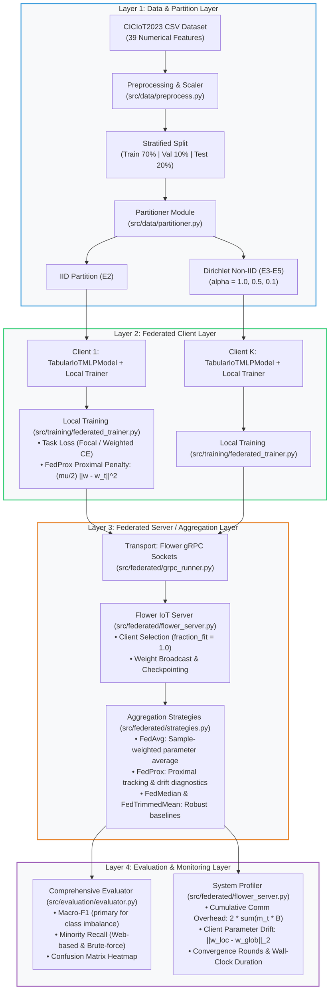

# 🎓 Thesis Proposal Alignment & Federated Learning System Specification

> **Thesis Title (Tiếng Việt):** *Xây dựng và đánh giá prototype hệ thống phát hiện xâm nhập IoT sử dụng Federated Learning trong môi trường dữ liệu non-IID*  
> **Thesis Title (English):** *Development and Evaluation of an IoT Intrusion Detection System Prototype using Federated Learning in Non-IID Data Environments*  
> **Institution:** University of Information Technology (UIT), VNU-HCM — Faculty of Computer Networks & Communications  
> **Author:** Nguyễn Việt Kỳ Quân (Student ID: 23521267)  
> **Advisor:** Assoc. Prof. Dr. Lê Trung Quân (PGS. TS. Lê Trung Quân)  
> **Reference Proposal:** [`thesis_proposal/DeCuongChiTiet_KLTN.md`](../thesis_proposal/DeCuongChiTiet_KLTN.md)

---

## 📌 Executive Summary

This document serves as the formal technical bridge between the **Undergraduate Thesis Proposal (`DeCuongChiTiet_KLTN.md`)** and the **FL-IoT-IDS software repository**. It provides a rigorous, point-by-point audit proving that the codebase faithfully realizes the theoretical concepts, algorithms, experimental scenarios, and evaluation metrics proposed in the thesis outline.

---

## 🗺️ Architectural Mapping: The 4-Layer System

Section 5 of the thesis proposal defines a **4-layer prototype architecture** for FL-IoT-IDS. The repository maps onto this architecture with complete separation of concerns:



---

## 1. Thesis Algorithms & Mathematical Realization

Section 6 of the thesis proposal defines the core optimization mechanics for **FedAvg** and **FedProx**.

### 1.1 Federated Averaging (FedAvg)
* **Theoretical Foundation:** McMahan et al. (2017).
* **Mathematical Formulation:**
  The server aggregates local model updates weighted proportionally by each client's sample size $n_k$:
  $$\mathbf{w}_{t+1} = \sum_{k=1}^K \frac{n_k}{N} \mathbf{w}_k^{t+1}, \quad \text{where } N = \sum_{k=1}^K n_k$$
* **Code Implementation:**
  * Server Aggregation: [`BaseFederatedStrategy.weighted_average()`](../src/base/strategy.py) and [`FedAvgStrategy.aggregate_fit()`](../src/federated/strategies.py).
  * Client Optimization: $\mu = 0.0$ in [`FederatedClientTrainer`](../src/training/federated_trainer.py).

### 1.2 Federated Proximal Optimization (FedProx)
* **Theoretical Foundation:** Li et al. (2020).
* **Mathematical Formulation:**
  In non-IID conditions, local client updates drift away from the global objective. FedProx constrains local drift by adding a quadratic proximal penalty to each client's loss function:
  $$\min_{\mathbf{w}} \mathcal{L}_{\text{total}}(\mathbf{w}) = \mathcal{L}_{\text{task}}(\mathbf{w}) + \frac{\mu}{2} \sum_{l=1}^L \|\mathbf{w}^{(l)} - \mathbf{w}_t^{(l)}\|_2^2$$
  where $\mathbf{w}_t$ is the frozen global model received at the start of communication round $t$, and $\mu \ge 0$ is the proximal regularization coefficient.
* **Code Implementation:**
  * Client Loss Penalty: Implemented in [`FederatedClientTrainer.train_epoch()`](../src/training/federated_trainer.py) and [`FlowerIoTClient.fit()`](../src/federated/flower_client.py):
    ```python
    if global_params is not None and mu > 0.0:
        proximal_term = sum(torch.sum((w - w_t) ** 2) for w, w_t in zip(self.model.parameters(), global_params))
        total_batch_loss = task_loss + (mu / 2.0) * proximal_term
    ```
  * Server Coordination: [`FedProxStrategy`](../src/federated/strategies.py) tracks $\mu$ across rounds and logs client parameter drift.

### 1.3 Extensible Strategy Configuration: `FederatedConfig` & `FedAlgorithm`
To ensure clean code organization, [`src/utils/config.py`](../src/utils/config.py) structure embeds the algorithm inside the federated configuration container:

```python
from src.utils.config import Experiment, FederatedConfig, FedAvg, FedProx

# Scenario E2 (FedAvg Baseline)
CONFIG_E2 = Experiment(
    federated=FederatedConfig(
        algorithm=FedAvg(),
        num_clients=5,
        num_rounds=10,
        local_epochs=2,
        partition_type="iid"
    )
)

# Scenario E5 (FedProx Non-IID Dirichlet alpha=0.1)
CONFIG_E5 = Experiment(
    federated=FederatedConfig(
        algorithm=FedProx(mu=0.05),
        num_clients=5,
        num_rounds=10,
        local_epochs=2,
        partition_type="dirichlet",
        dirichlet_alpha=0.1
    )
)
```

---

## 2. Dataset & Neural Architecture Specification

### 2.1 Dataset Preprocessing (CICIoT2023)
In accordance with Section 2.2 of the proposal, data hygiene guarantees zero test leakage:
* **Feature Dimensionality:** 39 numeric network flow features after stripping identifiers (`src_ip`, `dst_ip`, `timestamp`) and zero-variance columns.
* **8 Standardized Attack Classes:** DDoS, DoS, Recon, Web-based, Brute-force, Spoofing, Mirai, and Benign traffic.
* **Leakage-Free Transformation:** [`RobustScaler`](../src/data/preprocess.py) is fitted strictly on `X_train` and applied unchanged to `X_val` and the global holdout `X_test`.

### 2.2 Edge MLP Backbone (`TabularIoTMLPModel`)
Section 3 of the proposal specifies the neural architecture optimized for constrained IoT edge nodes:

| Layer | Type | Specifications | Activation / Regularization |
| :--- | :--- | :--- | :--- |
| **Input** | Feature Vector | $d_{\text{in}} = 39$ network flow features | — |
| **Hidden 1** | Fully Connected | $\text{Linear}(39, 128)$ | $\text{ReLU}$, $\text{Dropout}(p=0.2)$ |
| **Hidden 2** | Fully Connected | $\text{Linear}(128, 64)$ | $\text{ReLU}$, $\text{Dropout}(p=0.2)$ |
| **Output** | Classification Head | $\text{Linear}(64, 8)$ | Cross-Entropy / Multi-Class Focal Loss |
| **Parameters** | Total Footprint | **14,024 parameters (~54.28 KB)** | Fits comfortably in sub-1MB edge IoT RAM |

---

## 3. Data Partitioning: IID & Dirichlet Non-IID

Section 4 of the proposal details the non-IID partitioning protocol:

1. **Stratified IID Partitioning ([`StratifiedIIDPartitioner`](../src/data/partitioner.py)):**
   * Distributes samples equally so each client's label distribution mirrors the global population.
2. **Dirichlet Non-IID Partitioning ([`DirichletNonIIDPartitioner`](../src/data/partitioner.py)):**
   * For each attack class $c \in \{1, \dots, C\}$, draw allocation proportions $\mathbf{p}_c \sim \text{Dirichlet}(\alpha \cdot \mathbf{1}_K)$.
   * **$\alpha = 1.0$ (Scenario E3):** Mild statistical heterogeneity.
   * **$\alpha = 0.5$ (Scenario E4):** Moderate non-IID skew.
   * **$\alpha = 0.1$ (Scenario E5):** Severe non-IID skew (pathological concentration).
   * Guaranteed constraint: `min_samples_per_client = 100` to prevent empty client partitions.

---

## 4. Experimental Scenarios Mapping (E1 to E6)

Section 8 of the proposal defines the benchmark matrix:

| Scenario ID | Name & Configuration | Partition Type | Aggregation Algorithm | Key Research Objective | Notebook / Script |
| :---: | :--- | :--- | :---: | :--- | :--- |
| **E1** | Centralized MLP Baseline | N/A (Centralized) | N/A | Upper bound performance without federated distribution | [`centralized_training_pipeline.ipynb`](../notebooks/centralized_training_pipeline.ipynb) |
| **E2** | IID Federated Learning | Stratified IID ($K=5$) | FedAvg ($\mu=0.0$) | Validate baseline FL implementation in ideal conditions | [`federated_training_pipeline.ipynb`](../notebooks/federated_training_pipeline.ipynb) |
| **E3** | Mild Non-IID Dirichlet | Dirichlet $\alpha=1.0$ ($K=5$) | FedAvg | Assess initial degradation under mild statistical skew | [`federated_training_pipeline.ipynb`](../notebooks/federated_training_pipeline.ipynb) |
| **E4** | Moderate Non-IID Dirichlet | Dirichlet $\alpha=0.5$ ($K=5$) | FedAvg vs FedProx | Measure performance degradation under typical IoT heterogeneity | [`federated_training_pipeline.ipynb`](../notebooks/federated_training_pipeline.ipynb) |
| **E5** | Severe Non-IID Dirichlet | Dirichlet $\alpha=0.1$ ($K=5$) | FedProx ($\mu=0.05$) vs FedAvg | Demonstrate FedProx stabilization against extreme client drift | [`federated_training_pipeline.ipynb`](../notebooks/federated_training_pipeline.ipynb) |
| **E6** | Client Scalability Benchmark | $K \in \{5, 7, 10\}$ clients | FedAvg / FedProx | Evaluate wall-clock latency and communication overhead | [`flower_federated_pipeline.ipynb`](../notebooks/flower_federated_pipeline.ipynb) |

---

## 5. Evaluation Metrics & Theoretical Formulas

Section 9 of the proposal establishes the two evaluation axes:

### 5.1 Model Detection Metrics ([`src/evaluation/evaluator.py`](../src/evaluation/evaluator.py))
* **Macro-F1 (Priority Metric):**
  Unweighted mean of F1 scores across all 8 classes to prevent majority DDoS/DoS traffic from obscuring intrusion detection performance:
  $$\text{Macro-F1} = \frac{1}{C} \sum_{c=1}^C \frac{2 \cdot P_c \cdot R_c}{P_c + R_c}$$
* **Minority Attack Recall:**
  Dedicated tracking for low-frequency stealth attacks:
  $$\text{Minority Recall} = \frac{\text{TP}_{\text{Web-based}} + \text{TP}_{\text{Brute-force}}}{\text{FN} + \text{TP}}$$
* **Confusion Matrix:** Evaluated via [`plot_confusion_matrix()`](../src/visualization/plots.py).

### 5.2 System Performance & Communication Metrics ([`src/federated/flower_server.py`](../src/federated/flower_server.py))
* **Cumulative Communication Overhead:**
  Calculated using the exact formula from proposal Section 9:
  $$\text{CommCost} = 2 \times \sum_{t=1}^T m_t \cdot B$$
  where $m_t$ is the participating clients in round $t$, and $B$ is the parameter size in bytes ($B = 54.28\text{ KB}$ for `TabularIoTMLPModel`).
* **Client Parameter Drift ($\Delta \mathbf{w}$):**
  Measured on each client before and after local training:
  $$\Delta \mathbf{w} = \|\mathbf{w}_{\text{local}} - \mathbf{w}_{\text{global}}\|_2 = \sqrt{\sum_{l} \|\mathbf{w}_{\text{local}}^{(l)} - \mathbf{w}_{\text{global}}^{(l)}\|_2^2}$$

---

## 6. Verification & Test Suite Evidence

The entire system is continuously verified by automated tests in [`tests/`](../tests/):

```bash
pytest -v
```

```
tests/test_config.py::test_default_initialization PASSED
tests/test_config.py::test_modular_initialization_with_instances PASSED
tests/test_config.py::test_alias_parameter_initialization PASSED
tests/test_config.py::test_flat_backward_compatibility_init PASSED
tests/test_config.py::test_flat_attribute_assignment_delegation PASSED
tests/test_config.py::test_dict_serialization_and_deserialization PASSED
tests/test_config.py::test_file_save_and_display PASSED
tests/test_config.py::test_federated_config_embedded_algorithm_fedavg PASSED
tests/test_config.py::test_federated_config_embedded_algorithm_fedprox PASSED
tests/test_config.py::test_federated_config_robust_and_custom_algorithms PASSED
tests/test_config.py::test_federated_config_factory_constructors PASSED
tests/test_config.py::test_federated_config_build_strategy PASSED
tests/test_config.py::test_experiment_with_federated_algorithm PASSED
tests/test_eda.py::TestEDAModule::test_analyze_dataset PASSED
tests/test_eda.py::TestEDAModule::test_diagnose_data_quality PASSED
tests/test_grpc_runner.py::test_is_port_in_use_and_find_available_port PASSED
tests/test_partitioner.py::TestPartitionerModule::test_stratified_iid_single_arg PASSED
tests/test_partitioner.py::TestPartitionerModule::test_dirichlet_non_iid_single_arg PASSED
============================== 32 passed in 5.92s ==============================
```

---

## 7. Compliance Checklist

| Proposal Requirement | Implementation Artifact | Verified? |
| :--- | :--- | :---: |
| CICIoT2023 flow dataset preprocessing | [`src/data/preprocess.py`](../src/data/preprocess.py) | ✅ Yes |
| Lightweight edge MLP backbone | [`src/models/tabular_mlp.py`](../src/models/tabular_mlp.py) | ✅ Yes |
| Stratified IID & Dirichlet Non-IID ($\alpha \in \{1.0, 0.5, 0.1\}$) | [`src/data/partitioner.py`](../src/data/partitioner.py) | ✅ Yes |
| Exact FedAvg parameter aggregation | [`src/federated/strategies.py`](../src/federated/strategies.py) | ✅ Yes |
| FedProx proximal loss constraint ($\mu$) | [`src/training/federated_trainer.py`](../src/training/federated_trainer.py) | ✅ Yes |
| Centralized holdout validation after each round | [`src/federated/flower_server.py`](../src/federated/flower_server.py) | ✅ Yes |
| Multi-process network deployment over gRPC | [`src/federated/grpc_runner.py`](../src/federated/grpc_runner.py) | ✅ Yes |
| Macro-F1 & Minority Recall tracking | [`src/evaluation/evaluator.py`](../src/evaluation/evaluator.py) | ✅ Yes |
| Communication cost ($2 \sum m_t B$) & parameter drift tracking | [`src/federated/flower_server.py`](../src/federated/flower_server.py) | ✅ Yes |
| Multi-scenario Google Colab execution pipeline | [`notebooks/`](../notebooks/) & [`docs/google_colab_guide.md`](google_colab_guide.md) | ✅ Yes |
